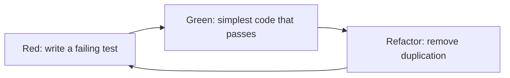
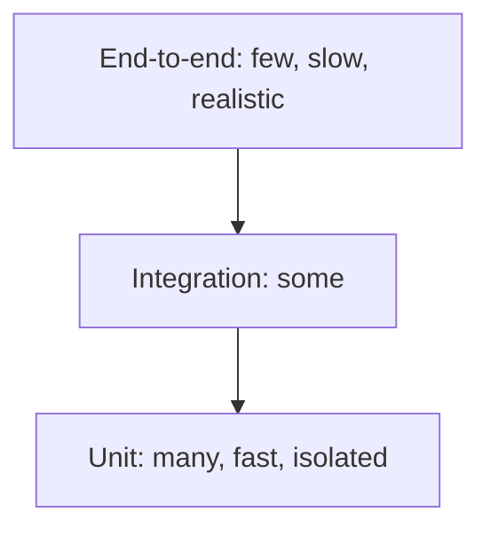

# Test-Driven Development (TDD)

**Test-Driven Development** writes a failing test before the code that makes it pass.
The tests are the visible output, but the real product is *design pressure*: code that
is hard to test is hard to use, and TDD makes you feel that pain before the code has
callers.

It is one of the original [XP practices](../Extreme%20Programming/XP%20Practices.md)
and the reason refactoring is safe there.

## The cycle



| Step | Rule | Why it matters |
|---|---|---|
| **Red** | Write one small test and watch it fail | A test never seen failing may be testing nothing |
| **Green** | Write the least code that passes, even if it is ugly | Keeps the step small enough that a failure points at the last edit |
| **Refactor** | Improve the design with the tests green | Design happens here, not in Green |

Each loop should take minutes. If a cycle takes an hour, the step was too big.

## A worked example

A `Cart` should apply a 10% discount above 100 units of currency.

Red, the test first:

```python
def test_no_discount_below_threshold():
    assert total([50, 30]) == 80
```

Green, the least code that passes:

```python
def total(prices):
    return sum(prices)
```

Deliberately no discount yet: nothing has asked for it. The next test does:

```python
def test_ten_percent_discount_above_hundred():
    assert total([60, 60]) == 108.0
```

Green again:

```python
def total(prices):
    subtotal = sum(prices)
    return subtotal * 0.9 if subtotal > 100 else subtotal
```

Then Refactor, with both tests green, for example naming the threshold and rate as
constants. The boundary itself deserves its own test, because `> 100` and `>= 100` are
a coin flip that only a test at exactly 100 will settle.

## Why write the test first

- **Executable specification.** The test states the intent in a form that cannot go
  stale, because it fails when the code drifts from it.
- **Design feedback.** Needing a database, a clock and three mocks to test one function
  is the test reporting that the function has too many dependencies. Fix the design,
  not the test.
- **Regression safety.** Refactoring and
  [collective ownership](../Extreme%20Programming/XP%20Practices.md) both depend on a
  suite that says "still correct" in seconds.
- **Coverage that means something.** Every line exists because a test demanded it.

## Test doubles

| Double | What it does | Use for |
|---|---|---|
| **Stub** | Returns canned values | Supplying input the test needs |
| **Mock** | Records calls and asserts on them | Verifying an interaction actually happened |
| **Fake** | Working but simplified implementation, such as an in-memory repository | Replacing slow infrastructure |
| **Spy** | Real object with calls recorded | Observing without replacing behaviour |

Over-mocking is the common failure: a test that mocks everything verifies only that the
code calls the methods the author expected, and it passes happily after a refactor
breaks the behaviour.

## The test pyramid



TDD lives mostly at the unit level, which is what makes the loop fast enough to run on
every save. An inverted pyramid, meaning mostly end-to-end tests, produces a suite that
is slow and flaky enough that people stop running it.

## Where it goes wrong

- **Testing implementation instead of behaviour.** Asserting on private methods and call
  order makes every refactor break the suite, and the team concludes that TDD is
  expensive.
- **Skipping Red.** A test written after the code and never seen failing can be
  permanently green by accident.
- **Skipping Refactor.** Green-only TDD produces a well-tested mess, and it is where
  most abandoned TDD adoptions stop.
- **Untestable seams.** Hard-wired clocks, static singletons and constructors doing I/O
  are the usual blockers. Inject them instead.

TDD is also a poor fit where the correct output is not known in advance, for example
exploratory data work or spikes. Spike first, delete the spike, then drive the real
implementation with tests.

## Check Your Understanding

<quiz>
Why must a test be observed failing before the production code is written?

- [ ] Because build tools require at least one failing test
- [x] Because a test never seen failing might pass for the wrong reason, and would then verify nothing
> Correct. Red proves the test is actually connected to the behaviour it claims to check.
- [ ] Because failing tests are needed for coverage reports
- [ ] Because the refactor step only runs after a failure
</quiz>

<quiz>
A test needs six mocks to set up. What is the most useful reading of that?

- [ ] The mocking library is inadequate
- [ ] The test should be converted to an end-to-end test
- [x] The unit under test has too many dependencies, and the test is reporting a design problem
> Correct. TDD's main benefit is this feedback. The fix belongs in the production code, not in the test setup.
- [ ] Six mocks is normal for unit tests
</quiz>

<quiz>
A team writes tests first, keeps them green, and never refactors. What is the likely outcome?

- [ ] Clean code, since every line was test-driven
- [x] A well-tested but poorly designed codebase, because the design improvement lives in the refactor step that was skipped
> Correct. Green only asks for code that passes. Refactor is where duplication and bad names are removed.
- [ ] The tests will gradually start failing on their own
- [ ] Coverage will drop below the threshold
</quiz>
