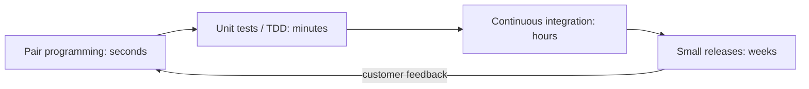

# Description
**Extreme Programming (XP)** is a **software development methodology** that focuses on **improving software quality** and **responsiveness to changing customer needs**. It promotes **frequent releases**, close collaboration with the customer, and continuous improvement through short development cycles and regular feedback.

# Core Principles
- **Communication**: Developers constantly talk with each other and with stakeholders to keep everyone on the same page.
- **Simplicity**: The team only builds what’s needed right now, no over-engineering.
- **Feedback**: Frequent releases and constant testing provide fast feedback.
- **Courage**: Developers are encouraged to make bold changes, like refactoring or discarding failing code.
- **Respect**: Team members trust and support one another.

# Key Practices

## 1. Pair Programming
Two developers work together at one computer, one writes code while the other reviews it in real-time. They switch roles frequently, which improves code quality and spreads knowledge across the team.

## 2. Test-Driven Development (TDD)
Tests are written _before_ the actual code. This ensures that every part of the software is covered by automated tests and behaves as expected.

## 3. Continuous Integration
Code is integrated and tested multiple times a day. This helps catch issues early and keeps the project in a constantly working state.

## 4. Small Releases
The product is released in small, frequent versions. This allows the customer to see progress and give feedback early and often.

## 5. On-site Customer
A real user (often a business representative) is available full-time with the development team to answer questions and provide guidance.

## 6. Refactoring
Code is regularly cleaned and improved without changing its behavior. This keeps the code-base simple, flexible, and easy to maintain.

# When to Use XP
- Requirements change frequently.
- The team is small (typically less than 10 developers).
- The project needs to deliver working software quickly and continuously.
- Close collaboration with users is possible.

# Benefits of XP
- High-quality, well-tested code.
- Fast response to change.
- Strong team collaboration and shared knowledge.
- Early and continuous delivery of value to users.

# Challenges of XP
- Requires strong discipline and team coordination
- Doesn’t work well with large or distributed teams.
- Needs full commitment from the customer to be on-site and involved.

# Pages in this section

- [XP Practices in Detail](XP%20Practices.md), how the practices work and why they depend on each other.

# XP and Scrum

XP and [Scrum](../Scrum/index.md) are complementary, not competing: Scrum prescribes the
management frame (roles, events, artifacts) and is silent on engineering, while XP prescribes
the engineering discipline and is thin on management. Most "Scrum" teams that sustain
quality over years are running XP practices underneath.

| Concern | Scrum | XP |
|---|---|---|
| Timebox | Sprint (1 to 4 weeks) | Iteration (1 to 2 weeks) |
| Customer | Product Owner | On-site customer |
| Engineering practices | Not specified | TDD, pairing, CI, refactoring, collective ownership |
| Change during the timebox | Sprint Goal is protected | An unstarted story may be swapped for one of equal size |

## The feedback loops

XP is best understood as nested loops, each shorter than the last:

Dropping an inner loop pushes its defects outward, where they cost more to find. This
is the same cost-of-change argument that motivates
[agility](../Agile/The%20Definition%20of%20Agility.md) generally.

## Check Your Understanding

<quiz>
Why does XP insist tests are written *before* the code?

- [ ] Because writing tests later takes more time
- [ ] Because the customer must approve tests before development starts
- [ ] Because it removes the need for refactoring
- [x] The test defines the expected behavior and fails first, so it proves it actually exercises the new code
> Correct. A test written afterwards can pass for the wrong reason and never demonstrates that it can fail.
</quiz>

<quiz>
A team adopts Scrum but keeps a two-week manual regression phase before every release. Which XP practice would fix it?

- [x] Continuous integration with an automated test suite, so integration and regression happen many times a day
> Correct. Without it, the Increment cannot honestly meet a Definition of Done that says "releasable".
- [ ] Pair programming
- [ ] On-site customer
- [ ] Collective code ownership
</quiz>

## Assessment

Work through the [Practices and Governance assessment](../../Assessments/Methodologies/XP%20DSDM%20and%20Scaling%20Quiz.md) once you have read this section.
