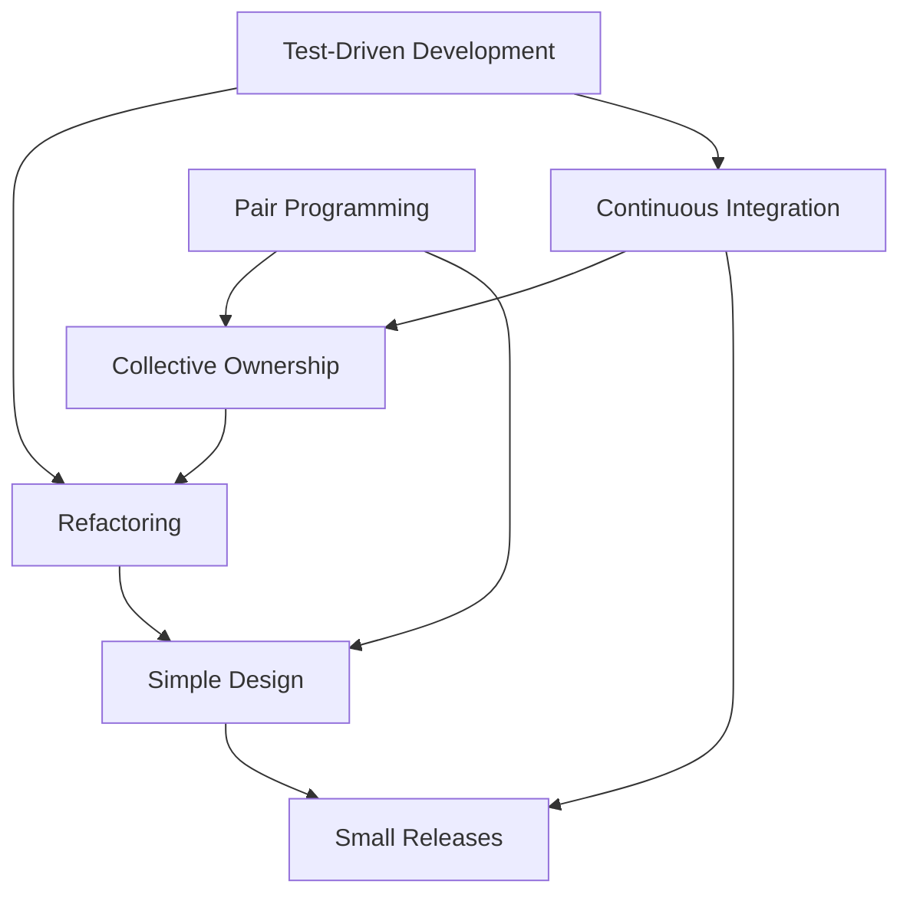

# XP Practices in Detail

[XP](index.md) is defined by its practices, and they are designed to reinforce each
other. Adopting one in isolation usually fails, because each practice covers a risk
that another practice creates.

## Test-Driven Development

The cycle is **red, green, refactor**:

1. Write a failing test for the next small behavior.
2. Write the simplest code that makes it pass.
3. Refactor with the test as a safety net.

=== "Python"

    ```python
    # 1. red: the test fails, which proves it exercises the new behavior
    def test_reorder_copies_items():
        cart = reorder(Order(items=["apple", "pear"]))
        assert cart.items == ["apple", "pear"]

    # 2. green: simplest thing that passes
    def reorder(order):
        return Cart(items=list(order.items))

    # 3. refactor: only now, with the test protecting the change
    ```

=== "Java"

    ```java
    @Test
    void reorderCopiesItems() {
        Cart cart = Reorder.from(new Order(List.of("apple", "pear")));
        assertEquals(List.of("apple", "pear"), cart.items());
    }
    ```

Writing the test first matters because a test written afterwards has never been
observed to fail, so it may pass for reasons unrelated to the code it claims to cover.

## Pair programming

Two people, one keyboard. The driver writes, the navigator thinks one step ahead.
Roles swap frequently.

| Gains | Costs |
|---|---|
| Continuous review, so defects are caught as they are written | Two people on one task, though not two people for twice as long |
| Knowledge spreads, and the bus factor rises | Tiring, and needs deliberate breaks |
| Design decisions are discussed before they calcify | Poor fit for trivial or mechanical work |

Mob or ensemble programming extends this to the whole team, typically for the hardest
or most cross-cutting problems.

## Continuous integration

Everyone integrates to the mainline at least daily, and an automated build plus test
suite runs on every change. A broken build is the team's top priority.

The practice exists to kill integration risk. Long-lived branches accumulate divergence
until merging becomes its own project, which is precisely the queue Lean calls
inventory.

## Refactoring

Continuous, small, behavior-preserving improvements to the design. Refactoring is only
safe with a strong test suite, which is why it is paired with TDD, and it is only
affordable if it happens continuously rather than as a quarterly cleanup project.

## Simple design

The design should pass four rules, in order: all tests pass, reveals intention, no
duplication, fewest elements. In practice this means **YAGNI**, build what is needed
now, because speculative flexibility is usually the wrong flexibility.

## Collective code ownership

Anyone may change any code. This removes the specialist bottleneck, and it depends on
coding standards, CI and tests to stay safe.

## Small releases and the planning game

Release in the smallest increments that deliver value. Planning is a negotiation:
the **customer** decides scope and priority, the **developers** decide estimates and
technical approach. Neither side overrides the other, which is what stops both
death-march commitments and gold-plating.

## Sustainable pace

Forty-hour weeks, or whatever the local equivalent is. Overtime is treated as a defect
in planning, because tired developers produce defects that cost more than the hours
gained.

## How the practices support each other



Remove TDD and refactoring becomes dangerous. Remove CI and collective ownership
becomes chaos. This interdependence is why partial XP adoptions so often conclude that
"XP does not work here".

## Check Your Understanding

<quiz>
Why is collective code ownership unsafe without continuous integration and a test suite?

- [ ] Because developers would need permission to edit files
- [ ] Because merge conflicts cannot be resolved without CI
- [x] Because anyone can change any code, so only automated tests running on every integration can catch what a change broke elsewhere
> Correct. The practices are mutually supporting, and dropping one removes the safety net another one depends on.
- [ ] Because pairing cannot happen across modules
</quiz>

<quiz>
In the planning game, who decides what gets built next and who decides how long it takes?

- [x] The customer decides scope and priority, the developers decide estimates and technical approach
> Correct. Separating those authorities is what prevents both imposed deadlines and developer-driven gold-plating.
- [ ] The customer decides both, and developers implement
- [ ] The developers decide both, and the customer accepts
- [ ] The coach decides both to keep the team balanced
</quiz>

<quiz>
XP treats sustained overtime as what?

- [ ] A necessary response to fixed deadlines
- [ ] A sign of team commitment
- [ ] A normal part of the release cycle
- [x] A planning defect, since tired developers introduce defects that cost more than the extra hours produce
> Correct. This is the same sustainable pace idea as Agile principle 8, applied as a hard team rule.
</quiz>
