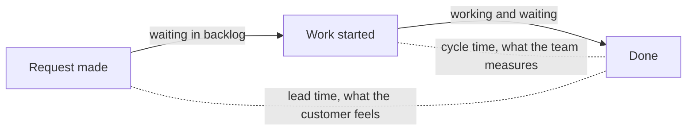

# WIP Limits and Flow Metrics

[Kanban](index.md) makes two claims that are unusual enough to be worth proving:
**starting less work makes it finish faster**, and **you can forecast without
estimating**. Both follow from a small amount of queueing theory.

## Little's Law

For a stable system:

$$
\text{cycle time} = \frac{\text{work in progress}}{\text{throughput}}
$$

With 20 items in progress and a throughput of 5 items per week, average cycle time is
$20 / 5 = 4$ weeks. Halve the work in progress to 10, and cycle time drops to
$10 / 5 = 2$ weeks, with throughput unchanged.

This is why WIP limits speed delivery up without anybody working harder. Nothing was
made faster, there is simply less waiting in queues.

## Where the time goes

Cycle time starts when work begins, so a team can report a healthy cycle time while
customers wait months. Lead time is the honest number.

## Why high WIP is expensive

- **Context switching.** Every parallel item costs re-orientation time.
- **Feedback delay.** A defect in an item started three weeks ago is discovered three
  weeks later, when the author has forgotten it.
- **Inventory risk.** Half-finished work has produced zero value and can still be
  invalidated by a change in priority.
- **Blocked items hide.** With ten items open per person, a blocked one is parked
  instead of escalated.

## Setting limits

Start from what the team does today, then tighten. A common heuristic is roughly
one-and-a-half items per person in the busiest column, then reduce until the board
starts to hurt, because the pain is exactly the bottleneck you wanted to find.

The right limit is the one that makes queues visible. If nothing ever blocks, the
limits are too loose to teach you anything.

## The metrics

| Metric | Definition | Answers |
|---|---|---|
| **Cycle time** | Time from work starting to it being Done | How long does a started item take? |
| **Lead time** | Time from request to delivery, including the wait in the backlog | What does the customer experience? |
| **Throughput** | Items completed per unit of time | How much can we deliver? |
| **Work in progress** | Items started and not finished | How much are we juggling? |
| **Flow efficiency** | Working time divided by total cycle time | How much of the time is an item just waiting? |

Flow efficiency is usually the shock. Typical software teams measure somewhere between
5% and 25%, which means most of an item's life is spent in a queue, not being worked
on. Adding people raises capacity, but reducing queues is what actually shortens
delivery.

## Charts worth keeping

- **Cumulative flow diagram (CFD).** Stacked area of items per state over time. A
  widening band means a growing queue in that state, which locates the bottleneck.
- **Cycle time scatterplot.** One dot per completed item. Percentile lines give
  probabilistic forecasts such as "85% of items finish within 9 days", which is a far
  more honest commitment than a single-point estimate.

## Forecasting without estimates

Take the team's historical throughput, sample it repeatedly at random (a Monte Carlo
simulation), and read the distribution of completion dates. It uses only measured
data, no story points, and it produces a probability rather than a promise.

## Check Your Understanding

<quiz>
A team halves its work in progress while throughput stays the same. What happens to cycle time?

- [ ] It stays the same, since the same amount of work is being done
- [ ] It doubles, because fewer items are worked in parallel
- [x] It halves, by Little's Law, because items spend less time waiting in queues
> Correct. Cycle time equals WIP divided by throughput, so cutting WIP at constant throughput cuts cycle time proportionally.
- [ ] It becomes unpredictable and cannot be derived
</quiz>

<quiz>
A team measures 10% flow efficiency. What does that mean?

- [ ] 10% of items are delivered late
- [x] Items spend about 90% of their cycle time waiting in queues rather than being worked on
> Correct. Which is why removing queues usually beats adding people when you want to deliver faster.
- [ ] The team is working at 10% of its capacity
- [ ] Only 10% of estimates are accurate
</quiz>

<quiz>
Which forecast is best supported by a cycle time scatterplot?

- [ ] "This item will take exactly 5 days"
- [ ] "The team will complete 30 points next Sprint"
- [ ] "We will deliver the whole backlog by the end of the quarter"
- [x] "85% of items like this one have finished within 9 days"
> Correct. Historical cycle time supports probabilistic statements, which carry their uncertainty visibly instead of hiding it in a single number.
</quiz>
