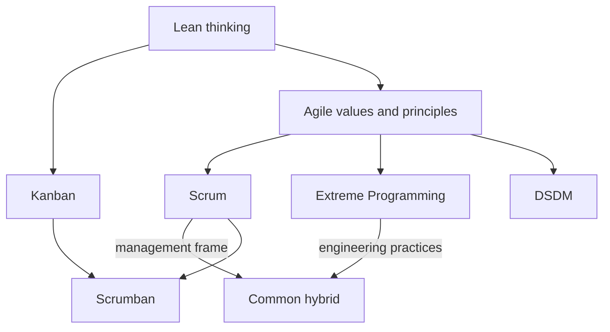

# Methodologies

A **methodology** is the set of values, roles, events and practices a team uses to turn
requirements into working software. A [process model](Process%20Models/index.md)
describes the *shape* of the work, meaning its phases, ordering and feedback points. A
methodology describes *how a team actually works day to day* inside that shape. Both
live in this section, because in practice a team picks them together.

## The families

| Family | Core bet | Cadence | Prescribes |
|---|---|---|---|
| [Agile](Agile/index.md) | Change is cheaper to absorb than to prevent | Weeks | Values and principles, not a process |
| [Scrum](Scrum/index.md) | Fixed timeboxes create rhythm and feedback | 1 to 4 week Sprints | Roles, events, artifacts |
| [Extreme Programming](Extreme%20Programming/index.md) | Engineering discipline drives agility | Days to weeks | Technical practices |
| [Kanban](Kanban/index.md) | Limiting work in progress makes work finish faster | Continuous flow | Visualization, WIP limits, flow metrics |
| [Lean](Lean/index.md) | Most of the delay is waste, not work | Whole value stream | Thinking tools, not a process |
| [DSDM](DSDM/index.md) | Time and cost are fixed, scope flexes | Timeboxes | Lifecycle, roles, MoSCoW governance |
| [Process Models](Process%20Models/index.md) | The shape of the work decides when you learn you were wrong | Phases or iterations | Ordering of phases and feedback points |

Scrum, XP, Kanban and DSDM are all compatible with the
[agile values](Agile/index.md). Teams routinely mix them, most commonly Scrum for the
management frame with XP for the engineering practices.

## Cross-cutting pages

- [Choosing a Methodology](Choosing%20a%20Methodology.md), how to pick, and why hybrids are normal.
- [Scaling Agile](Scaling%20Agile.md), LeSS, SAFe, Scrum@Scale and what actually breaks with many teams.
- [Other Methodologies](Other%20Methodologies.md), Crystal, FDD, RAD, Scrumban, Spiral and Shape Up.
- [Agile Anti-patterns](Agile/Agile%20Anti-patterns.md), how adoptions fail while keeping the name.

## How the pieces relate

## Quick orientation

- **Want a rhythm and clear accountabilities?** Start with [Scrum](Scrum/index.md).
- **Delivery keeps slipping on quality?** The gap is engineering, so read
  [XP Practices](Extreme%20Programming/XP%20Practices.md).
- **Work arrives unpredictably?** Use [Kanban](Kanban/index.md).
- **The date cannot move?** Use [MoSCoW](DSDM/MoSCoW.md) and flex scope.
- **Many teams, one product?** See [Scaling Agile](Scaling%20Agile.md).
- **Requirements stable, regulated or contract-bound?** A plan-driven
  [process model](Process%20Models/index.md) is often the safer fit.

## Assessments

Longer mixed quizzes covering this whole section:

- [Agile Foundations](../Assessments/Methodologies/Agile%20Foundations%20Quiz.md), 16 questions.
- [Scrum](../Assessments/Methodologies/Scrum%20Quiz.md), 16 questions.
- [Flow, Kanban and Lean](../Assessments/Methodologies/Kanban%20and%20Lean%20Quiz.md), 14 questions.
- [Practices and Governance](../Assessments/Methodologies/XP%20DSDM%20and%20Scaling%20Quiz.md), 16 questions.

## Check Your Understanding

<quiz>
What is the difference between a process model and a methodology?

- [ ] They are the same thing under two names
- [x] A process model describes the ordering of phases and feedback, and a methodology describes how a team works day to day inside it
> Correct. The Incremental Model says "deliver in increments". Scrum says who is in the room, for how long, and with which artifacts.
- [ ] A methodology only applies to agile teams, a process model only to plan-driven teams
- [ ] A process model is documentation, a methodology is code
</quiz>

<quiz>
Why do Scrum and XP combine so often?

- [ ] Because both were written by the same authors
- [ ] Because Scrum requires pair programming
- [ ] Because XP has no way to plan work
- [x] Because Scrum prescribes a management frame and no engineering practices, while XP prescribes engineering practices and little management structure
> Correct. They cover each other's gaps, which is why Scrum teams without technical practices tend to slow down after a year.
</quiz>
