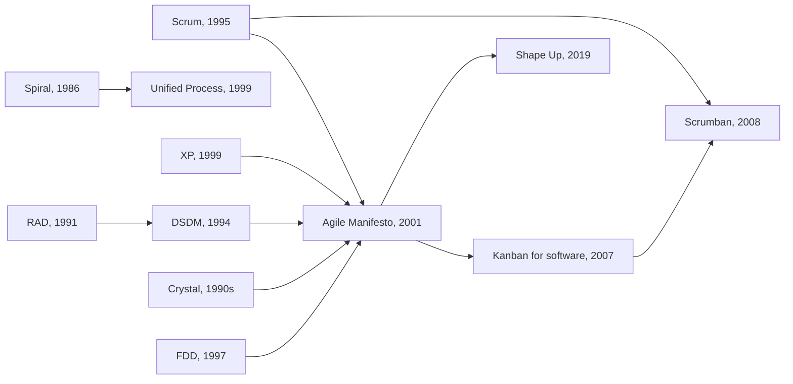

# Other Methodologies

Beyond [Scrum](Scrum/index.md), [XP](Extreme%20Programming/index.md),
[Kanban](Kanban/index.md) and [DSDM](DSDM/index.md), several methods are worth knowing.
Some are still used directly, and others contributed one idea that everything since has
absorbed.

## Crystal

A **family** of methods (Clear, Yellow, Orange, Red) sized by team size and criticality,
on the argument that a 6-person website and a 200-person medical device cannot share a
process. Its contribution is that **methodology weight should scale with the cost of
failure**.

Core practices: frequent delivery, reflective improvement, osmotic communication, which
is the learning that happens simply by sitting within earshot of the team.

## Feature-Driven Development (FDD)

Five processes: build an overall model, build a feature list, plan by feature, then
design and build by feature. Features are small, client-valued functions written as
`<action> the <result> <by|for|of|to> a(n) <object>`, and each is expected to take two
weeks or less.

FDD keeps an explicit up-front domain model and a class-owner per area, so it scales to
larger teams more comfortably than XP and appeals to organizations that want documented
design.

## Rapid Application Development (RAD)

Prototype-driven, timeboxed, and heavily dependent on user involvement and tooling.
Historically important as DSDM's direct ancestor and as the origin of "build a
prototype and evolve it". Vulnerable to prototypes being shipped as products.

## Scrumban

Scrum's cadence and roles, plus Kanban's WIP limits and flow metrics. Typically arrived
at rather than chosen, when a Scrum team keeps having its Sprint broken by urgent work
and decides to make the interruptions visible instead of pretending they do not happen.

## Spiral model

Risk-driven, iterative, with each loop covering objectives, risk analysis, development
and planning. Not agile, but it is where "address the highest risk first, in
iterations" enters the mainstream. See
[Other Process Models](Process%20Models/Other%20Process%20Models.md).

## Shape Up

Basecamp's method: six-week cycles, then a two-week cool-down. Work is **shaped** at a
middle level of abstraction before it is handed to a team, and the team gets full
autonomy over how to build it. Distinctively, the appetite is fixed and the scope is
cut to fit, which the method calls *hammering scope*, and projects that will not fit
are stopped rather than extended.

## Roughly when each appeared

## What each one contributed

| Method | Idea that outlived it |
|---|---|
| Crystal | Process weight should scale with team size and criticality |
| FDD | Client-valued features as the planning unit, with an explicit domain model |
| RAD | Evolutionary prototyping with heavy user involvement |
| Scrumban | Cadence and flow control are independent choices |
| Spiral | Attack the highest risk first, iteration by iteration |
| Shape Up | Fixed appetite, variable scope, and the courage to stop a project |

## Check Your Understanding

<quiz>
What is Crystal's central argument?

- [ ] That every team should use the lightest possible process
- [x] That the weight of a methodology should scale with team size and the criticality of failure
> Correct. Which is why Crystal is a family of methods rather than a single one.
- [ ] That documentation should replace face-to-face communication as teams grow
- [ ] That features should be the only unit of planning
</quiz>

<quiz>
In Shape Up, what happens when a project will not fit inside its six-week cycle?

- [ ] The cycle is extended until the work is complete
- [ ] The work is carried into the next cycle as a partial increment
- [x] Scope is cut to fit the fixed appetite, and if it still does not fit, the project is stopped rather than extended
> Correct. Fixed time with variable scope is the same trade DSDM makes with MoSCoW, applied at the project level.
- [ ] More people are added to the team for the remaining weeks
</quiz>
