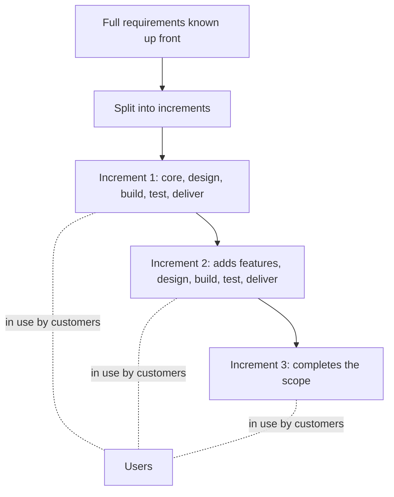

# Description
The **Incremental Model** combines elements of the **Waterfall model** with iterative development. Instead of delivering the whole system at once, it delivers **functional components (increments)** over time:

- The product is **designed, implemented, and tested** incrementally (a little more is added each time).
- Each increment adds **new functionality**.
- The **first increment** is usually the core product, additional features are built on top of it.
    

# Structure:
1. **Initial Planning**
2. **Design Increment 1 → Build → Test → Deliver**
3. **Design Increment 2 → Build → Test → Deliver**
4. **...Repeat until complete system is delivered**
    

# Advantages:
- Useful when not all requirements are known up front.
- Delivers **working software early and often**.
- **Easier to test and debug** smaller increments.
- **User feedback** can be integrated between increments.

# Disadvantages:
- Needs **good architectural planning**.
- Later increments might require **rework** of earlier ones.
- **System design issues** may arise if not all requirements are known.

# Diagram

## How the increments stack up

Each increment is a working part of the final product, so users get value before the
whole scope is finished, and feedback arrives while later increments can still change.
