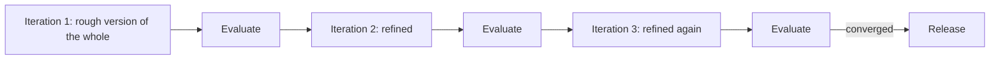

## Introduction

Iterative methodology is a development approach that emphasizes **repetition and refinement**. Instead of delivering a final product all at once, teams build it incrementally, improving through cycles of planning, designing, testing, and evaluating. This method is widely used in software development, engineering, education, and project management.

## Keypoints
- Cyclic Process: Work is divided into small iterations or cycles.
- Continuous Improvement: Each cycle builds upon the previous one, incorporating feedback and lessons learned.
- Flexibility: Allows for changes and adjustments throughout the project lifecycle.
- Risk Reduction: Early testing and feedback help identify issues before they escalate.

## Phases 
- **Planning**: Define goals, scope, and requirements for the iteration.
- **Designing**: Create models or prototypes based on the plan.
- **Implementing**: Develop the product or solution.
- **Testing**: Evaluate performance and functionality.
- **Reviewing**: Analyze results and gather feedback for the next cycle

## Refining the same product

Iterative differs from incremental in what each pass produces. An increment adds a new
finished slice, while an iteration improves the quality of what already exists.
