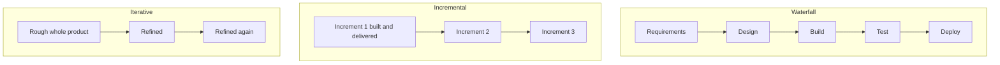

# Process Models

A **process model** describes the shape of the work: which phases exist, in what order
they run, and where feedback enters. It is the skeleton that a
[methodology](../index.md) puts flesh on. Waterfall says requirements come before
design. Scrum says who is in the room and for how long.

Every model below is an answer to one question: **when do we find out we were wrong?**

## The models

| Model | Shape | Feedback arrives | Best fit |
|---|---|---|---|
| [Waterfall](Waterfall%20Model.md) | Sequential phases, each finished before the next | At acceptance, near the end | Stable, well-understood, contract-fixed requirements |
| [V-Model](V-Model.md) | Waterfall folded, each phase paired with its test level | Per verification level, still late for requirements | Safety-critical and regulated work needing verification evidence |
| [Incremental](Incremental%20Model.md) | Requirements split into increments, each delivered in full | After each increment | Known scope that can usefully be delivered in pieces |
| [Iterative](Iterative%20Model.md) | The same product refined repeatedly | After each iteration | Requirements that must be discovered by building |
| [Unified Process](Unified%20Process%20Model%20(UP).md) | Four phases, iterations inside, risk-driven | Every iteration | Larger projects wanting iteration with formal artifacts |
| [Other models](Other%20Process%20Models.md) | Spiral, prototyping, RAD and more | Varies | Specialized risk or exploration profiles |

## The models side by side

Waterfall learns once, at the end. Incremental learns after each slice. Iterative
learns after each pass over the same ground.

## Incremental is not iterative

The two words are used interchangeably and mean different things.

- **Incremental** builds the final product a slice at a time. Each slice is finished,
  and the picture grows.
- **Iterative** builds a rough version of the whole, then refines it. Each pass covers
  the same ground at higher quality.

Most modern delivery, including [Scrum](../Scrum/index.md), is both. A Sprint delivers
a new slice and improves what already exists.

## Plan-driven and empirical

| | Plan-driven | Empirical |
|---|---|---|
| Assumption | Requirements can be known before building | Requirements are discovered by building |
| Control | Conformance to a plan | Frequent inspection of a working increment |
| Cost of a late change | High, since finished artifacts must be reworked | Lower, since increments are small and tested |
| Needs | Stable domain, clear contract | Available customer, automated tests, deployable increments |

Neither is a default. A pacemaker's firmware and a consumer web app carry different
risks, and the model should follow the dominant risk. See
[Choosing a Methodology](../Choosing%20a%20Methodology.md).

## Related

- [Use Cases Cheatsheet](../../Snippets%20and%20Cheatsheets/Process%20Models%20Use%20cases.md), a
  quick table of which model suits which situation.

## Check Your Understanding

<quiz>
What is the difference between incremental and iterative delivery?

- [ ] They are two names for the same practice
- [x] Incremental builds the product a finished slice at a time, while iterative refines a rough version of the whole across repeated passes
> Correct. Most modern delivery does both at once, which is why the terms get conflated.
- [ ] Incremental applies to requirements, iterative applies to testing
- [ ] Iterative delivers to users, incremental does not
</quiz>

<quiz>
Why does the V-Model suit safety-critical work?

- [ ] Because it delivers working software earlier than the alternatives
- [ ] Because it allows requirements to change late at low cost
- [x] Because every phase is paired with a verification level, so the traceable evidence that each requirement was tested is itself a deliverable
> Correct. In regulated domains the verification record is required output, not overhead, which is what justifies the up-front rigor.
- [ ] Because it needs no customer involvement
</quiz>
