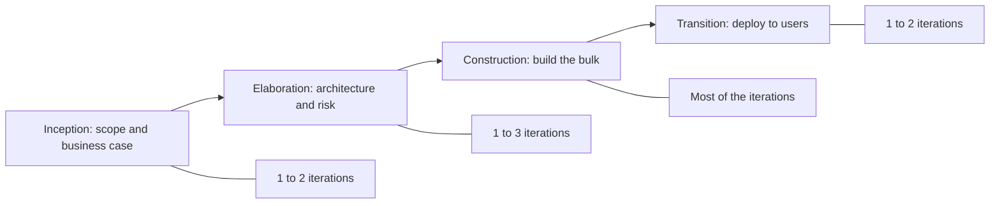

# Description

The **Unified Process (UP)** is a **software development process framework** that is **iterative**, **incremental**, and **use-case driven**. It helps teams organize large and complex software projects by breaking them down into smaller, manageable phases and cycles.

UP is not a rigid process, it’s a **flexible framework** that teams can adapt based on the project's size, complexity, and needs. One of the most well-known implementations of UP is the **Rational Unified Process (RUP)**.

# Core Characteristics

- **Iterative**: The software is built and improved over several short cycles rather than one long development phase.
- **Incremental**: The product is developed in chunks (increments), with each new version adding more features.
- **Architecture-Centric**: A strong focus on designing a robust and flexible software architecture early in the project.
- **Use-Case Driven**: Requirements are gathered and organized based on real user interactions with the system.
    

# Phases and iterations

Each phase contains one or more iterations, and every iteration produces executable
software. Elaboration carries the highest risk deliberately, since the architecture is
proven while there is still time to change it.

# Phases of the Unified Process

The Unified Process is divided into **four main phases**, each with specific goals and deliverables:

## 1. Inception Phase
- **Goal:** Define the scope and vision of the project.
	- Identify the business case.
	- Estimate costs and resources.
	- Identify key use cases and risks.
	- Determine whether the project is worth pursuing.

## 2. Elaboration Phase
- **Goal:** Analyze and design the system’s architecture.
	- Refine use cases and requirements.    
	- Address major risks.
	- Build an architectural prototype.
	- Create a detailed project plan for construction.

## 3. Construction Phase
- **Goal:** Build the actual software system.
	- Implement the design into working code.    
	- Test components and features.
	- Continue integrating and refining.    
	- Prepare for user deployment.

## 4. Transition Phase
- **Goal:** Deliver the system to end users.
	- Final testing and debugging.
	- User training and documentation.
	- Deployment into the production environment.    
	- Gather feedback for future iterations.

# Workflows (Disciplines)

Throughout all phases, UP uses different **workflows** (also called disciplines), such as:

- **Requirements**    
- **Analysis and Design**
- **Implementation**    
- **Testing**
- **Deployment**
- **Configuration and Change Management**
- **Project Management**

These workflows happen in every phase but with different intensity.

# Benefits of Unified Process

- Encourages planning and risk management.
- Produces high-quality software through frequent testing.
- Promotes reuse of components and architectural consistency.
- Adaptable to different types of projects.

# Challenges of Unified Process

- Can be heavyweight and documentation-heavy if not tailored.
- Requires experienced team members to execute effectively.    
- Needs careful planning to avoid overengineering early phases.

# When to Use UP

The Unified Process is ideal for:

- Large, complex, or long-term projects.
- Projects with evolving requirements.
- Teams that value formal structure, risk management, and architectural robustness.

The Unified Process brings **structure** and **discipline** to software development, while still being **flexible** enough to adapt to the realities of iterative delivery.

# Agile Unified Process (AUP)

See [Methodologies](../index.md) for the agile methods this variant draws on.

Each AUP iteration addresses these activities:
- Modeling
- Implementation
- Testing
- Deployment
- Configuration and project management
- Environment management