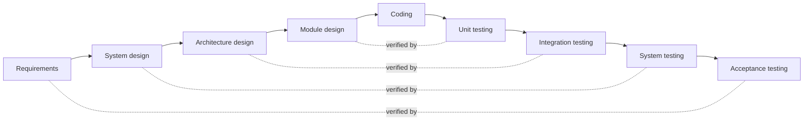

# Description

The **V-Model** (also known as the **Verification and Validation model**) is an extension of the Waterfall model, but with a focus on **testing at every stage**. Instead of going straight down like a waterfall, the process forms a **"V" shape**, the left side is development (verification), the right side is testing (validation), and they’re connected phase-by-phase.

# V-Model Phases:

## The V

The dotted lines are the point of the model. Every design document on the way down has
a named test level on the way up that proves it was satisfied, which is the traceable
evidence regulated domains require.

## Left Side: **Verification (Planning & Design):**

1. **Requirements Analysis**
2. **System Design**
3. **Architecture Design**
4. **Module Design**

## Right Side: **Validation (Testing):**

Each development phase has a matching test phase:

| Development Phase     | Corresponding Test Phase |
| --------------------- | ------------------------ |
| Requirements Analysis | Acceptance Testing       |
| System Design         | System Testing           |
| Architecture Design   | Integration Testing      |
| Module Design         | Unit Testing             |

# Advantages:
- **Early testing planning** improves quality.
- Clear links between development and testing.
- Errors can be caught early.
- Better suited for high-reliability systems (like aerospace, medical software, etc.)

# Disadvantages:
- Still rigid, not great for changing requirements.
- No early working prototypes.
- More complex than Waterfall.

# Diagrams

