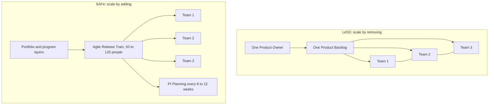

# Scaling Agile

Agile methods were designed for a team of roughly five to nine people who can talk to
each other. Scaling frameworks exist because organizations want that responsiveness
across dozens of teams, where the assumptions that made it work no longer hold.

## What actually breaks at scale

| Assumption at one team | What breaks with many teams |
|---|---|
| Everyone can talk face to face | Communication paths grow quadratically |
| One Product Owner sets priority | Priorities conflict across teams and products |
| The team owns its whole codebase | Shared components create cross-team dependencies |
| A Sprint produces a shippable Increment | Nobody's Increment is shippable alone |
| Retrospectives fix the problems found | Most impediments now sit outside the team |

Every framework below is an answer to those five rows. The frameworks differ mostly in
how much structure they add.

## The main options

### LeSS (Large-Scale Scrum)

Scrum, scaled by **removing** things rather than adding them. One Product Owner, one
Product Backlog, one shared Sprint, many teams. Coordination happens directly between
teams rather than through a layer of managers.

Best when several teams genuinely work on one product. It demands strong engineering
practices, because all teams integrate continuously into one codebase.

### SAFe (Scaled Agile Framework)

The most prescriptive and by far the most adopted in large enterprises. Teams are
grouped into an Agile Release Train of roughly 50 to 125 people, which plans together
in a **PI Planning** event every 8 to 12 weeks and delivers on a shared cadence.

Criticized for reintroducing up-front planning and management layers. Chosen anyway
because it gives a large organization a concrete, trainable operating model.

### Scrum@Scale

Scales Scrum by composing it fractally. A Scrum of Scrums coordinates delivery, and a
parallel Product Owner network coordinates priority. Lighter than SAFe, and it leaves
more design decisions to the organization.

### Spotify model

Squads, tribes, chapters and guilds. Widely copied, and worth remembering that it was
a **description of one company at one point in time**, not a framework, and Spotify
itself moved on. Copying an org chart does not transfer the culture that made it work.

## Two shapes of scaling

In LeSS the teams talk to each other directly. In SAFe the coordination is a layer
with its own roles and cadence, which is both the criticism and the reason large
organizations adopt it.

## Comparison

| | LeSS | SAFe | Scrum@Scale | Spotify model |
|---|---|---|---|---|
| Prescriptiveness | Low | High | Medium | Not a framework |
| Product Owners | One | Several, layered | A network | Per squad |
| Extra roles | Almost none | Many | Few | Chapter lead, tribe lead |
| Planning cadence | Sprint | PI, every 8 to 12 weeks | Sprint | Team choice |
| Common criticism | Hard for organizations to give up structure | Heavy, and easy to run as waterfall in disguise | Vague in places | Cargo-culted org chart |

## Before scaling anything

Most scaling problems are really dependency problems, so the cheapest fix is usually
structural rather than procedural:

1. **Reduce dependencies first.** Teams organized around a value stream, each owning
   its services end to end, need far less coordination. This is Conway's Law used
   deliberately.
2. **Invest in continuous delivery.** Independent deployment is what makes independent
   teams possible.
3. **Only then add a framework**, and add the least structure that solves the problem
   you actually observed.

A scaling framework applied to tangled architecture and manual releases scales the
coordination overhead, not the delivery.

## Check Your Understanding

<quiz>
What is the most effective thing to do before adopting a scaling framework?

- [x] Reduce cross-team dependencies by aligning team boundaries with the architecture, and automate delivery
> Correct. Most scaling pain is coordination caused by dependencies, and a framework layered on top of them only manages the symptom.
- [ ] Standardize story point scales across all teams
- [ ] Appoint a central release manager
- [ ] Synchronize every team onto the same Sprint length
</quiz>

<quiz>
How does LeSS differ from SAFe in approach?

- [ ] LeSS uses Kanban while SAFe uses Scrum
- [ ] LeSS is for hardware, SAFe for software
- [x] LeSS scales by removing structure, keeping one Product Owner and one backlog, while SAFe adds prescribed roles, layers and a planning cadence
> Correct. They sit at opposite ends of the prescriptiveness axis, which is the main choice an organization is actually making.
- [ ] LeSS requires PI Planning every quarter, SAFe does not
</quiz>

<quiz>
Why is the Spotify model a poor thing to copy directly?

- [ ] Because it only works for music streaming products
- [ ] Because squads are too small to deliver features
- [ ] Because it was never used in production
- [x] Because it described one company's culture at one moment, and copying the org chart transfers none of the autonomy and trust that made it work
> Correct. Spotify itself has since changed it, and the labels were the visible surface of the culture rather than its cause.
</quiz>
