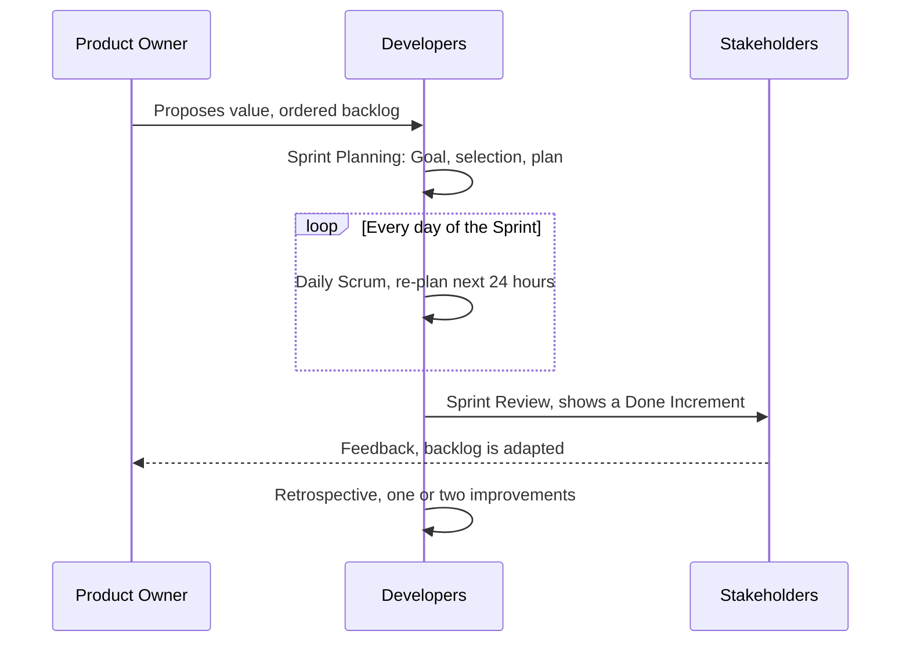

# Scrum Events

Scrum has five events. The [Sprint](Sprints.md) is a container, and the other four
happen inside it. Every event is a formal opportunity to **inspect and adapt**, which
is why skipping one does not save time, it just moves the discovery of a problem
later.

| Event | Timebox (1-month Sprint) | Inspects | Adapts |
|---|---|---|---|
| Sprint Planning | 8 hours | Product Backlog, capacity | Sprint Backlog, Sprint Goal |
| Daily Scrum | 15 minutes | Progress toward the Sprint Goal | The plan for the next 24 hours |
| Sprint Review | 4 hours | The Increment | The Product Backlog |
| Sprint Retrospective | 3 hours | The team's process | How the team works next Sprint |

## One Sprint, event by event

## Sprint Planning

Planning answers three questions:

1. **Why is this Sprint valuable?** The Product Owner proposes value, and the team
   crafts a **Sprint Goal**, one sentence describing why the Sprint is worth running.
2. **What can be Done this Sprint?** The Developers pull items from the Product
   Backlog. They pull, nobody pushes.
3. **How will the work get done?** The Developers decompose items into a plan. Enough
   detail to start, not a full task breakdown of the whole Sprint.

A Sprint Goal that is just "finish these seven tickets" is not a goal, it is a list. A
real goal survives the team dropping an item, because it names an outcome.

## Daily Scrum

Fifteen minutes, same time, same place, Developers only. The classic three questions
(yesterday, today, blockers) are a crutch, not a rule. The actual purpose is to
re-plan the next 24 hours against the Sprint Goal.

Status reporting to a manager is the most common failure mode. If people are speaking
to the Scrum Master instead of to each other, the event has degenerated.

## Sprint Review

A working session, not a demo theatre. The team shows a **real, Done Increment**,
stakeholders react, and the Product Backlog is adapted on the spot. Slides describing
what was built are a signal that the Increment does not exist.

## Sprint Retrospective

The Scrum Team, privately, inspects its own process, tools and interactions. Output is
not a list of complaints but **at most one or two improvements pulled into the next
Sprint Backlog**, so improvement competes for capacity like any other work.

## Backlog Refinement

Not an event in the Scrum Guide, but an ongoing activity: breaking down and estimating
upcoming items so Sprint Planning is not a discovery session. Commonly capped at
around 10% of the team's capacity.

## Check Your Understanding

<quiz>
Who is the Daily Scrum for?

- [ ] The Scrum Master, who collects status from each developer
- [x] The Developers, who re-plan the next 24 hours against the Sprint Goal
> Correct. It is a planning event for the people doing the work, not a status report to anyone.
- [ ] Stakeholders, who track progress daily
- [ ] The Product Owner, who reprioritizes the Sprint Backlog daily
</quiz>

<quiz>
A team's Sprint Goal reads "complete tickets 41 to 48". What is wrong with it?

- [ ] It names too few items to fill a Sprint
- [ ] Goals must be written by the Scrum Master
- [x] It names output rather than an outcome, so it cannot survive dropping an item and gives the team nothing to steer by
> Correct. A good Sprint Goal describes why the Sprint is valuable, which keeps it meaningful even when scope flexes.
- [ ] Nothing, this is the standard format for a Sprint Goal
</quiz>

<quiz>
Why does the Retrospective produce only one or two improvements?

- [ ] Because the Scrum Guide forbids longer lists
- [ ] Because most problems are outside the team's control
- [ ] Because the Scrum Master picks which ones matter
- [x] Because improvements are pulled into the next Sprint Backlog, so they compete for real capacity like any other work
> Correct. A list of twenty improvements nobody has time for is how retrospectives lose credibility.
</quiz>
