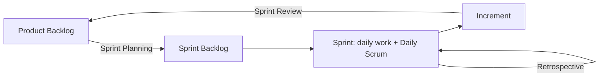

# Scrum

**Scrum** is the most widely used [agile](../Agile/index.md) methodology. It is a
lightweight framework: it prescribes a small set of **roles**, **events** and
**artifacts**, and deliberately says nothing about engineering practices, which come
from [XP](../Extreme%20Programming/index.md) or from the team itself.

Everything in Scrum exists to shorten the loop between *deciding to build something*
and *learning whether it was the right thing*.

## The framework at a glance

| Element | Items |
|---|---|
| Roles | [Product Owner, Scrum Master, Developers](Roles%20in%20Scrum.md) |
| Events | [Sprint](Sprints.md), Sprint Planning, Daily Scrum, Sprint Review, Sprint Retrospective |
| Artifacts | Product Backlog, Sprint Backlog, Increment |
| Commitments | Product Goal, Sprint Goal, Definition of Done |

## Artifacts

- **Product Backlog**, the single ordered list of everything that might be built.
  Owned by the Product Owner, never "final", refined continuously.
- **Sprint Backlog**, the items pulled for this Sprint plus the plan to deliver them.
  Owned by the Developers.
- **Increment**, the sum of completed items, meeting the **Definition of Done** and
  therefore potentially shippable.

The **Definition of Done** is the quality gate. Without a shared, strict one, "done"
drifts and the Increment silently accumulates technical debt.

## Pages in this section

- [Scrum Principles](Scrum%20Principles.md), the ideas the framework rests on.
- [Roles in Scrum](Roles%20in%20Scrum.md), who is accountable for what.
- [Sprints](Sprints.md), the timebox that contains everything else.
- [Scrum Events](Scrum%20Events.md), the five events and what each inspects.
- [Scrum Artifacts](Scrum%20Artifacts.md), the backlogs, the Increment and their commitments.
- [Definition of Done](Definition%20of%20Done.md), the quality gate that makes "done" mean something.

## Check Your Understanding

<quiz>
Who owns the Sprint Backlog?

- [ ] The Product Owner, who assigns tasks to each developer
- [ ] The Scrum Master, who tracks progress against it
- [x] The Developers, who pull the items and plan how to deliver them
> Correct. The Product Owner owns the *Product* Backlog and its ordering, and the Developers own the Sprint Backlog and the how.
- [ ] Management, who commit it to stakeholders
</quiz>

<quiz>
What makes an Increment "potentially shippable"?

- [ ] It has been demonstrated at the Sprint Review
- [ ] The Product Owner has approved the Sprint Goal
- [ ] All Sprint Backlog items were started
- [x] It meets the team's Definition of Done, so it is tested, integrated, and releasable without extra work
> Correct. Potentially shippable is a quality statement, not a promise that it will actually be released.
</quiz>

## Assessment

Work through the [Scrum assessment](../../Assessments/Methodologies/Scrum%20Quiz.md) once you have read this section.
