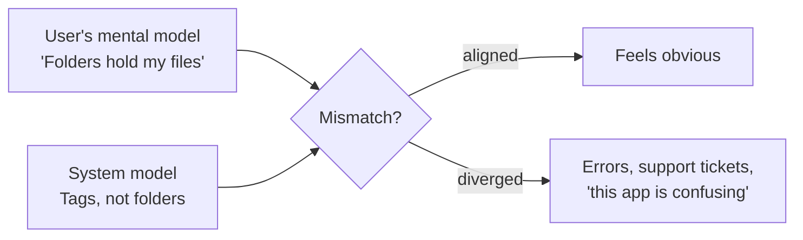

# UI/UX Design Principles (Laws of UX)

The *Laws of UX* are heuristics borrowed from psychology and human factors research. They are not rules that a design either passes or fails; they are predictions about how people will perceive and behave, useful for arguing about a design before it reaches users and for explaining why a usability test went the way it did.

Each law below is stated, illustrated with a small visual example, and followed by what it means in practice. The visuals are deliberately abstract: the point is the perceptual effect, not a particular product's styling.

## Perception and grouping

The Gestalt laws describe how the eye groups things *before* the reader has consciously parsed anything. Layout that fights them costs attention on every screen.

### Law of Proximity

Objects near each other are perceived as related.

<figure>
<svg viewBox="0 0 220 90" role="img" aria-label="Twelve dots evenly spaced, read as one undifferentiated field">
  <g fill="currentColor">
    <circle cx="20" cy="30" r="7"/><circle cx="60" cy="30" r="7"/><circle cx="100" cy="30" r="7"/>
    <circle cx="140" cy="30" r="7"/><circle cx="180" cy="30" r="7"/>
    <circle cx="20" cy="65" r="7"/><circle cx="60" cy="65" r="7"/><circle cx="100" cy="65" r="7"/>
    <circle cx="140" cy="65" r="7"/><circle cx="180" cy="65" r="7"/>
  </g>
</svg>
<figcaption>Even spacing: one group of ten</figcaption>
</figure>
<figure>
<svg viewBox="0 0 220 90" role="img" aria-label="The same dots clustered into three groups by spacing alone">
  <g fill="currentColor">
    <circle cx="16" cy="30" r="7"/><circle cx="38" cy="30" r="7"/><circle cx="16" cy="55" r="7"/><circle cx="38" cy="55" r="7"/>
    <circle cx="100" cy="30" r="7"/><circle cx="122" cy="30" r="7"/><circle cx="100" cy="55" r="7"/><circle cx="122" cy="55" r="7"/>
    <circle cx="184" cy="30" r="7"/><circle cx="184" cy="55" r="7"/>
  </g>
</svg>
<figcaption>Same dots, three groups, from spacing alone</figcaption>
</figure>

Spacing is the cheapest grouping tool there is: no borders, no colour, no labels. A form field whose label sits closer to the *previous* input than to its own is mis-grouped no matter what the markup says.

### Law of Common Region

Elements inside a shared boundary are perceived as a group, and a boundary beats proximity when the two disagree.

<figure>
<svg viewBox="0 0 220 90" role="img" aria-label="Six dots in a row, ungrouped">
  <g fill="currentColor">
    <circle cx="30" cy="45" r="8"/><circle cx="60" cy="45" r="8"/><circle cx="110" cy="45" r="8"/>
    <circle cx="140" cy="45" r="8"/><circle cx="170" cy="45" r="8"/><circle cx="200" cy="45" r="8"/>
  </g>
</svg>
<figcaption>Proximity suggests a 2 / 4 split</figcaption>
</figure>
<figure>
<svg viewBox="0 0 220 90" role="img" aria-label="The same dots with a box drawn around the middle three, which now read as a group">
  <rect x="45" y="20" width="115" height="50" rx="8" fill="none" stroke="currentColor" stroke-width="2" opacity=".6"/>
  <g fill="currentColor">
    <circle cx="30" cy="45" r="8"/><circle cx="60" cy="45" r="8"/><circle cx="110" cy="45" r="8"/>
    <circle cx="140" cy="45" r="8"/><circle cx="170" cy="45" r="8"/><circle cx="200" cy="45" r="8"/>
  </g>
</svg>
<figcaption>A container overrides it: 1 / 3 / 2</figcaption>
</figure>

This is why cards work, and why a card drawn around the wrong set of controls is worse than no card at all.

### Law of Similarity

Elements that share visual characteristics are perceived as having the same function.

<figure>
<svg viewBox="0 0 220 70" role="img" aria-label="A row of shapes where circles and squares alternate, reading as two interleaved kinds">
  <g fill="currentColor">
    <circle cx="25" cy="35" r="9"/>
    <rect x="56" y="26" width="18" height="18"/>
    <circle cx="105" cy="35" r="9"/>
    <rect x="136" y="26" width="18" height="18"/>
    <circle cx="185" cy="35" r="9"/>
  </g>
</svg>
<figcaption>Shape alone splits the row into two classes</figcaption>
</figure>
<figure>

  a real link ·
  another link ·
  not a link

<figcaption>The corollary: look alike, behave alike, or lie</figcaption>
</figure>

The failure mode is the expensive one: underlined non-links, buttons styled as text, and two different components sharing one appearance teach users a rule that then breaks.

### Law of Uniform Connectedness

Elements that are visually connected, by a line, a rail, an enclosing shape, are perceived as more related than elements that are merely near or alike.

<figure>
<svg viewBox="0 0 220 70" role="img" aria-label="Four dots with a connecting line between the first two and between the last two">
  <g stroke="currentColor" stroke-width="3" opacity=".7">
    <line x1="35" y1="35" x2="85" y2="35"/><line x1="135" y1="35" x2="185" y2="35"/>
  </g>
  <g fill="currentColor">
    <circle cx="35" cy="35" r="8"/><circle cx="85" cy="35" r="8"/>
    <circle cx="135" cy="35" r="8"/><circle cx="185" cy="35" r="8"/>
  </g>
</svg>
<figcaption>Connection beats proximity: two pairs, not four dots</figcaption>
</figure>

Stepper rails, tree-view guides, and the line joining a legend swatch to its series all exploit this.

### Law of Prägnanz

The eye resolves ambiguous or complex forms into the simplest interpretation available.

<figure>
<svg viewBox="0 0 220 90" role="img" aria-label="A circle and a square overlapping, read as two simple shapes rather than one complex outline">
  <circle cx="85" cy="45" r="32" fill="none" stroke="currentColor" stroke-width="2"/>
  <rect x="100" y="20" width="60" height="50" fill="none" stroke="currentColor" stroke-width="2"/>
</svg>
<figcaption>Read as circle + square, never as the odd combined outline</figcaption>
</figure>

Simple, regular shapes are processed faster and remembered better, which is the whole argument for restrained iconography and plain layout grids.

## Attention and memory

### Miller's Law and Working Memory

The average person holds about **seven (± two)** items in working memory, and that figure is generous; later work puts the practical limit closer to four. Working memory is also volatile: an interruption wipes it.

<figure>

4916037248851

<figcaption>Unchunked: unreadable, unrepeatable</figcaption>
</figure>
<figure>

4916 0372 4885 1

<figcaption>Chunked: the same digits, now holdable</figcaption>
</figure>

The design consequence is **chunking**, not "never show more than seven things". A list of 200 products is fine; a step that requires remembering seven values from a previous screen is not. Carry state forward for the user instead of asking them to hold it.

### Cognitive Load

Total mental effort spent using the interface. Effort spent decoding the interface is effort not spent on the task.

<figure>
<svg viewBox="0 0 220 80" role="img" aria-label="Bar split mostly into interface overhead, leaving little for the task">
  <rect x="10" y="20" width="150" height="26" fill="currentColor" opacity=".65"/>
  <rect x="160" y="20" width="50" height="26" fill="currentColor" opacity=".2"/>
  <text x="10" y="62" font-size="10" fill="currentColor">interface overhead ▮ task</text>
</svg>
<figcaption>Extraneous load crowds out the actual work</figcaption>
</figure>
<figure>
<svg viewBox="0 0 220 80" role="img" aria-label="Bar with a small overhead segment and a large task segment">
  <rect x="10" y="20" width="45" height="26" fill="currentColor" opacity=".65"/>
  <rect x="55" y="20" width="155" height="26" fill="currentColor" opacity=".2"/>
  <text x="10" y="62" font-size="10" fill="currentColor">interface overhead ▮ task</text>
</svg>
<figcaption>The budget is fixed; only the split is designable</figcaption>
</figure>

### Selective Attention

People filter out anything that resembles what they came to ignore.

<figure>

728 × 90, banner-shaped, right-rail, dismissible

↑ invisible to a user hunting for content

<figcaption>Banner blindness: format, not content, triggers the filter</figcaption>
</figure>

Important messages placed in ad-shaped containers are not seen. Neither are consent notices styled like marketing.

### Serial Position Effect

Items at the beginning and end of a sequence are recalled best; the middle sags.

<figure>
<svg viewBox="0 0 220 90" role="img" aria-label="U-shaped recall curve, high at the first and last positions and low in the middle">
  <polyline points="20,25 60,55 100,70 140,70 180,50 205,22" fill="none" stroke="currentColor" stroke-width="2.5"/>
  <line x1="12" y1="80" x2="212" y2="80" stroke="currentColor" stroke-width="1" opacity=".4"/>
  <text x="12" y="90" font-size="9" fill="currentColor">first</text>
  <text x="186" y="90" font-size="9" fill="currentColor">last</text>
</svg>
<figcaption>Recall by position: primacy and recency win</figcaption>
</figure>

Put the primary action first or last in a navigation set. The middle of a long menu is where features go to be forgotten.

### Von Restorff Effect (Isolation Effect)

When several similar objects are present, the one that differs is remembered.

<figure>

Cancel
Save draft
Publish

<figcaption>One emphasised action; the rest recede</figcaption>
</figure>
<figure>

Cancel
Save draft
Publish

<figcaption>Everything emphasised: nothing is</figcaption>
</figure>

Do not carry the emphasis on colour alone, that fails for colour-blind users and in monochrome. Pair it with weight, size, or position.

### Zeigarnik Effect

Uncompleted tasks are remembered better than completed ones, and the open loop creates pressure to close it.

<figure>

Profile completeness

  

3 of 5 steps done, add a photo to finish

<figcaption>A visible open loop pulls users back</figcaption>
</figure>

Progress indicators, "2 steps left", and saved-but-unsent drafts all use it. It becomes a dark pattern when the loop is manufactured rather than real.

### Goal-Gradient Effect

Motivation increases as people approach a goal, and *apparent* progress counts.

<figure>
<svg viewBox="0 0 220 80" role="img" aria-label="Two punch cards, one empty with eight slots and one with ten slots of which two are pre-stamped">
  <g fill="none" stroke="currentColor" stroke-width="2">
    <g>
      <circle cx="20" cy="25" r="7"/><circle cx="40" cy="25" r="7"/><circle cx="60" cy="25" r="7"/><circle cx="80" cy="25" r="7"/>
      <circle cx="100" cy="25" r="7"/><circle cx="120" cy="25" r="7"/><circle cx="140" cy="25" r="7"/><circle cx="160" cy="25" r="7"/>
    </g>
    <g>
      <circle cx="20" cy="60" r="7" fill="currentColor"/><circle cx="40" cy="60" r="7" fill="currentColor"/>
      <circle cx="60" cy="60" r="7"/><circle cx="80" cy="60" r="7"/><circle cx="100" cy="60" r="7"/><circle cx="120" cy="60" r="7"/>
      <circle cx="140" cy="60" r="7"/><circle cx="160" cy="60" r="7"/><circle cx="180" cy="60" r="7"/><circle cx="200" cy="60" r="7"/>
    </g>
  </g>
</svg>
<figcaption>Identical work remaining; the pre-stamped card gets finished more often</figcaption>
</figure>

Grant artificial head-starts, and make the remaining distance visible. Never show progress that isn't real.

## Decision and action

### Hick's Law

Decision time grows logarithmically with the number and complexity of choices:

$$ T = b \log_2\!\left(n + 1\right) $$

<figure>

Export as: PDF · PDF/A · PNG · JPEG · TIFF · SVG · EPS · DOCX · ODT · RTF · TXT · CSV · JSON · XML

<figcaption>14 flat options: one long scan, one hard decision</figcaption>
</figure>
<figure>

Export as: <strong>PDF</strong> · Image ▸ · Document ▸ · Data ▸

<figcaption>Same options, categorised: three easy decisions</figcaption>
</figure>

The fix is rarely deletion, it is progressive disclosure, categorisation, and a sane default. Note the "complexity" term: five unfamiliar options can cost more than fifty familiar ones.

### Choice Overload

Beyond decision *time*, too many comparable options reduce satisfaction and the likelihood of choosing at all.

<figure>
<svg viewBox="0 0 220 80" role="img" aria-label="Conversion falling as the number of options rises">
  <polyline points="18,25 55,20 95,35 140,55 190,66" fill="none" stroke="currentColor" stroke-width="2.5"/>
  <line x1="12" y1="72" x2="212" y2="72" stroke="currentColor" stroke-width="1" opacity=".4"/>
  <text x="12" y="80" font-size="9" fill="currentColor">few options</text>
  <text x="160" y="80" font-size="9" fill="currentColor">many</text>
</svg>
<figcaption>More choice, less conversion, and more regret afterwards</figcaption>
</figure>

Highlight a recommended plan, cap comparison sets, and let filters do the elimination.

### Fitts's Law

Time to acquire a target depends on its distance and size:

$$ T = a + b \log_2\!\left(\frac{2D}{W}\right) $$

<figure>
<svg viewBox="0 0 220 90" role="img" aria-label="A cursor far from a small target versus close to a large target">
  <text x="8" y="30" font-size="14" fill="currentColor">▶</text>
  <rect x="185" y="20" width="16" height="10" fill="currentColor"/>
  <line x1="24" y1="25" x2="180" y2="25" stroke="currentColor" stroke-dasharray="4 3" opacity=".5"/>
  <text x="8" y="70" font-size="14" fill="currentColor">▶</text>
  <rect x="60" y="55" width="80" height="24" fill="currentColor"/>
  <line x1="24" y1="66" x2="56" y2="66" stroke="currentColor" stroke-dasharray="4 3" opacity=".5"/>
</svg>
<figcaption>Far + small is slow; near + large is fast</figcaption>
</figure>

Practical consequences: touch targets of at least 44 × 44 px, the whole row clickable rather than the four-word link inside it, and destructive actions deliberately *not* adjacent to the ones people click all day. Screen edges are effectively infinite in size, a cursor cannot overshoot them, which is why edge-docked menus and bars are fast.

### Doherty Threshold

Productivity rises sharply when system response stays under **400 ms**, because neither the user nor the computer waits for the other.

<figure>
<svg viewBox="0 0 220 84" role="img" aria-label="Latency bands from instant to attention-lost">
  <rect x="10" y="18" width="45" height="20" fill="currentColor" opacity=".75"/>
  <rect x="57" y="18" width="45" height="20" fill="currentColor" opacity=".5"/>
  <rect x="104" y="18" width="45" height="20" fill="currentColor" opacity=".3"/>
  <rect x="151" y="18" width="59" height="20" fill="currentColor" opacity=".15"/>
  <text x="10" y="52" font-size="9" fill="currentColor">&lt;100ms instant</text>
  <text x="10" y="66" font-size="9" fill="currentColor">&lt;400ms flow · &lt;1s uninterrupted · &gt;10s attention lost</text>
</svg>
<figcaption>Perceived-performance bands</figcaption>
</figure>

When the work genuinely takes longer, buy back the perception: optimistic UI, skeleton screens, progress that reflects real progress, and useful work started before the user finishes typing.

### Tesler's Law (Conservation of Complexity)

Every system has irreducible complexity. The only question is who absorbs it, the user, or the engineering.

<figure>
<svg viewBox="0 0 220 90" role="img" aria-label="A fixed-size block of complexity shifted between the user side and the system side">
  <rect x="12" y="16" width="196" height="22" fill="none" stroke="currentColor" opacity=".5"/>
  <rect x="12" y="16" width="130" height="22" fill="currentColor" opacity=".55"/>
  <text x="12" y="52" font-size="9" fill="currentColor">user absorbs ▮ system absorbs</text>
  <rect x="12" y="60" width="196" height="22" fill="none" stroke="currentColor" opacity=".5"/>
  <rect x="12" y="60" width="45" height="22" fill="currentColor" opacity=".55"/>
</svg>
<figcaption>The total never shrinks; it only moves</figcaption>
</figure>

Address parsing, timezone handling, and retry logic are complexity someone pays for. Paying it once in code beats charging every user for it forever.

### Occam's Razor

Among designs that meet the requirements, prefer the one with the fewest parts, and remove elements only until removing one more would break the design.

<figure>

[icon] <strong>Search</strong> 
Enter a term to search the catalogue below 
▭
Go · clear · advanced · help

<figcaption>Five decorations around one input</figcaption>
</figure>
<figure>

🔍 Search the catalogue

<figcaption>The same function, nothing left to remove</figcaption>
</figure>

### Pareto Principle

Roughly 80% of effects come from 20% of causes. In products: a small subset of features carries most of the usage.

<figure>
<svg viewBox="0 0 220 84" role="img" aria-label="A long-tail usage distribution with a few dominant features">
  <g fill="currentColor">
    <rect x="14" y="12" width="20" height="56"/><rect x="38" y="26" width="20" height="42"/>
    <rect x="62" y="42" width="20" height="26"/><rect x="86" y="54" width="20" height="14"/>
    <rect x="110" y="60" width="20" height="8"/><rect x="134" y="63" width="20" height="5"/>
    <rect x="158" y="64" width="20" height="4"/><rect x="182" y="65" width="20" height="3"/>
  </g>
  <line x1="10" y1="68" x2="210" y2="68" stroke="currentColor" opacity=".4"/>
</svg>
<figcaption>Optimise the head; do not let the tail set the layout</figcaption>
</figure>

Measure before deciding which 20% it is. The tail still matters, it just should not be the default view.

### Parkinson's Law

Work expands to fill the time available. Users take as long as they are given.

<figure>

Pay with saved card 
or 
enter card details manually

<figcaption>Autofill and one-tap paths shorten the task before habit lengthens it</figcaption>
</figure>

Making a task *possible* to complete quickly is not enough, the fast path must also be the obvious one.

## Expectation

### Jakob's Law

Users spend most of their time on *other* sites, so they expect yours to work like the ones they already know.

<figure>

🔍 &nbsp; 🛒 &nbsp; ☰
<strong>logo</strong> &nbsp; Products &nbsp; Pricing &nbsp; Docs

<figcaption>Conventional: logo left, cart right, hamburger far right</figcaption>
</figure>
<figure>

☰ &nbsp; 🛒 &nbsp; <strong>logo</strong> Pricing &nbsp; Docs &nbsp; Products

<figcaption>Novel: every user pays the learning cost</figcaption>
</figure>

Innovate where it differentiates the product. Do not innovate on the location of the close button.

### Mental Model

People carry a belief about how a system works, formed from every similar system they have used. Friction appears when the design's model and the user's model diverge.

Match the model, or teach it deliberately, a metaphor, an onboarding pass, an empty state that shows the intended shape.

### Postel's Law (Robustness Principle)

*Be liberal in what you accept, and conservative in what you send.*

<figure>

Phone: <code>+1 (415) 555-0132</code> 
✗ Digits only, no spaces or symbols

<figcaption>Rejecting input the system could easily normalise</figcaption>
</figure>
<figure>

Phone: <code>+1 (415) 555-0132</code> 
Saved as +14155550132

<figcaption>Accept any reasonable form; normalise internally</figcaption>
</figure>

Accept whatever the human can plausibly type; be strict and predictable in what you output and store. Liberal parsing is not permission to skip validation at trust boundaries, normalise *then* validate.

### Paradox of the Active User

Users never read the manual. They start acting immediately, so learning must happen inside the doing.

<figure>

<strong>Welcome!</strong> 7 slides of feature tour before you can begin. 
[Skip] ← what everyone clicks

<figcaption>Upfront instruction, discarded</figcaption>
</figure>
<figure>

Empty project · Start from a template 
Tip appears the first time you drag a block

<figcaption>Instruction delivered at the moment of need</figcaption>
</figure>

## Feeling

### Aesthetic-Usability Effect

People perceive attractive designs as more usable, tolerate minor problems in them longer, and report higher satisfaction for the same task performance.

<figure>

<strong>Submit request</strong> 
Name &nbsp; 
OK

<figcaption>Same flow, judged harder to use</figcaption>
</figure>
<figure>

<strong>Submit request</strong> 
Name 
&nbsp; 
Submit

<figcaption>Same flow, judged easier</figcaption>
</figure>

The effect cuts both ways: polish masks usability problems during testing, so a beautiful prototype can hide defects that survive to production.

### Peak-End Rule

People judge an experience largely by its most intense moment and by how it ended, not by the average.

<figure>
<svg viewBox="0 0 220 90" role="img" aria-label="An experience curve with a marked peak and a marked endpoint">
  <polyline points="15,60 45,52 75,20 105,58 135,55 165,48 200,28" fill="none" stroke="currentColor" stroke-width="2.5"/>
  <circle cx="75" cy="20" r="5" fill="currentColor"/>
  <circle cx="200" cy="28" r="5" fill="currentColor"/>
  <text x="58" y="14" font-size="9" fill="currentColor">peak</text>
  <text x="178" y="20" font-size="9" fill="currentColor">end</text>
</svg>
<figcaption>These two points dominate the memory of the whole</figcaption>
</figure>

Invest in the moments that matter most, and in the endings: a confirmation screen, an order delivered, an error that is handled gracefully. Negative peaks are weighted more heavily than positive ones, so removing the worst moment beats adding a delightful one.

### Flow

The state of full absorption in a task, reached when challenge and skill are matched and feedback is immediate.

<figure>
<svg viewBox="0 0 220 100" role="img" aria-label="Challenge versus skill chart with anxiety above the diagonal, boredom below, and flow along it">
  <line x1="20" y1="85" x2="205" y2="85" stroke="currentColor" opacity=".4"/>
  <line x1="20" y1="85" x2="20" y2="10" stroke="currentColor" opacity=".4"/>
  <line x1="20" y1="85" x2="200" y2="15" stroke="currentColor" stroke-width="2.5"/>
  <text x="44" y="30" font-size="9" fill="currentColor">anxiety</text>
  <text x="128" y="76" font-size="9" fill="currentColor">boredom</text>
  <text x="112" y="42" font-size="9" fill="currentColor" transform="rotate(-21 112 42)">flow</text>
  <text x="150" y="96" font-size="8" fill="currentColor">skill →</text>
</svg>
<figcaption>Flow lives on the diagonal; the interface has to move with the user</figcaption>
</figure>

This is the argument for progressive disclosure with an accelerating path: defaults and guardrails for the novice, keyboard shortcuts and bulk operations for the expert, in the same product.

## Using these laws

- They are **heuristics, not acceptance criteria**. They generate hypotheses; usability testing and analytics decide.
- They **conflict**. Fitts's Law wants big, close targets; Hick's Law wants fewer of them; Jakob's Law wants them where every other product puts them. Resolving that is the design work.
- They are **descriptive, not permission**. Zeigarnik, goal-gradient, and choice architecture all convert directly into dark patterns when used to serve the business against the user. The same research that makes an interface humane makes it manipulative, the difference is intent, and it is visible in the metrics you chose to optimise.
- They **do not replace accessibility**. Every visual technique above needs a non-visual equivalent: grouping expressed in the accessibility tree, emphasis not carried by colour alone, targets reachable by keyboard.

Related: [Usability](../Software Architecture/Architectural Characteristics/Usability.md) as an architectural characteristic, and [Design Principles](Design Principles.md).

