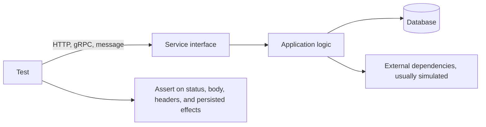
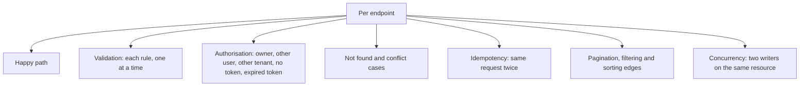

# API Testing

**API testing** exercises a service through its programmatic interface rather than through
a user interface. It is the highest-value layer in most automated suites: far more
realistic than a unit test, far faster and more stable than a browser-driven one.

## What to assert

| Aspect | Examples |
|---|---|
| **Status codes** | 201 on create, 404 on missing, 409 on conflict, 422 on validation failure |
| **Body and schema** | Required fields present, types correct, no unexpected data leakage |
| **Headers** | Content type, caching, security headers, pagination links |
| **Persisted effects** | The row exists with the right values, which the response alone does not prove |
| **Side effects** | Events published, messages queued, exactly once |
| **Errors** | Machine-readable error codes, not just a message string |

Asserting on the persisted effect is what makes this
[gray box](../Testing%20Techniques/Gray%20Box%20Testing.md) rather than black box testing,
and it catches the class of defect where the response says success and nothing was written.

## Cases worth covering

The authorisation row is a table-driven test, not a set of hand-written cases, and it is
the highest-severity coverage available at this level. See
[security testing](../Non-Functional%20Testing/Security%20Testing.md).

Idempotency is second. Retrying a request with the same idempotency key must not create a
second order or a second charge, and clients retry constantly in the real world.

## Contract stability

APIs have consumers, so backward compatibility is part of correctness.

| Change | Compatible? |
|---|---|
| Adding an optional response field | Yes, if consumers ignore unknown fields |
| Adding a required request field | No |
| Removing or renaming a field | No |
| Narrowing an accepted value range | No |
| Changing an error code for an existing condition | No, consumers branch on it |

Schema assertions catch accidental removals. For guarantees across teams and services, use
[contract testing](../Testing%20Approaches/Contract%20Testing.md), which verifies what
consumers actually depend on rather than the whole schema.

## Practice notes

- **Own your test data.** Each test creates the resources it needs and cleans up, so tests
  can run in parallel and in any order.
- **Simulate third parties, verify the real contract separately.** Provider sandboxes for
  the tests, contract checks for the truth.
- **Assert on error bodies.** Error handling is where most escaped API defects live, and
  most suites test only the happy path.
- **Do not re-test business rules already covered by unit tests.** Cover the wiring,
  serialisation, validation and persistence, not every pricing permutation.
- **Keep response snapshots narrow.** Snapshotting an entire body including timestamps and
  identifiers makes every harmless change a failure, and the team starts re-approving
  without reading.

## Check Your Understanding

<quiz>
Why should an API test assert on persisted state rather than only on the response?

- [ ] Because response bodies are not stable enough to assert on
- [x] Because a correct status and body can be returned while nothing was written, so the response alone is a weak oracle
> Correct. Asserting on the effects is what makes the test meaningful at this level.
- [ ] Because status codes vary between environments
- [ ] Because schema validation cannot detect missing fields
</quiz>

<quiz>
Which API test coverage is highest severity and most easily table driven?

- [ ] Pagination boundary values
- [x] Authorisation across owner, another user, another tenant, no token and expired token for every endpoint
> Correct. Broken access control is the most common serious category and is mechanical to cover.
- [ ] Response header caching directives
- [ ] Sorting stability for equal keys
</quiz>
