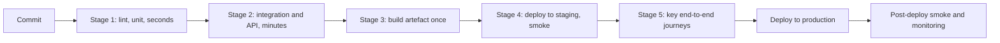
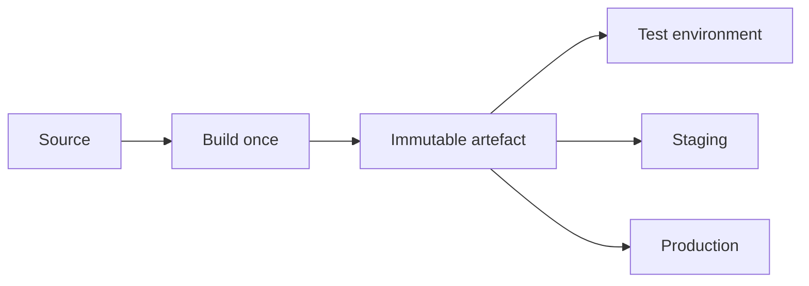
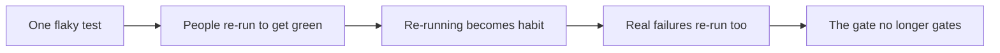

# Automated Testing in CI/CD

A test suite's value depends on where it runs. The same tests provide dramatically
different protection depending on whether they gate a merge, run nightly, or sit in a
folder nobody executes.

## Fail fast, cheapest first

Order the pipeline by cost, so the expensive stages never run on a build the cheap ones can
already reject. Two minutes of unit tests that reject a broken commit saves the thirty
minutes of environment provisioning behind it.

| Stage | Runtime budget | Gates |
|---|---|---|
| Lint, type check, unit | Under 5 minutes | Every commit and pull request |
| Integration and API | Under 15 minutes | Every pull request |
| End-to-end on key journeys | Under 30 minutes | Merge to main, and pre-release |
| Performance and security scans | Longer | Nightly, and pre-release |
| Full compatibility matrix | Longest | Pre-release |

Budgets matter more than they look. Once the pull request pipeline exceeds roughly fifteen
minutes, people stop waiting for it, start batching changes, and the feedback loop the
pipeline exists to provide is gone.

## Build once, promote the artefact

Rebuilding per environment means the thing tested is not the thing deployed. Build once,
test that artefact, promote the same bytes, and vary only configuration.

## Quality gates

A gate is an automated criterion that stops the pipeline. Useful ones are objective, fast
and non-negotiable in the moment.

| Gate | Reasonable rule |
|---|---|
| Tests | Any failure stops the pipeline |
| Coverage | Coverage of *changed lines* must not drop below a threshold |
| Static analysis | No new high-severity findings |
| Dependencies | No new critical vulnerabilities |
| Performance | Key endpoint budgets not regressed beyond a margin |
| Migration | Migrations apply cleanly and are reversible |

Gate on the delta rather than the absolute wherever possible. A project-wide coverage
threshold on a legacy codebase is either unachievable or gamed, while "do not make the
changed lines worse" is fair and effective.

## Flakiness is a pipeline-level emergency

Detect flakiness automatically by tracking pass and fail history per test, quarantine
offenders out of the gating path immediately, and fix or delete them on a deadline. A
quarantine with no deadline is just a slower way of deleting them.

## Beyond the pipeline

- **Deployment strategies as testing.** Canary and blue-green releases expose a change to a
  small share of real traffic with automatic rollback on error budget burn, which tests
  under conditions no environment reproduces.
- **Post-deploy verification.** A short smoke suite after each production deploy turns a
  rollback decision from twenty minutes of manual checking into two minutes of automation.
- **Monitoring as the last test.** Alerting on symptoms, error rates and latency
  percentiles is the check that runs continuously against real usage.

## Check Your Understanding

<quiz>
Why should the pipeline run cheap stages before expensive ones?

- [ ] Because expensive stages are less reliable
- [x] Because a broken build rejected in two minutes never consumes the thirty minutes of provisioning and end-to-end testing behind it
> Correct. Fail fast keeps both feedback time and infrastructure cost down.
- [ ] Because coverage cannot be measured after integration tests
- [ ] Because artefacts must be built before unit tests can run
</quiz>

<quiz>
Why gate on coverage of changed lines instead of total project coverage?

- [ ] Because tools measure changed lines more accurately
- [x] Because it targets the newly risky code, is achievable without backfilling legacy tests, and is harder to satisfy by farming easy coverage elsewhere
> Correct. Gating on deltas is fair on legacy codebases and still enforces improvement.
- [ ] Because total coverage cannot be computed in a pipeline
- [ ] Because changed lines are always covered by unit tests
</quiz>
