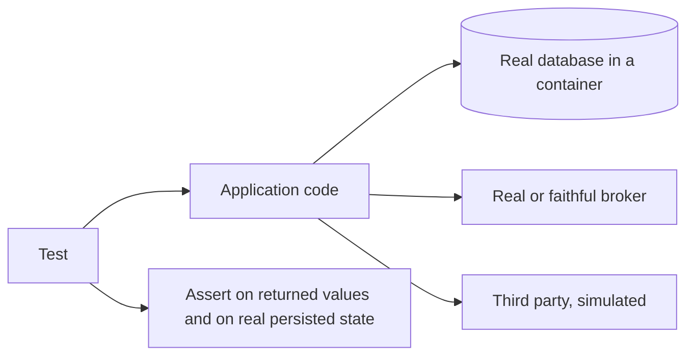
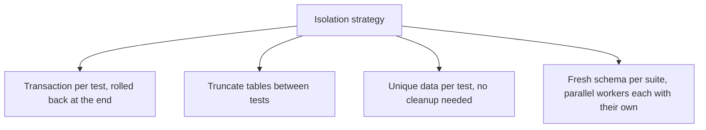

# Integration Test Automation

[Integration testing](../Test%20Levels/Integration%20Testing.md) explains what this level
tests. This page is about automating it: making tests that cross real seams fast enough,
isolated enough and reliable enough to run on every commit.

## Containerised dependencies

The practice that made this level practical: start the real database, broker or cache as a
container from within the test run.

| Approach | Fidelity | Cost |
|---|---|---|
| **Real engine in a container per suite** | High, it is the actual engine | Seconds of startup, reusable across tests |
| **Shared long-lived environment** | High | Collisions, ordering dependencies, flakiness |
| **In-memory substitute of a different engine** | Low, different dialect and constraints | Fast, and misleading |

Prefer the first. The third is the classic false economy: the test suite passes against a
different database than the one production runs, so dialect, constraint and migration
defects survive to release.

## Isolation between tests

Integration tests share expensive state, which is where flakiness comes from.

| Strategy | Speed | Caveat |
|---|---|---|
| Transaction rollback | Fastest | Cannot test code that commits or uses its own transactions |
| Truncate between tests | Fast | Must cover every table, including new ones |
| Unique data per test | Fast, parallel-friendly | Requires discipline in every test |
| Schema per worker | Slower to start | The most robust for parallel runs |

Whatever the choice, no test may depend on data left by another. Order dependence is a
[flaky test](../Test%20Quality/Flaky%20Tests.md) waiting for a parallel run.

## What to make real, again

| Dependency | Default |
|---|---|
| Your database | Real, in a container, with the real migrations applied |
| Your message broker | Real or an in-process implementation with the same delivery semantics |
| Your cache | Real, since eviction and serialisation are what you are testing |
| Third-party APIs | Simulated locally, with a separate [contract test](../Testing%20Approaches/Contract%20Testing.md) against the real one |
| Clock, randomness, identifiers | Controlled |

Run the real migrations rather than loading a schema dump. Migration failures are among the
most common deployment incidents, and running them in every integration suite tests them
continuously for free.

## Keeping the suite fast

- **Start dependencies once per suite**, not once per test.
- **Parallelise with isolated data**, which is the largest available speedup.
- **Seed the minimum.** Large shared fixtures make tests slow and couple them together.
- **Do not re-test business rules** already covered by unit tests. This level exists for
  the seams: mapping, transactions, serialisation, queries, wiring.
- **Budget the runtime.** If the integration suite outgrows the pull request window, it
  gets moved to nightly, and nightly feedback is worth a fraction of per-commit feedback.

## Check Your Understanding

<quiz>
Why run the real database migrations in the integration suite rather than loading a schema dump?

- [ ] Dumps cannot represent indexes and constraints
- [x] Migration failures are a common deployment incident, and running them on every suite exercises them continuously at no extra cost
> Correct. It also guarantees the tested schema matches what deployment will actually produce.
- [ ] Migrations run faster than restoring a dump
- [ ] Schema dumps are incompatible with containerised databases
</quiz>

<quiz>
Two integration tests pass individually and fail when run in parallel. What is the most likely cause?

- [ ] The container startup time exceeded the timeout
- [x] They share data or state, so isolation per test is missing and one test's effects reach the other
> Correct. Transaction rollback, truncation, unique data or a schema per worker all address this.
- [ ] The database dialect differs from production
- [ ] Assertions were made on persisted state rather than return values
</quiz>
