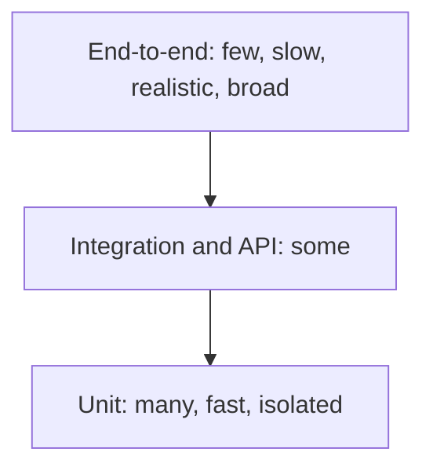
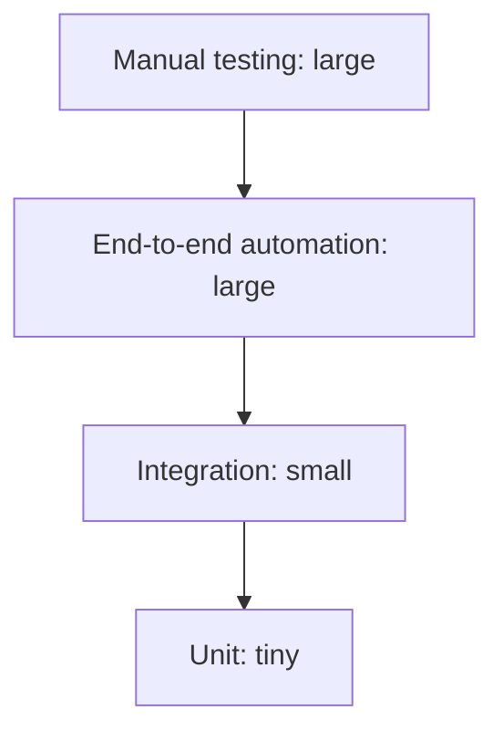

# Test Automation Pyramid

The **test automation pyramid**, from Mike Cohn, is a rule of thumb about the *shape* of a
suite: many fast isolated tests at the bottom, fewer as you go up, very few slow broad ones
at the top.

## Why the shape

Each property that makes a test valuable degrades as you move up.

| | Unit | Integration and API | End-to-end |
|---|---|---|---|
| **Speed** | Milliseconds | Seconds | Minutes |
| **Diagnosis on failure** | Names one behaviour | Names one seam | Requires investigation |
| **Realism** | Low | Medium | High |
| **Fragility** | Low | Medium | High |
| **Cost to maintain** | Low | Medium | High |
| **How many** | Thousands | Hundreds | Tens |

The trade is realism against feedback quality. High realism is worth paying for a few
times, on the journeys that matter, and not worth paying thousands of times for validation
rules a unit test settles in a millisecond.

## The inverted pyramid, or ice cream cone

The failure state most teams drift into, usually because end-to-end tests can be added
without changing the production code, whereas unit tests require testable design.

Its symptoms are consistent: suite takes hours, failures are ambiguous, flakiness is
normal, people re-run until green, and the team eventually stops trusting the suite while
still paying for it.

## Where the model needs adjusting

The pyramid is a heuristic, not a law, and two refinements are worth knowing.

- **The testing trophy** puts the greatest weight on integration tests, arguing that for
  applications made mostly of glue code, the seams are where the defects are and unit tests
  of thin wrappers prove little. For a service that mostly translates HTTP to SQL, that is
  a fair reading.
- **Microservice architectures** shift weight toward
  [contract testing](../Testing%20Approaches/Contract%20Testing.md), which gives much of
  the confidence of cross-service end-to-end tests without the cost of running the whole
  estate in one environment.

The invariant that survives every variation: the higher a test sits, the fewer of them
there should be, and every check should live at the lowest level that can catch the defect.

## Using it as a diagnostic

| Observation | What it usually means |
|---|---|
| Suite takes hours | Too much weight at the top |
| Failures are hard to attribute | Too much weight at the top |
| Unit tests pass but nothing works together | Missing middle layer |
| Every refactor breaks many tests | Unit tests coupled to structure, not the pyramid's fault |
| Few unit tests because code is untestable | A production design problem, not a testing problem |

The last row is the important diagnosis. A team that cannot write unit tests usually has
constructors doing I/O, static singletons and hard-wired clocks, and no amount of
end-to-end automation compensates for that.

## Check Your Understanding

<quiz>
Why should end-to-end tests be few?

- [ ] Because they cannot be run in continuous integration
- [x] They are slow, fragile and give ambiguous failures, so their high realism is worth paying for only on the journeys that matter most
> Correct. Every check that a lower level can catch belongs at that lower level.
- [ ] Because they duplicate acceptance testing
- [ ] Because browser automation tools are unreliable by nature
</quiz>

<quiz>
A team has an inverted pyramid and cannot add unit tests because the code is hard to test. What is the real problem?

- [ ] The unit testing framework is unsuitable for the language
- [x] A production design problem: I/O in constructors, static state and hard-wired dependencies, which no amount of end-to-end automation compensates for
> Correct. Testability is a property of the design, and the pyramid's shape reflects it.
- [ ] The team needs more end-to-end coverage first
- [ ] Unit tests are unnecessary when integration tests exist
</quiz>
