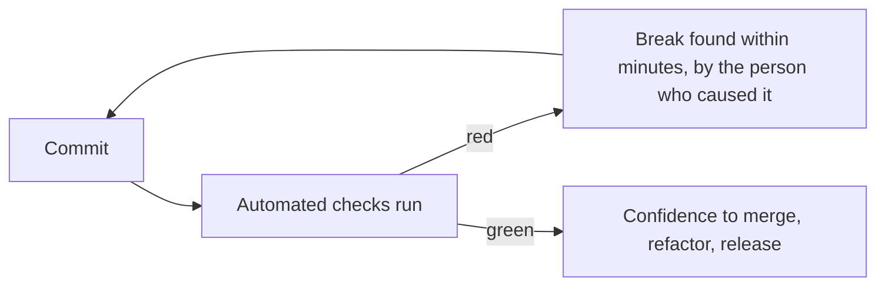
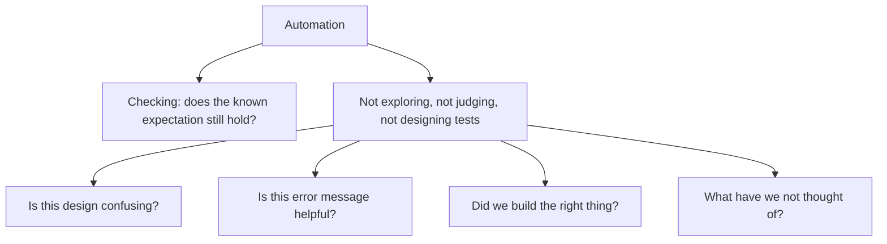

# Test Automation

**Test automation** is using software to execute checks and report results, instead of a
person performing them. Its value is not that machines are cheaper than people. It is that
a check which runs on every commit changes what the team can safely do.

## What automation actually buys

| Benefit | Why it matters |
|---|---|
| **Fast feedback** | A break found in minutes is fixed by the author, in context, for a fraction of the cost |
| **Repeatability** | The same check, the same way, every time, with no attention drift |
| **Refactoring safety** | Structural change is only safe when something confirms behaviour is unchanged |
| **Scale** | Thousands of checks per commit, which no manual process can reach |
| **Frees human attention** | People move to [exploratory testing](../Testing%20Techniques/Exploratory%20Testing.md), which machines cannot do |

The last row is the strategically important one. Automation is not a replacement for
testers, it is what stops testers from spending their week re-verifying what already worked
yesterday.

## What automation cannot do

An automated suite verifies the expectations someone already had. It never has a new one.
That is why a heavily automated project with no exploratory work still ships surprises.

## Costs to plan for

Automation is code, and it has the cost profile of code.

| Cost | Notes |
|---|---|
| **Writing** | Usually the smallest part, and the only one teams estimate |
| **Maintenance** | Tests change whenever behaviour changes, and badly written ones change when it does not |
| **Infrastructure** | Environments, data, containers, runners, parallelisation |
| **Debugging failures** | Cheap at the unit level, expensive for broad end-to-end tests |
| **Flakiness** | The largest hidden cost, because it also destroys trust in everything else |

A test that costs more to maintain than the defects it catches should be deleted. That
judgement is uncomfortable and is the reason most suites are larger than they are useful.

## Making it stick

- **Own it like production code.** Review it, refactor it, name things well, remove
  duplication. A test suite nobody refactors becomes a suite nobody can change.
- **Run it where it matters.** An automated suite that runs nightly and is triaged weekly
  provides a fraction of the value of the same suite gating every commit.
- **Fail loudly and fix immediately.** A red build that stays red for a day teaches the
  team that red does not mean anything.
- **Quarantine flakiness rather than tolerating it.** One test that fails randomly trains
  everyone to re-run until green.
- **Keep the shape right.** See the
  [test automation pyramid](Test%20Automation%20Pyramid.md), and
  [what should be automated](What%20Should%20Be%20Automated.md) for choosing candidates.

## Check Your Understanding

<quiz>
What is the strongest argument for test automation?

- [ ] It is cheaper per test execution than manual testing
- [x] It gives feedback fast enough and often enough to make continuous change safe, and frees people for work machines cannot do
> Correct. The value is in what the team can now do safely, not in the per-execution cost.
- [ ] It removes the need for testers on the team
- [ ] It guarantees higher coverage than manual testing
</quiz>

<quiz>
Which cost of automation is most often underestimated?

- [ ] The initial cost of writing the tests
- [x] Maintenance and flakiness, since tests are code that changes with the system and unreliable tests destroy trust in the whole suite
> Correct. Writing is usually the smallest and the only estimated part.
- [ ] The licence cost of automation tooling
- [ ] The time spent choosing a framework
</quiz>
