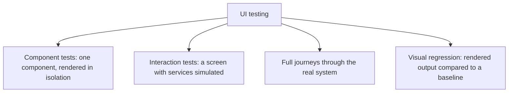
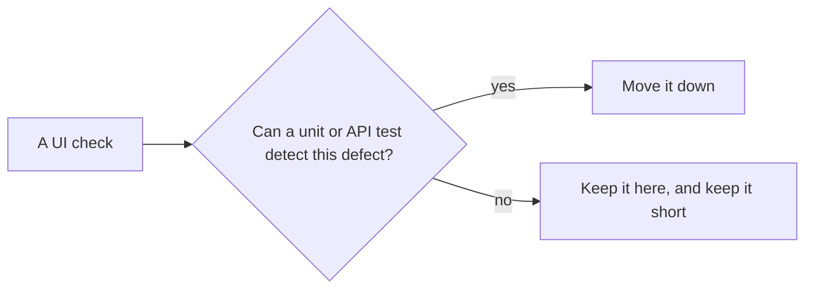

# UI Testing

**UI testing** drives the application through its user interface. It is the only automation
that exercises what the user actually touches, and it is the slowest, most fragile layer in
the suite, so it has to be used sparingly and built carefully.



Most UI checks belong in the first two rows, where they run in milliseconds and fail
precisely. Reserve full journeys for the handful of paths whose breakage would stop the
business.

## Why UI tests break

| Cause | Fix |
|---|---|
| **Timing** | Wait for a condition, never for a fixed duration. No sleeps |
| **Brittle selectors** | Address elements by role and accessible name, or by a stable test identifier, never by CSS path or position |
| **Shared data** | Each test creates its own users and records |
| **Animation** | Disable animation in the test environment |
| **Environment drift** | Pin browser versions, run in containers |
| **Third-party widgets** | Simulate them, or exclude the region from visual comparison |

Selecting elements by role and accessible name has a bonus: a test that cannot find the
button by its accessible name has just found an
[accessibility](../Non-Functional%20Testing/Accessibility%20Testing.md) defect.

## Page objects, and their limits

Wrapping screens in objects that expose intent rather than selectors keeps the tests
readable and centralises the churn.

```python
class CheckoutPage:
    def enter_card(self, number, expiry): ...
    def submit(self): ...
    def confirmation_message(self): ...
```

```python
def test_successful_purchase(checkout: CheckoutPage):
    checkout.enter_card("4242...", "12/30")
    checkout.submit()
    assert "Thank you" in checkout.confirmation_message()
```

The limit is that page objects reduce maintenance cost without reducing runtime cost or
fragility. They make a large UI suite cheaper to own, not a good idea.

## Visual regression testing

Comparing rendered screenshots against approved baselines catches layout breakage that no
assertion describes. It is genuinely useful and has two failure modes worth planning for:

- **Noise.** Font rendering, animation, dynamic data and platform differences produce
  diffs that mean nothing. Pin the environment, mask dynamic regions, allow a small
  tolerance.
- **Blind approval.** If updating baselines becomes routine, the baseline stops being an
  oracle and starts recording whatever the code last did, including the bug.

## Keeping the layer small



Validation messages, pricing rules, permission logic and error handling should all be
covered below the UI. What genuinely needs the UI: navigation and routing, form wiring,
rendering of state, and the two or three critical journeys end to end.

Capture screenshots, video, console output and network logs on failure automatically.
Without them, a UI failure in CI is a guess, and guessing is how flaky tests get re-run
instead of fixed.

## Check Your Understanding

<quiz>
Why prefer selecting elements by role and accessible name over CSS selectors?

- [ ] Role-based selectors execute faster in the browser
- [x] They survive styling and markup changes, and a failure to find an element by its accessible name also reveals an accessibility defect
> Correct. It couples the test to the interface's meaning rather than its structure.
- [ ] CSS selectors cannot be used in modern automation tools
- [ ] Accessible names are unique by specification
</quiz>

<quiz>
What is the main risk of visual regression testing over time?

- [ ] Screenshots consume too much storage
- [x] Routine approval of baseline updates turns the baseline into a record of whatever the code last did, bug included
> Correct. This is the snapshot oracle problem, and it is why diffs must actually be read.
- [ ] It cannot detect layout changes below a certain size
- [ ] It requires the full system to be deployed
</quiz>
