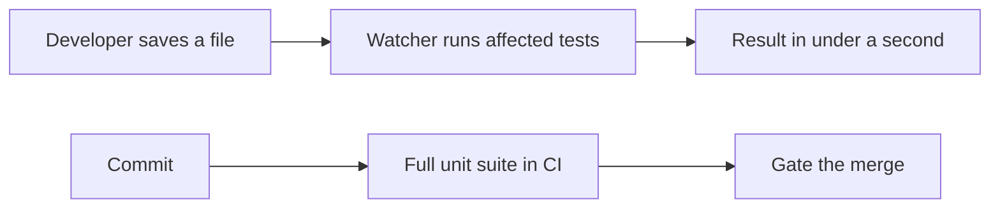
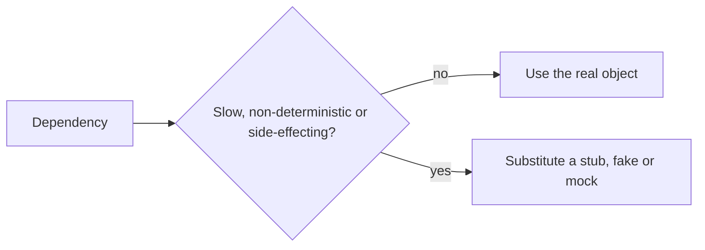

# Unit Test Automation

Automating [unit tests](../Test%20Levels/Unit%20Testing.md) is the base of the
[pyramid](Test%20Automation%20Pyramid.md) and the cheapest automation a team can own. This
page is about the mechanics: how the tests are structured, run and kept fast.



The two loops matter for different reasons. The inner loop changes how code gets written.
The outer loop is what makes the guarantee collective.

## Structure that survives

| Practice | Effect |
|---|---|
| **Arrange, act, assert** with visible separation | The scenario is readable at a glance |
| **One behaviour per test** | A failure names one thing |
| **Behaviour-based names** | `rejects_expired_card`, not `test_validate_3` |
| **No branching or loops in test bodies** | A test that needs an `if` is two tests |
| **Test data builders** | Each test shows only what is relevant to it |
| **Parameterised cases for tables of data** | Boundaries and partitions without copy-paste |

```python
@pytest.mark.parametrize("amount,expected", [
    (49.99, 5), (50.00, 0), (50.01, 0), (0, 5),
])
def test_shipping_cost_at_threshold(amount, expected):
    assert shipping_cost(amount) == expected
```

Parameterisation is the natural fit for
[boundary value analysis](../Testing%20Techniques/Boundary%20Value%20Analysis.md): the
table of cases in the test design becomes the table in the code, with one failure per
failing row.

## Keeping the suite fast

Speed is a correctness property of a unit suite, because a slow suite stops being run.

- **No I/O.** No network, no disk, no real database, no sleeps. If a unit test needs to
  wait, the dependency should be injected and controlled.
- **Controlled clock.** Inject time. Every `sleep(2)` in a suite is two seconds paid on
  every run forever.
- **Cheap fixtures.** Shared expensive setup is a sign the test is not a unit test.
- **Parallel by default**, which is only possible if tests share no state. See
  [test isolation](../Test%20Quality/Test%20Isolation.md).
- **Budget it.** A whole-project unit suite over a minute or two is already discouraging
  people from running it locally.

## Doubles, kept in proportion

Use [test doubles](../Test%20Doubles/index.md) for the dependencies that are slow,
non-deterministic, or have side effects, and use real objects everywhere else. Mocking
every collaborator produces tests that assert on internal call structure and break on every
refactor while proving nothing about behaviour.



## In the pipeline

| Stage | What runs |
|---|---|
| Pre-commit hook | Linters and the fastest subset, optional |
| Pull request | Full unit suite, coverage of changed lines reported |
| Merge to main | Full unit suite, plus integration |
| Nightly | Everything, including [mutation testing](../Testing%20Approaches/Mutation%20Testing.md) on critical modules |

Gate merges on the unit suite. It is fast enough that gating costs almost nothing, and it
is the layer whose failures are cheapest to fix.

## Check Your Understanding

<quiz>
Why is execution speed treated as a correctness property of a unit suite?

- [ ] Because continuous integration platforms bill by the minute
- [x] Because a slow suite stops being run locally, and an unrun suite provides no protection at all
> Correct. Speed is what keeps the inner feedback loop alive.
- [ ] Because slow tests are more likely to be flaky
- [ ] Because coverage tools time out on long runs
</quiz>

<quiz>
Which practice most improves the diagnostic value of a failing unit test?

- [ ] Asserting several related properties in one test to save runtime
- [x] One behaviour per test with a name describing that behaviour, so the failure names exactly what broke
> Correct. Multiple assertions per test hide everything after the first failure.
- [ ] Sharing fixtures across the whole test module
- [ ] Mocking every collaborator to isolate the unit fully
</quiz>
