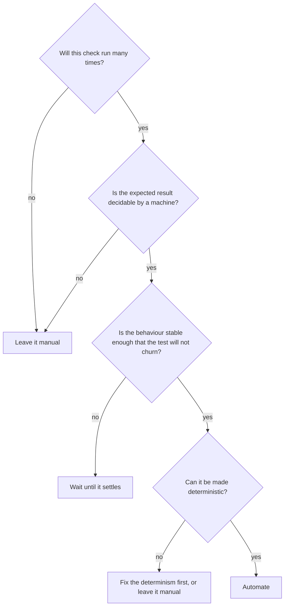
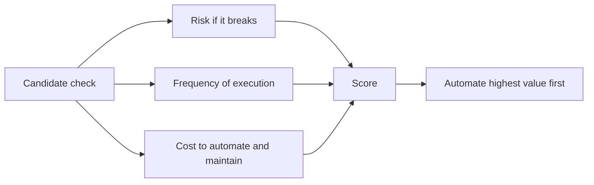

# What Should Be Automated

Not every check is worth automating, and automating the wrong ones produces a slow,
fragile suite that costs more than it protects. The decision is an economic one: expected
value against expected cost, over the life of the test.

## Strong candidates

| Check | Why it pays |
|---|---|
| Unit-level business rules | Cheap, fast, run thousands of times |
| Boundary and partition cases | Mechanical, high defect yield, tedious by hand |
| [Regression](../Functional%20Testing/Regression%20Testing.md) paths | Run on every change forever |
| [Smoke checks](../Functional%20Testing/Smoke%20Testing.md) after deployment | Needed at times no human is watching |
| API and contract checks | Stable interfaces, machine-decidable results |
| Authorisation matrices | Table-driven, high severity, impossible to do by hand at scale |
| Data migrations and calculations | Exact expected values, high cost of error |
| Repeated setup for manual testing | Automating the *setup* often beats automating the test |

## Poor candidates

| Check | Why it fails |
|---|---|
| One-off verification | Automating costs more than doing it once |
| Anything with no machine-decidable oracle | Visual appeal, wording quality, "does this feel right" |
| [Usability](../Non-Functional%20Testing/Usability%20Testing.md) and the judgement part of accessibility | Needs human perception and interpretation |
| Rapidly changing interfaces | The test churns faster than it protects |
| [Exploratory work](../Testing%20Techniques/Exploratory%20Testing.md) | Its value is that the next step is unplanned |
| Checks that cannot be made deterministic | They will become [flaky](../Test%20Quality/Flaky%20Tests.md) and poison the suite |

## Prioritising among the good candidates

Highest value first, in practice: the checks that gate a release, the ones covering the
paths where failure is expensive, and the ones currently eating the most manual time.
Lowest value: additional permutations of an area that already has good coverage.

## The level question

Automating the right check at the wrong level is the most common expensive mistake.

| Check | Wrong level | Right level |
|---|---|---|
| Discount calculation at the boundary | End-to-end through the browser | Unit |
| Validation error for a bad email | End-to-end | Unit or API |
| Order persists with the right total | End-to-end | Integration |
| Whole checkout journey works | Unit, which cannot see it | End-to-end, once |

The rule: automate each check at the lowest level that can actually detect the defect. See
the [pyramid](Test%20Automation%20Pyramid.md).

## Automate the enablers too

Some of the highest-return automation is not tests at all: environment provisioning, test
data creation, deployment, database seeding and resetting. When a manual test costs
forty minutes of setup and five minutes of testing, automating the setup returns more than
automating the test would.

## Check Your Understanding

<quiz>
Which check is the poorest candidate for automation?

- [ ] A boundary case on a pricing rule
- [ ] A post-deployment smoke check
- [x] Whether an error message reads clearly and helpfully to a new user
> Correct. There is no machine-decidable oracle, so this needs human judgement.
- [ ] An authorisation matrix across roles and resources
</quiz>

<quiz>
A team automates every validation rule as a browser-driven end-to-end test. What is the problem?

- [ ] Browser tests cannot assert on validation messages
- [x] The checks are automated at too high a level, making them slow, fragile and hard to diagnose when a unit test would detect the same defects
> Correct. Automate each check at the lowest level that can detect the defect.
- [ ] Validation rules should not be automated at all
- [ ] End-to-end tests cannot run in continuous integration
</quiz>
