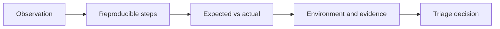
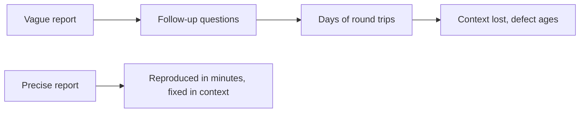

# Bug Reports

A bug report exists to get a defect fixed. Everything in it should serve that: make the
problem reproducible, make its impact clear, and make the decision about it easy.

The most common reason a report fails is not rudeness or length. It is that nobody else can
reproduce it.

## Anatomy

| Field | Content | Common failure |
|---|---|---|
| **Title** | The failure in one line: what breaks, where, when | "Checkout broken" |
| **Steps to reproduce** | Numbered, from a known starting state, with the exact data used | Steps that assume the reader's account state |
| **Expected result** | What should happen, and why: requirement or rule | Left blank because it "should be obvious" |
| **Actual result** | What did happen, precisely | "It doesn't work" |
| **Environment** | Version or build, browser, OS, device, environment, account or role | Missing the build number, so nobody knows if it is already fixed |
| **Frequency** | Always, intermittent, once | Not recorded, so intermittent bugs are closed as unreproducible |
| **Evidence** | Screenshot, video, logs, request and response, correlation identifier | A screenshot of a stack trace instead of the text |
| **Impact** | Who is affected and how badly | Omitted, so triage cannot prioritise |
| **Severity** | Technical impact of the failure | Confused with [priority](Severity%20vs%20Priority.md) |

## A worked example

> **Title**: Shipping charged on orders of exactly 50 despite the free shipping threshold
>
> **Environment**: staging, build 4.12.3, Chrome 141, standard customer role
>
> **Steps**:
> 1. Sign in as a standard customer with an empty cart
> 2. Add SKU-1001, quantity 1, price 50.00
> 3. Go to checkout
>
> **Expected**: shipping cost 0, per pricing rule PR-14 which grants free shipping at 50 or
> above
>
> **Actual**: shipping cost 5.00, order total 55.00
>
> **Frequency**: always, 5 of 5 attempts
>
> **Evidence**: screenshot attached, request identifier `req_8fa21c`
>
> **Impact**: every order at exactly the threshold is overcharged, and the threshold is the
> most common promotional value

That report is fixable without a single follow-up question, which is the only standard that
matters.

## Practice notes

- **Reproduce it twice before reporting.** The second attempt tells you which steps actually
  matter and gives you the frequency.
- **Start from a known state.** "Log in as a new customer" beats "on my account", which
  nobody else has.
- **Quote the rule.** Linking expected behaviour to a requirement or acceptance criterion
  converts an argument into a decision.
- **Paste text, not pictures of text.** Stack traces and errors should be searchable.
- **One defect per report.** Bundled reports get partially fixed and half-closed.
- **Include the request or correlation identifier** when one exists. It is the fastest path
  from report to server logs.
- **Report intermittent bugs anyway**, with the frequency stated. Three vague reports of the
  same intermittent failure are often enough to find it.
- **Describe, do not diagnose.** A guessed cause in the title sends everyone in that
  direction, and it is wrong often enough to matter. Report what you saw, add the hypothesis
  separately.

## Why quality of reports pays

A report needing three clarification rounds usually costs more total time than it took to
find the defect. The extra five minutes spent writing it precisely is the cheapest step in
the whole [defect lifecycle](Defect%20Lifecycle.md).

## Check Your Understanding

<quiz>
Which omission most often makes a bug report unusable?

- [ ] Missing severity classification
- [x] Reproduction steps that do not start from a known state, so nobody else can reproduce the failure
> Correct. A defect that cannot be reproduced usually gets closed regardless of how real it is.
- [ ] No link to the related requirement
- [ ] Screenshots attached instead of video
</quiz>

<quiz>
Why should a report describe the observation rather than a guessed cause?

- [ ] Because reporters are usually not developers
- [x] Because a guessed cause in the title anchors everyone's investigation in one direction, and guesses are wrong often enough to waste real time
> Correct. Report what was observed, and add any hypothesis separately and clearly labelled.
- [ ] Because causes cannot be verified before triage
- [ ] Because the tracker cannot index technical terms
</quiz>
