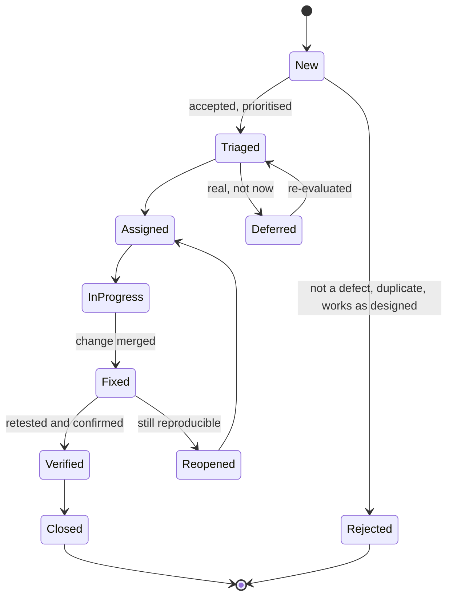
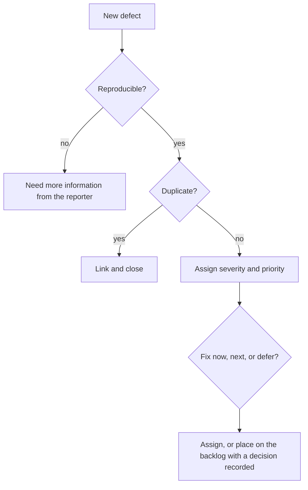

# Defect Lifecycle

A defect report moves through a defined set of states from discovery to closure. The value
of naming the states is that everyone knows who holds it, what has to happen next, and what
"done" means for it.

## What happens in each state

| State | Owner | The question being answered |
|---|---|---|
| **New** | Reporter | What did you see, and how do we reproduce it? |
| **Triaged** | Product plus engineering | Is it real, how bad, when |
| **Assigned** | Team | Who is fixing it |
| **In progress** | Developer | What is the actual cause |
| **Fixed** | Developer | Change merged, plus a regression test |
| **Verified** | Tester | Reproduced on the old build, gone on the new one |
| **Closed** | Tester or reporter | Nothing outstanding |
| **Reopened** | Tester | Still reproducible, back to the team |
| **Deferred** | Product | Accepted risk with a review date |
| **Rejected** | Triage | Duplicate, not a defect, or intended behaviour |

## Triage

The step that keeps the process from becoming a queue nobody manages.

Triage should be regular and short. A backlog reviewed weekly stays a decision log. One
reviewed twice a year becomes an archive nobody reads, and its size becomes an argument
rather than information.

Severity and priority are set here, and they are two different things. See
[severity versus priority](Severity%20vs%20Priority.md).

## Rules that keep the lifecycle honest

- **The reporter closes, or a tester does.** A developer marking their own fix as closed
  removes the verification step entirely.
- **Verify on the same steps as the report.** Confirming an approximation of the scenario is
  how defects get reopened by users instead of testers.
- **Every fix leaves a regression test.** Otherwise the defect can return silently. See
  [regression testing](../Functional%20Testing/Regression%20Testing.md).
- **Deferred means a date.** A deferred defect without a review date is a closed defect
  wearing a disguise.
- **Reopened is data, not blame.** A high reopen rate points at unclear reports, unverified
  fixes, or environments that differ.

## What the data is for

The lifecycle produces the numbers that drive
[quality assurance](../Quality%20Fundamentals/Quality%20Assurance.md) rather than
individual fixes:

| Metric | Signal |
|---|---|
| Escaped defects per release | How much the process is leaking |
| Where defects are found | Whether testing is shifting left |
| Time in each state | Where the queue actually is, often triage rather than fixing |
| Reopen rate | Fix quality and verification quality |
| Defect clustering by module | Where to aim the next test effort |

## Check Your Understanding

<quiz>
Why should a developer not close their own defect after fixing it?

- [ ] Because permissions should be restricted in the tracker
- [x] Because closing without independent verification skips the check that the reported scenario is actually resolved
> Correct. Verification against the original reproduction steps is a separate step from fixing.
- [ ] Because only the product owner may set defect states
- [ ] Because the fix cannot be merged before verification
</quiz>

<quiz>
A high proportion of defects are reopened after being marked fixed. What does this most likely indicate?

- [ ] Testers are applying overly strict acceptance criteria
- [x] Fixes are being verified loosely, or reports lack precise reproduction steps, or environments differ between fix and verification
> Correct. Reopen rate is a signal about report quality, fix quality and verification, not about individual blame.
- [ ] The severity scale needs more levels
- [ ] Triage is being held too frequently
</quiz>
