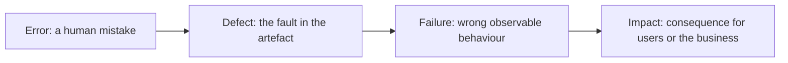
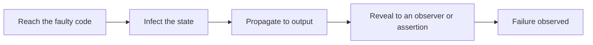

# Errors, Defects and Failures

Three words used interchangeably in conversation, with a precise chain between them. The
distinction matters because each link is a different opportunity to intervene.

| Term | Also called | Where it lives | Example |
|---|---|---|---|
| **Error** | Mistake | In a person's head | The developer misreads "50 or more" as "more than 50" |
| **Defect** | Bug, fault | In code, a document, a configuration | `if (total > 50)` |
| **Failure** | | In the running system | An order of exactly 50 is charged for shipping |
| **Impact** | | In the world | Complaints, refunds, lost trust |

## A defect is not always a failure

A defect only becomes a failure when the faulty code is reached, corrupts state, that
state propagates to the output, and something checks the output. This is the RIPR model:
Reachability, Infection, Propagation, Revealability.

Consequences worth internalising:

- Executing faulty code proves nothing. `is_adult(30)` runs the boundary defect above and
  returns the right answer.
- A test can execute a defect and still pass, if it asserts on the wrong thing.
- Dormant defects exist in every system, waiting for an input that reaches them.

## Where each is prevented

| Link | Prevention |
|---|---|
| Error | Clear requirements, review, pairing, shared examples, training |
| Defect | Static analysis, types, code review, [TDD](../Testing%20Approaches/Test-Driven%20Development.md) |
| Failure | Testing, validation, defensive design, fault tolerance |
| Impact | Monitoring, fast rollback, feature flags, graceful degradation |

Reading right to left is the cost order: intervening at the error is the cheapest, at the
impact the most expensive. That is the whole argument for
[shift left](../Quality%20in%20the%20SDLC/Shift-Left%20Testing.md) restated in defect
terminology.

## Related terms

| Term | Meaning |
|---|---|
| **Root cause** | The process or condition that allowed the error, found by [root cause analysis](Root%20Cause%20Analysis.md) |
| **Latent defect** | Present but not yet triggered |
| **Regression** | A defect reintroduced into behaviour that previously worked |
| **Escaped defect** | Found by users rather than by the team, the headline quality metric |
| **Incident** | The operational event a failure causes |

## Why the vocabulary matters in practice

"There is a bug" collapses four different things into one word, and the response differs at
each link. A failure report tells you what a user saw. Finding the defect tells you what to
change. Finding the error tells you why it was written that way. Only the last one prevents
the next instance, which is the difference between
[quality control and quality assurance](../Quality%20Fundamentals/QA%20vs%20QC%20vs%20Testing.md).

## Check Your Understanding

<quiz>
A test executes a line containing a defect and passes. Which explanation is consistent?

- [ ] The defect is not really a defect
- [x] The state was not infected for that input, or the infection did not propagate, or the assertion did not check the affected output
> Correct. This is the RIPR model, and it is why coverage of a faulty line does not guarantee detection.
- [ ] The test was run in the wrong environment
- [ ] The defect is latent and cannot be triggered by any input
</quiz>

<quiz>
Which intervention addresses the *error* rather than the defect or the failure?

- [ ] Adding a boundary test for the affected rule
- [x] Reviewing the requirement with the business before implementation, so the rule is not misunderstood in the first place
> Correct. Testing catches defects, review and shared examples prevent the mistakes that create them.
- [ ] Enabling a stricter static analysis rule
- [ ] Rolling back the release automatically on error rate
</quiz>
