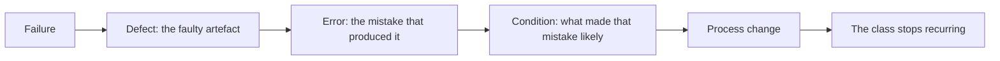
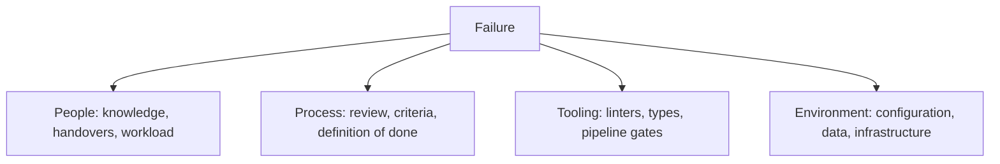
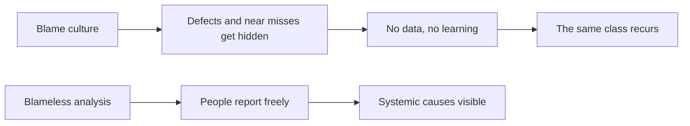

# Root Cause Analysis

**Root cause analysis (RCA)** asks why a defect existed, not just what the faulty line was.
Fixing the line stops one failure. Fixing the cause stops the class.

It is the mechanism that converts [quality control](../Quality%20Fundamentals/Quality%20Control.md)
findings into [quality assurance](../Quality%20Fundamentals/Quality%20Assurance.md) change.

## Five whys, done properly

> The customer was overcharged on shipping.
>
> 1. **Why?** The threshold comparison used `>` instead of `>=`.
> 2. **Why?** The developer read "over 50" in the ticket and implemented it literally.
> 3. **Why?** The acceptance criteria did not state the boundary, and no example was given.
> 4. **Why?** Stories are written without worked examples, and refinement does not cover
>    boundaries.
> 5. **Why?** There is no definition of ready that requires examples for numeric rules.

The fix at level 1 is one character. The fix at levels 4 and 5 prevents every future
boundary ambiguity, and it is a process change rather than a code change.

Two cautions with the technique: five is not magic, stop when the answer becomes actionable
rather than counting; and a chain that terminates at a person's name has gone wrong, because
"the developer was careless" is not a cause anyone can act on.

## Other techniques

| Technique | Good for |
|---|---|
| **Fishbone diagram** | Categorising possible causes across people, process, tooling, environment, data |
| **Fault tree** | Working backwards from a failure through the conditions that had to hold |
| **Timeline reconstruction** | Incidents, where sequence and detection delay matter |
| **Defect clustering analysis** | Finding systemic causes across many defects rather than one |

## The three questions that produce actions

For each defect worth analysing:

1. **Why did it happen?** The condition, not the person.
2. **Why did we not catch it?** Which check should have caught it, and why did it not exist
   or not fire. This is usually the more valuable question, and it is the one most often
   skipped.
3. **What change stops the class?** A specific, owned, dated action.

Question two produces answers like: the review had no checklist for numeric boundaries, the
test suite had no boundary case because the criteria had none, or the monitoring only
alerted on errors and this failure returned a successful response.

## Blamelessness is practical, not polite

Blameless analysis is not about being kind. It is the only way to get accurate information,
because in a blame culture the most important facts are the ones people do not volunteer.

## When to run it

Not for every defect. It is worth the time for:

- Anything that reached production with real impact.
- Recurring defect classes, which are the highest-value target of all.
- Any defect that several existing checks should have caught and did not.
- Near misses, which are free lessons with no damage attached.

Close the loop: an RCA whose actions are never implemented is a meeting, and teams learn
quickly whether the actions are real.

## Check Your Understanding

<quiz>
Which question in a root cause analysis is most often skipped and most valuable?

- [ ] What was the faulty line of code
- [x] Why did our existing checks not catch it, so which check was missing or ineffective
> Correct. It converts one defect into a durable improvement in the detection process.
- [ ] Who introduced the change
- [ ] How long did the fix take
</quiz>

<quiz>
Why is blameless analysis a practical requirement rather than a courtesy?

- [ ] Because organisational policy usually mandates it
- [x] Because in a blame culture people withhold exactly the information the analysis needs, so the systemic cause stays invisible and recurs
> Correct. Accurate data depends on it being safe to report.
- [ ] Because individual mistakes are never a contributing factor
- [ ] Because it shortens the analysis meeting
</quiz>
