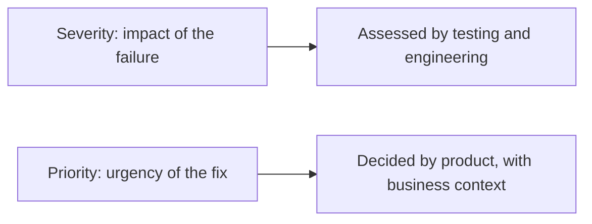
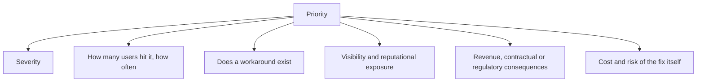

# Severity vs Priority

Two attributes of a defect, constantly conflated, answering different questions and decided
by different people.

- **Severity**: how bad the failure is when it happens. A technical assessment.
- **Priority**: how soon it should be fixed. A business decision.

## The four combinations

| | High priority | Low priority |
|---|---|---|
| **High severity** | Data loss in checkout. Fix now | Catastrophic failure in a feature retiring next month, or reachable only by an impossible configuration |
| **Low severity** | The company name is misspelled on the landing page | A cosmetic misalignment on an internal admin screen |

The two off-diagonal cells are why both attributes are needed. A typo cannot crash
anything, and if it is in the product name on the home page it still gets fixed today. A
crash is maximally severe, and if it only occurs in a configuration nobody uses it can
wait.

## Typical scales

| Severity | Meaning |
|---|---|
| **Critical** | Data loss or corruption, security breach, system unusable, no workaround |
| **High** | Major function broken, workaround is painful or unavailable |
| **Medium** | Function impaired, acceptable workaround exists |
| **Low** | Minor or cosmetic, no functional impact |

| Priority | Meaning |
|---|---|
| **Immediate** | Stop other work, hotfix |
| **High** | Next release |
| **Medium** | Scheduled into upcoming work |
| **Low** | Fix when convenient, or never |

## What actually drives priority

Severity is one input among several. A medium-severity defect on the signup page affecting
every new user outranks a high-severity defect in a rarely used report.

## Keeping the two apart in practice

- **Different owners.** Testing and engineering assess severity from evidence. Product
  decides priority with commercial context. When the same person sets both under pressure,
  they collapse into one number.
- **Severity is not negotiable.** It describes what the failure does, and it does not change
  because the release date is close.
- **Priority is meant to change.** It is re-evaluated as circumstances change, and that is
  correct behaviour rather than churn.
- **Record the reasoning for the off-diagonal cases.** "High severity, low priority" needs a
  written reason, otherwise it reads as an oversight to whoever finds it later.
- **Watch for grade inflation.** When everything is critical and immediate, both scales stop
  carrying information and triage becomes a shouting match.

## Check Your Understanding

<quiz>
A crash occurs only in a legacy configuration used by no current customer. How should it be classified?

- [ ] Low severity, low priority
- [x] High severity, low priority: the failure itself is severe, but the business impact of delaying the fix is minimal
> Correct. This is exactly why severity and priority are recorded separately.
- [ ] High severity, high priority, since crashes are always urgent
- [ ] Low severity, high priority
</quiz>

<quiz>
Who should decide priority, and why?

- [ ] The tester who found the defect, since they understand its technical impact best
- [x] Product, with business context, because urgency depends on users affected, revenue, contracts and workarounds, not only on technical impact
> Correct. Severity is a technical assessment, priority is a business decision informed by it.
- [ ] The developer assigned to the fix, since they know the cost
- [ ] Whoever runs the triage meeting, by default
</quiz>
