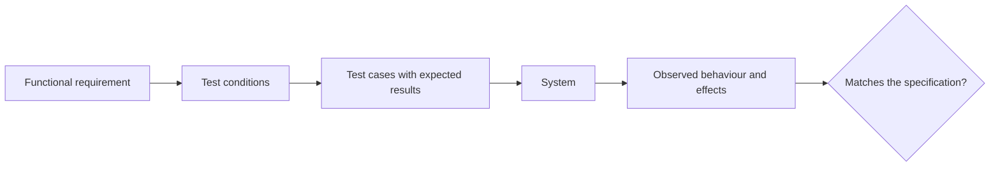
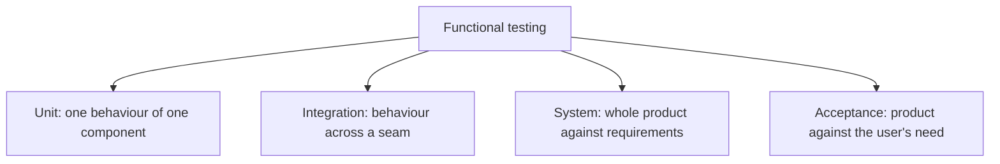

# Functional Testing

**Functional testing** checks *what* the system does: given these inputs and this state,
does it produce the specified outputs and effects. It is contrasted with
[non-functional testing](../Non-Functional%20Testing/index.md), which
checks *how well* it does it.

## Functional or non-functional

| Requirement | Type |
|---|---|
| A refund returns the original amount to the original payment method | Functional |
| A refund completes within two seconds at the 95th percentile | Non-functional |
| Only an administrator can issue a refund above 1000 | Functional, and a security concern |
| The refund screen is usable with a screen reader | Non-functional, [accessibility](../Non-Functional%20Testing/Accessibility%20Testing.md) |
| A failed refund is retried three times, then queued for manual review | Functional |

The rule of thumb: if a stakeholder can state it as "the system shall do X", it is
functional. If it is "the system shall do X *well enough*, measured by Y", it is not.

## Functional testing spans every level

The technique family is mostly black box:
[equivalence partitioning](../Testing%20Techniques/Equivalence%20Partitioning.md),
[boundary values](../Testing%20Techniques/Boundary%20Value%20Analysis.md),
[decision tables](../Testing%20Techniques/Decision%20Table%20Testing.md) and
[state transitions](../Testing%20Techniques/State%20Transition%20Testing.md) cover most
functional requirements between them.

## Named functional test types

| Type | Purpose | When it runs |
|---|---|---|
| [Smoke testing](Smoke%20Testing.md) | Is the build worth testing at all? | Immediately after each deployment |
| [Sanity testing](Sanity%20Testing.md) | Does the specific change work? | After a fix or a small change |
| [Regression testing](Regression%20Testing.md) | Did the change break anything that worked? | On every commit and before release |
| [User acceptance testing](User%20Acceptance%20Testing.md) | Will the user accept it? | Before release |

These are not different techniques, they are the same functional checks selected and run
for different purposes, which is why one test case can appear in several of these suites.

## What functional testing misses

A system can satisfy every functional requirement and still fail in production:

- Correct results that arrive too late under real load.
- Correct behaviour that is unusable, or unusable by anyone relying on assistive
  technology.
- Correct behaviour that leaks data to the wrong user.
- Correct behaviour that cannot be recovered after a node dies.

None of those are functional defects, and none are detectable by a functional suite. That
is the entire argument for the non-functional section, and for stating quality attribute
requirements with numbers so they can be tested at all.

## Practice notes

- **Trace every case to a requirement or a risk**, so the coverage question is answerable.
  See [traceability](../Testing%20Fundamentals/Traceability.md).
- **Assert on effects, not only on responses.** A correct HTTP 200 with no row written is
  a functional defect that a shallow assertion misses.
- **Cover the negative paths.** Validation failures, permission denials and downstream
  errors are functional requirements too, and they are where most escaped defects live.
- **Push cases down the levels.** Any functional check that a unit test can make should not
  be made by an end-to-end test.

## Check Your Understanding

<quiz>
Which of these is a functional requirement?

- [ ] The search results page renders within 500 milliseconds
- [x] A failed payment is retried three times, then queued for manual review
> Correct. It states behaviour the system must produce, independent of how well or how fast.
- [ ] The interface meets WCAG 2.2 level AA
- [ ] The service sustains 5000 concurrent users
</quiz>

<quiz>
A release passes its entire functional suite and then fails in production. Which cause is consistent with that?

- [ ] A business rule was implemented incorrectly
- [x] Correct behaviour that collapses under real load, which is a non-functional property the functional suite never measured
> Correct. Functional testing checks what the system does, not how well it does it under real conditions.
- [ ] A validation error message was missing
- [ ] A state transition was allowed that should have been refused
</quiz>
