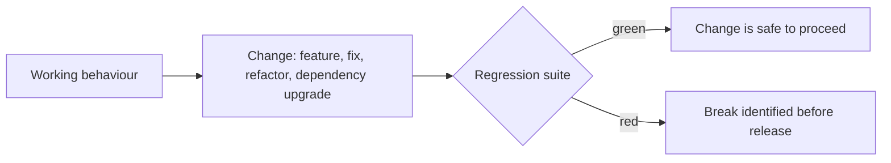
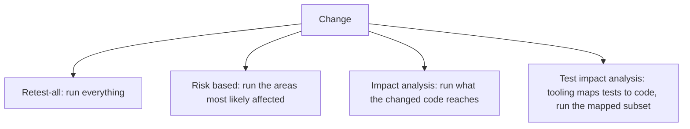

# Regression Testing

**Regression testing** re-runs existing tests to check that a change did not break
behaviour that previously worked. It is the reason a codebase can keep changing: without
it, the cost and risk of every modification grows until change effectively stops.

## Where regressions come from

| Source | Example |
|---|---|
| **Direct change** | A fix alters shared logic and changes another caller's behaviour |
| **Side effect** | A new index changes query ordering that something depended on |
| **Dependency upgrade** | A library changes a default, such as date parsing or rounding |
| **Configuration** | An environment variable differs between environments |
| **Data** | A migration alters values that code assumed |
| **Reintroduction** | An old bug returns because a fix was reverted or lost in a merge |

The last row is the argument for adding a test with every bug fix. A defect that returns
undetected costs the entire investigation a second time.

## Selecting what to re-run

Running everything on every change is ideal and often impractical past a certain suite
size. The selection strategies, in increasing order of cost to set up:

| Strategy | Needs | Risk |
|---|---|---|
| Retest-all | Nothing, but time | None, other than slow feedback |
| Risk based | Judgement and defect history | Human judgement misses indirect effects |
| Impact analysis | Dependency knowledge and [traceability](../Testing%20Fundamentals/Traceability.md) | Indirect coupling is easy to miss |
| Test impact analysis | Coverage-based tooling in the pipeline | Stale mappings after large refactors |

Practical compromise used by most teams: fast tests on every commit, the full suite before
merge or nightly, and the full suite always before release.

## Keeping the suite from strangling the team

A regression suite grows monotonically unless it is managed, and a suite that takes hours
gets skipped, which returns the team to having none.

- **Push tests down the pyramid.** A
  regression check that a unit test can make should never be an end-to-end test.
- **Parallelise and shard.** Wall clock time is what determines whether the suite is run.
- **Delete duplicates.** Many old cases test the same rule through different paths, and
  deleting them loses nothing.
- **Treat flakiness as a defect.** One tolerated [flaky test](../Test%20Quality/Flaky%20Tests.md)
  teaches the team to re-run until green, which disables the whole suite in practice.
- **Prune by value.** Tests for removed features and long-obsolete behaviours are pure cost.

## Regression testing and refactoring

The relationship is worth stating explicitly: refactoring is defined as changing structure
without changing behaviour, so it is only meaningful when something can confirm the
behaviour did not change. That confirmation is the regression suite.

This is also why tests coupled to implementation detail are so damaging. They break during
refactoring even though behaviour is unchanged, which trains the team to treat red as
noise.

## Check Your Understanding

<quiz>
Why should every fixed defect leave an automated test behind?

- [ ] To increase the coverage percentage of the module
- [x] Because reintroduction is a common regression source, and without a test the same defect can return and be investigated from scratch
> Correct. The test converts a one-off investigation into permanent protection.
- [ ] Because sanity testing cannot verify fixes
- [ ] Because defect reports are closed automatically when a test exists
</quiz>

<quiz>
A regression suite takes four hours and the team has started skipping it before merges. What is the most effective response?

- [ ] Reduce the coverage target so fewer tests are needed
- [x] Push checks down to faster levels, parallelise, delete duplicates and fix flakiness, so the suite is fast enough to actually run
> Correct. An unrun suite provides no protection, so wall clock time is a quality property of the suite itself.
- [ ] Run the suite only after release
- [ ] Convert the suite into a larger smoke test
</quiz>
