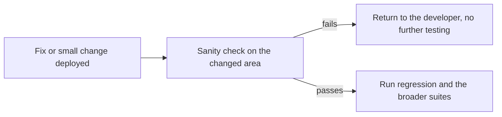
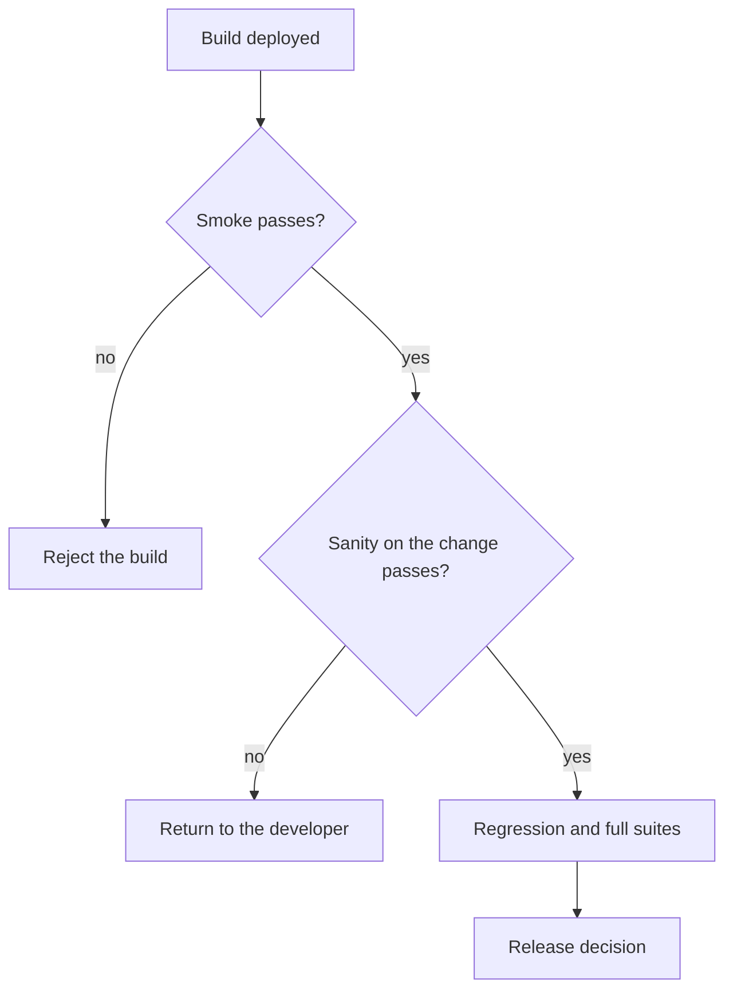

# Sanity Testing

A **sanity test** is a narrow, focused check that a specific change actually did what it
claimed, before spending time on anything broader. It is what you run after a bug fix or a
small modification, on a build that is already known to start.

## Smoke and sanity are not the same

They are constantly confused, and the distinction is simple: smoke is wide and shallow,
sanity is narrow and deep.

| | [Smoke](Smoke%20Testing.md) | Sanity |
|---|---|---|
| **Question** | Does the build run at all? | Does this particular change work? |
| **Scope** | Every critical area, one check each | One area, in detail |
| **Trigger** | Every deployment | After a fix or a small change |
| **Typically** | Automated and gating | Often manual and exploratory |
| **Scripted in advance** | Yes, a fixed suite | Usually not, it depends on the change |

A build passes smoke and fails sanity when the service is up but the fix does not work. A
build fails smoke and sanity is never reached, because there is nothing to check.

## What a sanity check covers

For a fix to "refunds fail when the order contains a discounted item":

| Check | Why |
|---|---|
| The reported scenario now behaves correctly | The fix works at all |
| The exact steps from the bug report | Confirms the reporter's case, not an approximation |
| One or two neighbouring cases: a refund without a discount, a partial refund | The fix did not narrow the behaviour |
| The obvious side effect: the ledger entry and the payment provider call | The fix was not only cosmetic |

That last row matters most. A very common outcome is that the screen now shows success
while the underlying record is still wrong.

## Where it sits in the flow

Both gates exist to avoid spending the expensive suites on a build that cannot pass them.

## Practice notes

- **Reproduce the original defect first, if possible.** Confirming the failure on the old
  build and its absence on the new one is the only way to know the fix caused the change.
- **Add a regression test for the fixed defect.** The sanity check is a one-off human
  judgement, the automated test is what stops the bug returning. Every fixed defect should
  leave one behind.
- **Keep it timeboxed.** Sanity checking is deliberately shallow beyond the change. If it
  keeps expanding, the real need is regression testing.
- **Do not use it as a release gate on its own.** It says the change works, and says
  nothing about what the change broke.

## Check Your Understanding

<quiz>
What distinguishes sanity testing from smoke testing?

- [ ] Sanity testing runs before deployment, smoke testing after
- [x] Smoke is broad and shallow across the whole build, sanity is narrow and deep on the specific change
> Correct. They answer different questions and are usually run in that order.
- [ ] Sanity testing is always automated, smoke testing is manual
- [ ] Sanity testing replaces regression testing after a fix
</quiz>

<quiz>
A sanity check confirms the fix works. What should still happen?

- [ ] Nothing further, the change is verified
- [x] An automated regression test for the defect is added, and the broader regression suite is run to see what the change broke
> Correct. Sanity says the change works, not that it was harmless.
- [ ] The smoke suite is extended to include the fixed scenario
- [ ] The defect is closed without further testing
</quiz>
