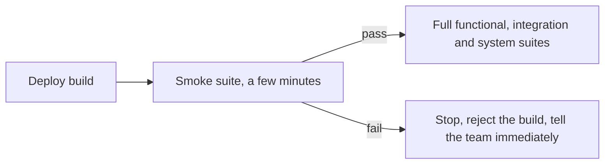
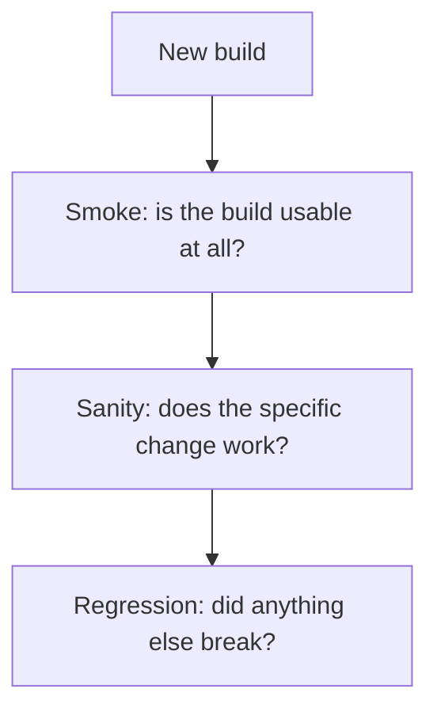

# Smoke Testing

A **smoke test** is a small, fast suite that answers one question: is this build healthy
enough to be worth testing further? The name comes from hardware, where powering on a new
board and seeing no smoke meant the real testing could begin.

Its purpose is to protect expensive activities from a broken deployment. Without it, a
team spends two hours in a system test run before discovering the service never started.

## What belongs in a smoke suite

| Include | Exclude |
|---|---|
| The application starts and reports healthy | Field-level validation |
| Authentication works | Edge cases and boundaries |
| The database and each critical dependency are reachable | Anything already covered by unit tests |
| One or two critical journeys complete, such as login and checkout | Error path permutations |
| Key pages or endpoints return successfully | Anything slow or flaky |

Sizing rule: a few minutes at most, and every failure must clearly mean "this build is
broken". If a smoke failure ever prompts "is that a real failure", the suite has the wrong
tests in it.

## Smoke, sanity and regression

| | Smoke | [Sanity](Sanity%20Testing.md) | [Regression](Regression%20Testing.md) |
|---|---|---|---|
| **Scope** | Broad and shallow | Narrow and deep | Broad and deep |
| **Question** | Does it run? | Does this change work? | Did anything break? |
| **Duration** | Minutes | Minutes | Long, often parallelised |
| **Typical trigger** | Every deployment | After a fix | Every commit or before release |

## Where it runs

- **After every deployment to any environment.** A smoke suite that only runs in staging
  cannot catch a production configuration mistake.
- **As the entry criterion for the test phase**, which is what stops broken builds from
  consuming a system test window.
- **After a production release**, as the fastest confirmation that the deploy is live and
  serving. This is where a smoke suite most often earns its cost, since it turns a
  rollback decision from twenty minutes of manual checking into two minutes of automation.

## Keeping it useful

- **Automate it entirely.** A manual smoke test does not get run at three in the morning,
  which is exactly when it is needed.
- **Never let it grow.** Every team drifts toward adding "one more important check". Once
  it takes twenty minutes it stops being a gate and becomes a second regression suite.
- **Zero tolerance for flakiness.** A flaky smoke test blocks every build in the
  organisation, and it will be disabled rather than fixed.
- **Make it deployment-aware.** Check versions and configuration, not only that pages load.
  A smoke suite that passes against the previous version still running is worse than none.

## Check Your Understanding

<quiz>
What is the primary purpose of a smoke suite?

- [ ] To replace regression testing with a faster alternative
- [x] To decide quickly whether a build is healthy enough to justify further, more expensive testing
> Correct. It is a gate, not a source of detailed coverage.
- [ ] To verify every critical business rule in detail
- [ ] To measure performance after deployment
</quiz>

<quiz>
A smoke suite has grown to 300 tests and takes 25 minutes. What is the problem?

- [ ] The tests are too shallow to detect real problems
- [x] It is no longer a fast gate, so broken builds are discovered late and the team starts skipping it
> Correct. Smoke suites must stay small and fast, with detail pushed into the regression suite.
- [ ] It cannot be run after production deployments
- [ ] It duplicates the sanity testing performed after fixes
</quiz>
