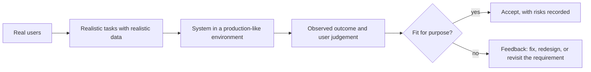
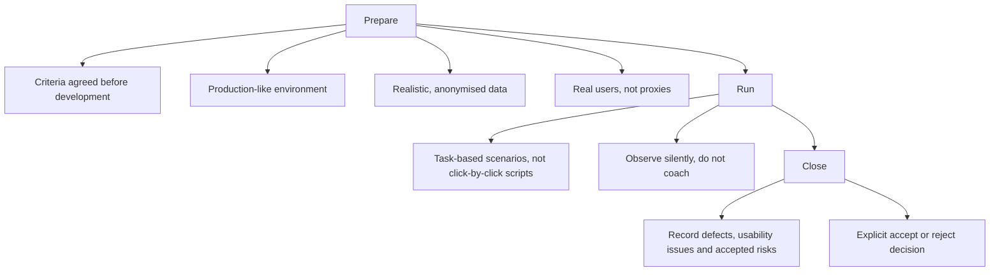

# User Acceptance Testing

**User Acceptance Testing (UAT)** puts the assembled system in front of the people who will
use it, doing the work they actually do, to decide whether it is fit for purpose. It is the
most direct form of
[acceptance testing](../Test%20Levels/Acceptance%20Testing.md) and the clearest example of
[validation](../Quality%20Fundamentals/Verification%20and%20Validation.md).

## What it is for and what it is not for

| UAT is for | UAT is not for |
|---|---|
| Confirming the system supports the real job | Finding functional defects that lower levels missed |
| Surfacing wrong assumptions in the requirements | Verifying the specification line by line |
| Checking the workflow fits how people actually work | Performance or security testing |
| Building confidence and readiness in the user group | A formality performed on a scripted demo path |

If UAT is producing a stream of ordinary functional bugs, the lower test levels are too
weak, and those defects are being found at the most expensive point available.

## Running it well

The two details that decide whether UAT is worth anything:

- **Task-based scenarios.** "Process the month-end reconciliation for your branch" produces
  real information. "Click Reports, then select March, then click Export" only proves the
  buttons exist.
- **No coaching.** The moment someone says "no, use the menu at the top", the finding has
  been erased. Confusion is the result, not an interruption to be corrected.

## Common failure modes

| Failure | Consequence |
|---|---|
| Product owner performs UAT alone | Validates their own assumptions, not the users' work |
| Scripted step-by-step instructions | Confirms the happy path, hides every usability problem |
| Toy data | Volume, edge cases and messy real records are never exercised |
| Environment differs from production | Findings do not transfer, integrations behave differently |
| Criteria agreed at the end | Acceptance becomes a negotiation about what was meant |
| Feedback recorded but not triaged | Users conclude UAT is theatre and stop engaging |

## Alpha, beta and continuing validation

UAT in a session is a snapshot. Real fitness for purpose shows over time.

- **Alpha**: internal users, in a controlled environment, before external exposure.
- **Beta**: a selected external group using the real system for real work, which surfaces
  the environment and data diversity no test lab reproduces.
- **After release**: feature usage, task completion rates, support tickets and abandonment
  are UAT that never stops, and they are often the first honest signal about whether the
  feature was worth building.

## Check Your Understanding

<quiz>
Why should UAT scenarios be stated as tasks rather than as step-by-step instructions?

- [ ] Because step-by-step scripts take longer to write
- [x] Because a script proves only that the described path exists, while a task reveals whether users can work out how to do their job
> Correct. Confusion during a task is the finding, and a script removes the opportunity to observe it.
- [ ] Because tasks are easier to automate afterwards
- [ ] Because scripts cannot be traced to requirements
</quiz>

<quiz>
During UAT a user hesitates and cannot find the export function. What is the correct response?

- [ ] Show them where it is so the session can continue
- [x] Observe and record it, since the hesitation is a genuine finding about the design
> Correct. Coaching erases the very information the session exists to collect.
- [ ] Mark the scenario as passed, since the function exists
- [ ] Raise it as a training issue rather than a defect
</quiz>
