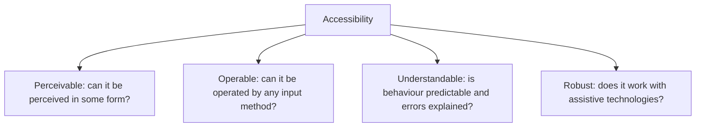
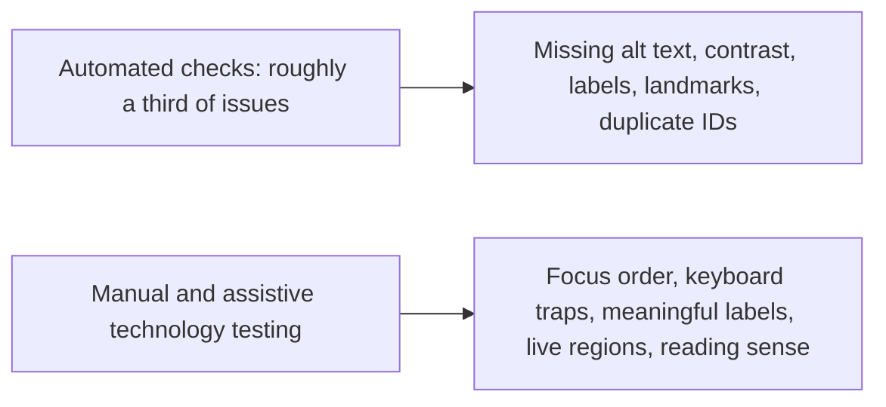

# Accessibility Testing

**Accessibility testing** checks that people with disabilities can use the system: with a
screen reader, with the keyboard alone, with magnification, with reduced colour perception,
with limited motor control, and with cognitive differences.

It is frequently a legal requirement, and it is always a correctness requirement: an
interface that cannot be operated by a portion of its users is defective, in the same way
that one returning wrong totals is defective.

Those four are the POUR principles underlying WCAG, and they are a better testing checklist
than the numbered success criteria, which are easier to audit against once problems are
suspected.

## What automation can and cannot do

Automated tooling in the pipeline is cheap and worth having on every component, but a clean
automated report means very little on its own. It cannot judge whether alternative text is
*meaningful*, whether the focus order matches the visual order, or whether an error message
is announced when it appears.

## The manual checks that matter most

| Check | How to do it | Typical failure |
|---|---|---|
| **Keyboard only** | Unplug the mouse and complete a full task | Focus trapped in a modal, or a control that cannot be reached |
| **Visible focus** | Tab through and watch | Focus indicator removed by a CSS reset |
| **Focus order** | Tab through and compare with the visual layout | Order jumps around after content is inserted |
| **Screen reader** | Complete the task with a screen reader | Buttons announced as "button", images as filenames |
| **Zoom to 200%** | Resize and reflow | Content clipped, horizontal scrolling required |
| **Contrast** | Automated check plus judgement | Placeholder text and disabled states below threshold |
| **Forms** | Submit with errors | Errors shown only in colour, or never announced |
| **Motion** | Enable reduced motion preference | Animation continues, causing discomfort |
| **Timing** | Wait on a timed flow | Session expires with no warning and no extension |

The keyboard-only pass is the highest-value single test on the list. It takes minutes, needs
no tooling, and finds a large share of the serious defects, because most keyboard failures
are also screen reader failures.

## Where it fits in the process

| Stage | Activity |
|---|---|
| **Design** | Contrast, focus states, target sizes and error patterns decided in the design system |
| **Component development** | Automated checks per component in the test suite |
| **Feature completion** | Keyboard pass and a screen reader pass on the new flow |
| **Release** | Full audit of critical journeys against the target conformance level |
| **Continuous** | Accessibility acceptance criteria in the definition of done |

Building accessible components once in a shared design system is far cheaper than
retrofitting every feature, which is the practical argument for putting the effort at the
design and component layers rather than at the audit.

## Common defects worth knowing

- `div` and `span` elements wired up as buttons, so they are unreachable by keyboard and
  unannounced by screen readers. Using the native element solves it entirely.
- Placeholder text used instead of a label, which disappears on input and is often
  unannounced.
- Icon-only buttons with no accessible name.
- Custom dropdowns and modals rebuilt from scratch without the expected keyboard behaviour.
- Content updates injected without a live region, so a screen reader user never learns that
  anything happened.
- Colour as the only indicator of state or error.

## Check Your Understanding

<quiz>
An automated accessibility scan reports zero issues. What can be concluded?

- [ ] The interface is accessible and conformant
- [x] Only that a subset of machine-detectable issues is absent, since focus order, meaningful labels and screen reader behaviour need manual testing
> Correct. Automated tools catch roughly a third of issues, and the remainder require human judgement.
- [ ] The interface meets WCAG level AA
- [ ] Manual testing is needed only for custom components
</quiz>

<quiz>
Which single manual check gives the most value for the least effort?

- [ ] Verifying colour contrast ratios by hand
- [x] Completing a full task using the keyboard alone, which exposes unreachable controls, focus traps and missing focus indicators
> Correct. Most keyboard failures are also screen reader failures, so one short pass surfaces a wide class of defects.
- [ ] Checking every image has alternative text
- [ ] Validating the HTML against the specification
</quiz>
