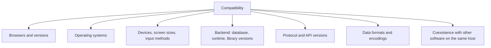
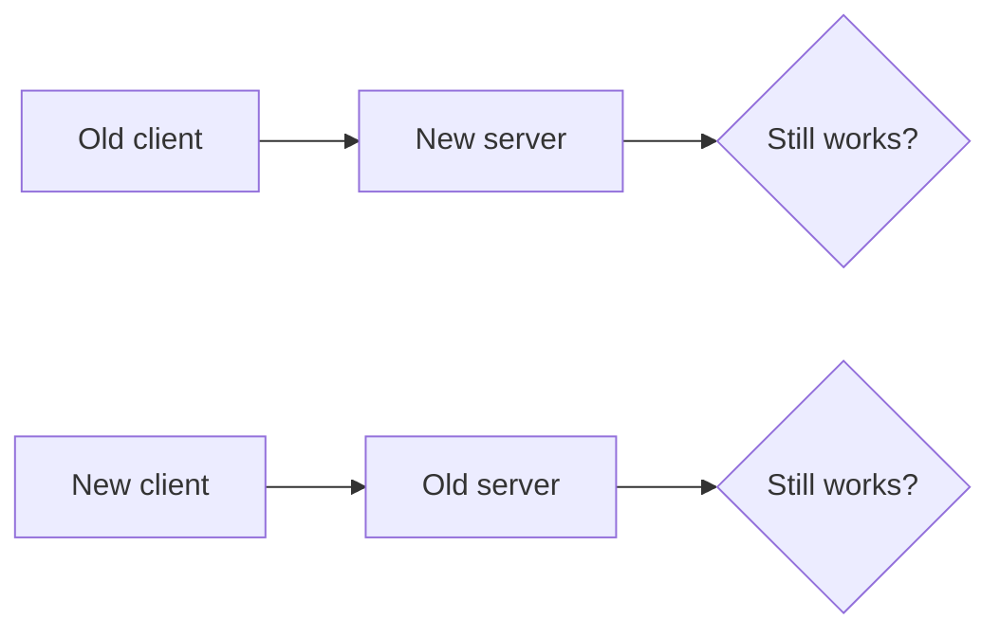

# Compatibility Testing

**Compatibility testing** checks that the system works across the environments it must
support, and alongside the other software it must coexist with. The functionality is
already correct. The question is whether it stays correct on a different browser, device,
operating system, database version or protocol version.

## Backward and forward compatibility

The dimension that causes real incidents during deployment, because a rolling release runs
two versions at once.

| Compatibility | Meaning | Test |
|---|---|---|
| **Backward** | New version accepts old inputs and old data | Run the previous release's clients and data against the new build |
| **Forward** | Old version tolerates new inputs | Send new fields to the old version and confirm it ignores them safely |
| **Data** | New code reads old rows, old code reads new rows | Deploy the migration, then run both versions against the same database |
| **Wire** | Message formats interoperate across versions | Replay recorded messages from the previous version |

During a rolling deployment both directions matter simultaneously. A migration that renames
a column breaks every instance still running the old code, which is why expand-then-
contract migrations exist: add the new column, write both, migrate, switch reads, and only
then drop the old one.

## Defining the support matrix

Compatibility work is unbounded unless someone writes down what is supported.

| Input | Source |
|---|---|
| Browser and version share | Real analytics for this product, not global statistics |
| Device and screen sizes | Analytics, plus any devices the customer contract names |
| Operating system versions | Vendor support windows and observed usage |
| Backend versions | What is deployed across all environments and customers |
| Assistive technologies | Screen reader and platform combinations in actual use |

A support matrix should state what is **not** supported as explicitly as what is. Without
that line, every unusual environment becomes a defect.

## Keeping the combination count sane

The matrix multiplies quickly, which is the natural home of
[pairwise testing](../Testing%20Techniques/Pairwise%20Testing.md): cover every pair of
environment values rather than every full combination, and add specific seeded
configurations for the ones with the largest real usage.

Layer the effort:

| Layer | Coverage |
|---|---|
| Every commit | One primary environment, full functional suite |
| Every merge to main | A pairwise-reduced set of the top environments |
| Before release | Full support matrix on the critical journeys only |
| Continuously | Production error monitoring grouped by environment, which finds what the matrix missed |

That last row is the honest one. Real users arrive with combinations nobody planned for,
and grouping production errors by browser, version and device is often the fastest
compatibility signal available.

## Common findings

- Rendering and layout differences at specific viewport widths, especially between the
  breakpoint boundaries.
- Date, number and currency formatting under different locales and time zones.
- Input differences: touch versus mouse, virtual keyboards, autofill behaviour.
- Feature support gaps in older browser versions, especially in newer CSS and JavaScript
  APIs.
- Database dialect differences in SQL, collation and case sensitivity.
- Character encoding problems that appear only with non-ASCII data.

## Check Your Understanding

<quiz>
Why does a rolling deployment require both backward and forward compatibility?

- [ ] Because rollbacks are performed automatically
- [x] Because two versions run at the same time, so old clients must work against the new version and the old version must tolerate new inputs
> Correct. This is also why database migrations use an expand-then-contract sequence rather than renaming in place.
- [ ] Because load balancers cannot route by version
- [ ] Because compatibility only matters for public APIs
</quiz>

<quiz>
A support matrix of five browsers, four operating systems and three devices gives 60 combinations. What is the practical approach?

- [ ] Test all 60 before every release
- [x] Use pairwise reduction to cover every pair of environment values, seed the highest-usage configurations, and monitor production errors grouped by environment
> Correct. Full enumeration is unaffordable, and real usage data covers what the reduced set misses.
- [ ] Test only the single most popular combination
- [ ] Remove older versions from the support matrix until it is small enough
</quiz>
