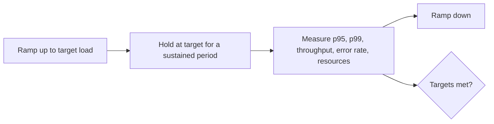
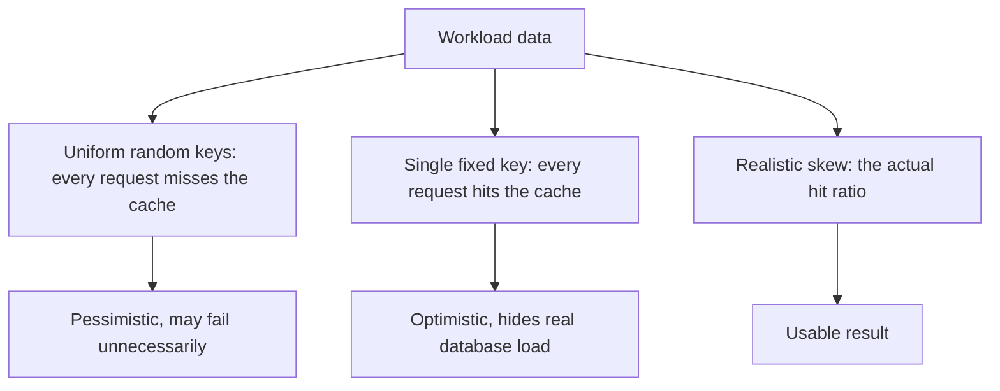

# Load Testing

**Load testing** runs the system at expected and peak production volume to confirm it meets
its [performance](Performance%20Testing.md) targets. The question is narrow: at the load we
expect, do we hit our latency, throughput and error rate goals?

It differs from [stress testing](Stress%20Testing.md) by staying within the load the system
is supposed to handle. Load answers "is it good enough", stress answers "where does it
break".

## Building the workload model

The single thing that decides whether the results mean anything.

| Input | Source |
|---|---|
| Which operations, and in what ratio | Production access logs, not guesses |
| Requests per second at average and at peak | Analytics, with a peak-to-average factor |
| Think time between user actions | Real session data, typically seconds not zero |
| Data distribution | Real key distribution, since a single hot key behaves differently from a uniform spread |
| Session and authentication behaviour | Real login rates, token lifetimes, cache warmth |

A workload that hammers one cheap endpoint with no think time is not a load test. It
measures the throughput of one code path, which no user experiences.

## Cache and data realism

The second branch is the classic mistake: a test that reuses one product identifier reports
excellent numbers because everything after the first request is served from cache.

## What to watch during the run

| Signal | What it tells you |
|---|---|
| p95 and p99 latency over time | Rising during a steady hold means something is accumulating |
| Throughput versus offered load | A gap means requests are queueing or being rejected |
| Error rate | Errors under target load are a failure regardless of latency |
| CPU, memory, and garbage collection | Memory climbing during a steady hold suggests a leak |
| Connection pool usage and queue depth | The most common real bottleneck, and invisible from latency alone |
| Database time per request | Usually where the time actually goes |

Watch the dependencies as well as the system. A load test that saturates a shared staging
database tells you about the database, not about the service.

## Load profiles worth running

- **Expected average**, held long enough to reach steady state.
- **Peak**, at the highest realistic volume, including the seasonal or campaign peak.
- **Soak**, at moderate load for many hours, which is how leaks, connection exhaustion and
  log disk growth are found.
- **Spike**, an abrupt jump to peak, which tests autoscaling reaction time and queue
  behaviour rather than steady-state capacity.

Soak testing is the one most often skipped and the one that catches the failure class
nothing else catches: the system that is fine for an hour and dies at hour nine.

## Interpreting a pass

A pass means the targets were met under the conditions tested, which is why the conditions
belong in the report: load level, data volume, environment size, and workload mix. A
"passed load testing" claim without those numbers is not a result, and it will be quoted
later as though it applied to a different situation entirely.

## Check Your Understanding

<quiz>
A load test repeatedly requests the same product identifier and reports excellent latency. What is wrong?

- [ ] The think time is unrealistic
- [x] Every request after the first is served from cache, so the test never exercises the real database load
> Correct. The key distribution in the workload must reflect real access patterns.
- [ ] The ramp-up period was too short
- [ ] Percentiles cannot be computed for repeated requests
</quiz>

<quiz>
Which load profile most reliably exposes memory leaks and connection exhaustion?

- [ ] A short spike to double the peak load
- [x] A soak test holding moderate load for many hours
> Correct. These failures accumulate over time and are invisible in short runs.
- [ ] A ramp to the breaking point
- [ ] A single-user baseline measurement
</quiz>
