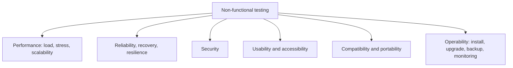
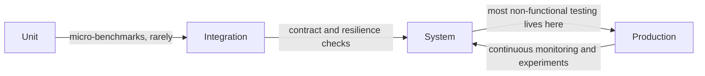

# Non-Functional Testing

**Non-functional testing** measures *how well* a system does what it does: fast enough,
available enough, secure enough, usable enough, portable enough. The behaviour may be
perfectly correct and the system still unfit.

These properties map to the characteristics in
[software quality models](../Quality%20Fundamentals/Software%20Quality%20Models.md) and, on
the design side, to
architectural characteristics.

## The requirement problem

Nearly every non-functional failure starts as an untestable requirement.

| Untestable | Testable |
|---|---|
| The system must be fast | Checkout responds in under 400ms at p95 with 1000 concurrent users |
| The system must be highly available | 99.9% monthly availability measured at the load balancer, maintenance excluded |
| The system must be secure | No high or critical findings in the OWASP Top 10 categories on release scan |
| The system must be usable | 90% of new users complete first-time setup unaided in under 5 minutes |
| The system must scale | Throughput grows within 10% of linear from 2 to 8 application nodes |

The pattern of a testable statement: **a metric, a target, a condition, and a measurement
point**. Missing any one of the four makes it unverifiable, and unverifiable quality
attributes are discovered in production by users.

## Where these tests belong

Most non-functional properties are emergent, meaning they exist only for the assembled
system in a realistic environment. A component can be fast in isolation and the system slow
because of a serialisation point that no unit test can see.

The consequence is that non-functional testing depends on environment fidelity more than
any other kind. Results from a single node with a hundred rows of data predict nothing.

## Shift left, shift right

| Earlier | Later |
|---|---|
| Performance budgets checked per commit for key endpoints | Load testing before release |
| Static and dependency security scanning in the pipeline | Penetration testing on a release candidate |
| Automated [accessibility](Accessibility%20Testing.md) checks in component tests | Assistive technology sessions with real users |
| Chaos experiments in staging | Controlled production experiments and monitoring |

Neither column alone is sufficient. Early checks catch regressions cheaply but cannot
reproduce real load or real users. Late testing is realistic but expensive and arrives
after the design decisions are locked in.

## Choosing what to test

Non-functional testing is expensive, so it follows risk rather than completeness.

1. Identify the two or three quality attributes that actually drive this system. A
   payments platform is dominated by reliability and security, a media site by
   performance, an internal tool by neither.
2. Write a measurable target for each, using the four-part pattern above.
3. Automate the cheapest continuous check for each target.
4. Schedule the expensive verification, load runs, penetration tests, accessibility
   audits, at the points where the answer can still change a decision.

Testing all eight quality characteristics equally is the non-functional equivalent of
spreading test effort evenly across modules, and it fails for the same reason.

## Check Your Understanding

<quiz>
What makes a non-functional requirement testable?

- [ ] Assigning it a priority and an owner
- [x] Stating a metric, a target, the conditions it holds under, and where it is measured
> Correct. Without all four, no check can decide whether the requirement was met.
- [ ] Expressing it as a user story with acceptance criteria
- [ ] Linking it to an architectural characteristic
</quiz>

<quiz>
Why do most non-functional tests belong at the system level or in production rather than at the unit level?

- [ ] Because unit test frameworks cannot measure time
- [x] Because these properties are emergent: they arise from the assembled system in a realistic environment, not from any single component
> Correct. A fast component can sit inside a slow system, and only the whole system reveals it.
- [ ] Because non-functional requirements are written after the code
- [ ] Because production is the only place with real users
</quiz>
