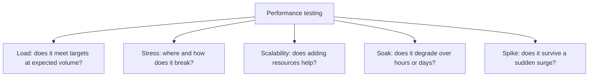
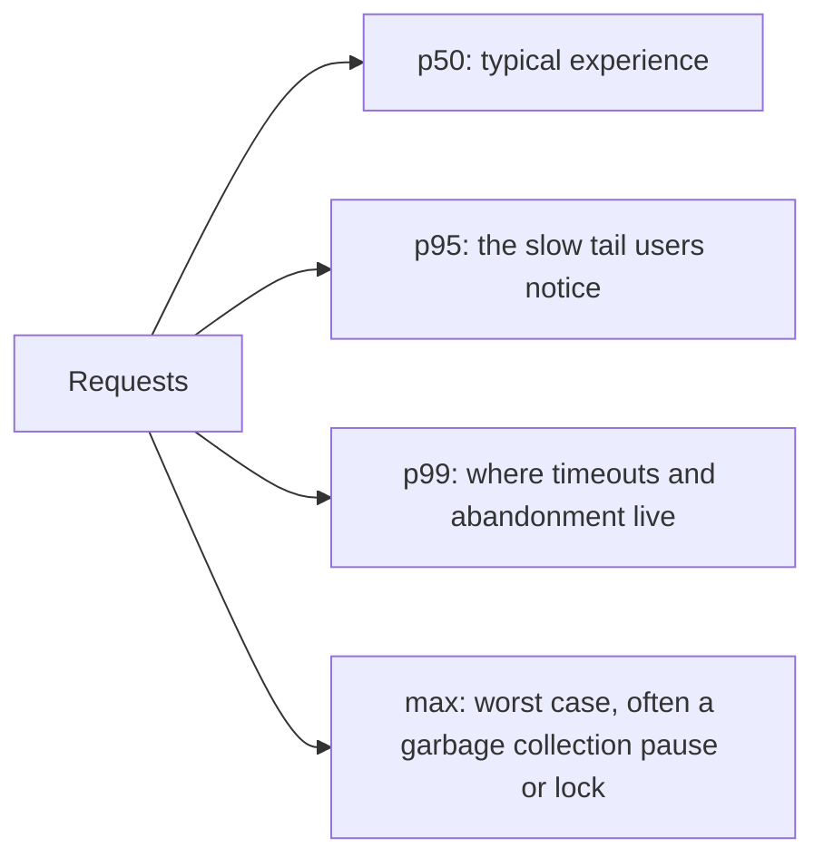
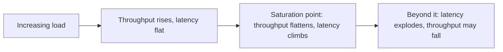

# Performance Testing

**Performance testing** measures how a system behaves under a given workload: response
time, throughput, and resource consumption. It is the umbrella over
[load](Load%20Testing.md), [stress](Stress%20Testing.md) and
[scalability](Scalability%20Testing.md) testing, each of which asks a different question
about the same three metrics.

## The three metrics

| Metric | Definition | Common mistake |
|---|---|---|
| **Response time** | Time from request to complete response | Reporting the mean |
| **Throughput** | Completed requests per unit time | Confusing offered load with completed work |
| **Resource use** | CPU, memory, connections, IO, queue depth | Measuring only the application, not the database |

## Never use the average

Response time distributions are long-tailed, so the mean hides exactly the users who are
suffering.

A service averaging 200ms may still time out for one request in a hundred. State targets
as percentiles, and always report p95 and p99 alongside throughput, because a percentile
without its load level means nothing.

## Designing a performance test

| Element | Getting it right | Getting it wrong |
|---|---|---|
| **Workload model** | Mix of operations matching real traffic ratios | 100% of one cheap read endpoint |
| **Data volume** | Production-scale data | A hundred rows, so every query hits an in-memory table |
| **Think time** | Realistic pauses between user actions | Zero delay, which models a denial of service rather than users |
| **Environment** | Same topology, instance sizes and configuration as production | One node with debug logging enabled |
| **Warm-up** | Discard the initial period | Measuring cold caches and lazy initialisation as steady state |
| **Duration** | Long enough to reach steady state | 30 seconds, which measures nothing but queues filling |

The data volume row causes more false confidence than the rest combined. Query plans
change completely between a thousand rows and ten million, so a test on a small dataset
frequently reports excellent numbers for code that will collapse in production.

## Reading the results

The saturation point is the number worth extracting: the load at which latency starts
rising while throughput stops. Capacity planning is done against that point, not against
the load where the system finally errors.

When targets are missed, the answer is almost never "the code is slow". Look in order at
database queries and missing indexes, N+1 access patterns, serialisation points and locks,
connection pool limits, chatty network calls, and garbage collection pauses.

## Making it continuous

A load test run once before release finds problems when they are most expensive to fix.
Cheaper alternatives that run constantly:

- **Performance budgets per endpoint** asserted in the pipeline, failing the build on
  regression beyond a threshold.
- **Query count assertions** in integration tests, which catch N+1 patterns at the moment
  they are introduced.
- **Production percentile monitoring** with alerts, which is the only measurement made
  under genuinely real conditions.

## Check Your Understanding

<quiz>
Why are average response times a poor way to state performance targets?

- [ ] Averages are harder to measure than percentiles
- [x] Response time distributions are long-tailed, so the mean hides the slow requests that users actually notice and that trigger timeouts
> Correct. Targets should be stated as percentiles at a specified load.
- [ ] Averages cannot be compared between environments
- [ ] Averages exclude failed requests by definition
</quiz>

<quiz>
A performance test on a database with 1000 rows reports excellent latency, and production is slow. What is the most likely explanation?

- [ ] The test used too much think time
- [x] Query plans and index behaviour differ completely at production data volumes, so the test never exercised the real access cost
> Correct. Data volume fidelity is the most common source of false confidence in performance testing.
- [ ] The percentiles were calculated incorrectly
- [ ] The warm-up period was too long
</quiz>
