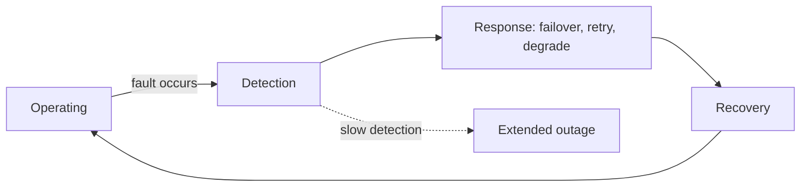
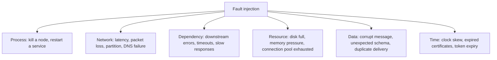

# Reliability Testing

**Reliability testing** measures whether the system keeps working correctly over time and
under fault conditions, and how quickly it returns to service when something fails.

Reliability is not the absence of faults. It is the property that faults do not become
user-visible failures, and that those which do are short.

## The measures

| Measure | Meaning | Test that produces it |
|---|---|---|
| **Availability** | Proportion of time the service is usable | Long-running monitoring, soak runs |
| **MTBF** | Mean time between failures | Extended operation under realistic load |
| **MTTR** | Mean time to restore service | Deliberate failure injection with timed recovery |
| **RTO** | Target time to restore after a disaster | Full recovery rehearsal |
| **RPO** | Acceptable data loss window | Restore from backup, measure the gap |
| **Failure rate** | Failures per unit of work | Error rate under sustained load |

MTTR is usually the one worth improving. Most systems cannot prevent all faults, but nearly
all can detect and recover faster than they currently do.

## Fault injection

Reliability claims are untested until faults are actually caused.

The certificate and token rows are worth naming: expiry is the most predictable outage
cause in existence and one of the least tested, because it needs a clock change rather than
a code change to reproduce.

## What to verify

| Property | The actual test |
|---|---|
| **Detection** | Cause the fault and measure how long until an alert fires |
| **Failover** | Kill the primary, measure the switch and whether requests were lost |
| **Retry safety** | Duplicate a request and confirm no duplicate side effect |
| **Bounded degradation** | With a dependency down, confirm the core path still works |
| **Recovery without intervention** | Restore the dependency and confirm the system heals itself |
| **Backup and restore** | Restore into a clean environment and verify data completeness |
| **State after failure** | Confirm no partial writes or orphaned records survived |

The backup row is the classic. Backups that have never been restored are not backups, they
are files, and the first restore attempt during an incident is the worst possible time to
discover that.

## Soak and endurance

Some reliability failures are only visible over time.

- Memory leaks that take hours to matter.
- Connection or file handle leaks that exhaust a limit after a day.
- Log or temporary file growth that fills a disk after a week.
- Scheduled jobs that overlap once a month, at month end.
- Counters or identifiers that wrap after a long enough period.

A soak test at moderate load for many hours or days is the only practical way to find these
before users do.

## Reliability in production

Since the real environment is the only one with real faults, reliability work continues
after release: error budgets, alerting on symptoms rather than causes, blameless incident
review, and controlled fault experiments on live traffic. Each production incident is also a
reliability test that already ran, so treating its findings as input to the test suite is
free coverage.

## Check Your Understanding

<quiz>
Why is MTTR usually a more productive target than MTBF?

- [ ] MTBF cannot be measured in distributed systems
- [x] Most systems cannot prevent every fault, but nearly all can detect and recover faster, which directly reduces user-visible downtime
> Correct. Detection time in particular is often the largest and most reducible component.
- [ ] MTTR is required by service level agreements and MTBF is not
- [ ] MTBF only applies to hardware components
</quiz>

<quiz>
A team has automated nightly backups and has never restored one. What is the accurate assessment?

- [ ] Recovery is covered, provided the backup job reports success
- [x] The recovery capability is untested, since a backup that has never been restored proves only that files were written
> Correct. Restore rehearsals are what verify RTO and RPO, and the first attempt during an incident is the worst time to find a problem.
- [ ] Backups need testing only when the schema changes
- [ ] Reliability is unaffected because backups are not part of the running system
</quiz>
