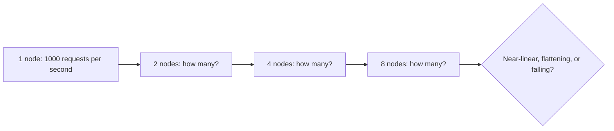
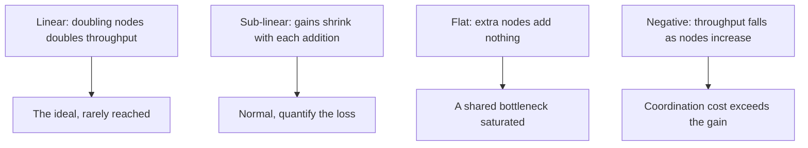

# Scalability Testing

**Scalability testing** measures how the system's capacity responds to added resources, and
how it behaves as data and users grow. The question is not "is it fast enough now", which is
[load testing](Load%20Testing.md), but "does adding capacity actually buy capacity".

## Two directions of growth

| | Vertical scaling | Horizontal scaling |
|---|---|---|
| **Add** | A bigger machine | More machines |
| **Limit** | The largest machine available | Coordination and shared bottlenecks |
| **Test** | Capacity at each instance size | Capacity at each node count |
| **Typical wall** | Single-thread performance, memory bandwidth | Database, locks, shared cache, leader nodes |

## Reading the scaling curve

The flat and negative cases both point at something shared: a single database writer, a
global lock, a chatty cache invalidation protocol, or coordination between nodes growing
faster than the work does. Adding hardware there makes the bill grow and nothing else.

The practical output of a scaling test is a number: "throughput grows at roughly 0.8 per
added node up to 8 nodes, then flattens". That number is what capacity planning and cost
forecasting need, and it cannot be derived from a single-node measurement.

## Data growth, the other axis

Users are not the only thing that grows.

| Growth | Failure it produces |
|---|---|
| Table row count | Queries without a suitable index degrade from milliseconds to seconds |
| Rows per tenant | A query fine for the average customer times out for the largest one |
| Object or file count | Directory listings and full scans become the bottleneck |
| History retention | Backups exceed their window, restores exceed the recovery target |
| Index size | Working set no longer fits in memory, and IO becomes the limit |

Test with realistic future volumes, not current ones. A system tested at today's data size
has been tested for the least demanding day of its life.

## Designing the test

1. Establish a single-node baseline: throughput at the saturation point, with realistic
   data volume and workload mix.
2. Add capacity in steps, re-measuring at each step with the same workload model.
3. Record throughput, latency percentiles and resource use per node at each step.
4. Identify the first non-linearity and find what it is: usually the shared component
   whose utilisation keeps climbing while per-node utilisation falls.
5. Repeat at larger data volumes, since a system that scales well at 1 million rows may not
   at 100 million.

Autoscaling deserves its own check. It has two properties worth measuring separately from
capacity: how fast it reacts to a surge, and whether it scales down without dropping
in-flight work.

## Check Your Understanding

<quiz>
Throughput stops improving after the fourth application node although each node is only 40% utilised. What does this indicate?

- [ ] The nodes are undersized and should be scaled vertically
- [x] A shared component such as the database, a lock or a cache has saturated, so additional nodes cannot contribute
> Correct. Falling per-node utilisation alongside flat throughput is the classic signature of a shared bottleneck.
- [ ] The workload model contains too much think time
- [ ] The load generator has reached its own limit, which is impossible to detect
</quiz>

<quiz>
Why must scalability testing use realistic future data volumes rather than current ones?

- [ ] Because larger datasets make the test run faster
- [x] Because query plans, index behaviour, memory working sets and backup windows all change with data size, so results at today's volume do not predict tomorrow's
> Correct. Data growth is a scaling axis in its own right, independent of user count.
- [ ] Because production data cannot be anonymised at small volumes
- [ ] Because autoscaling only triggers above a data threshold
</quiz>
