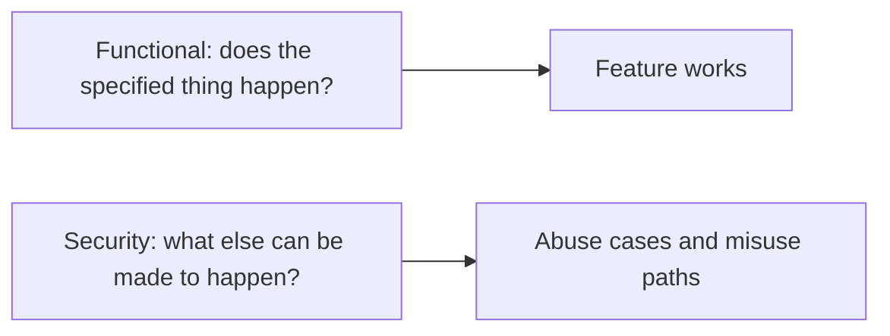
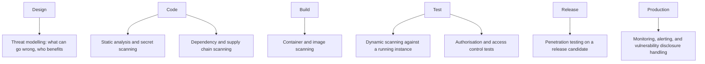
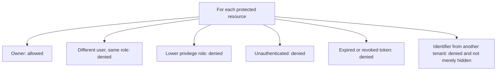

# Security Testing

**Security testing** looks for ways the system can be made to do something it should not:
disclose data to the wrong party, accept an action from an unauthorised actor, or be
manipulated into an unintended state.

It differs from functional testing in its stance. Functional testing asks whether the
specified behaviour happens. Security testing asks what *else* is possible.

## Where it fits in the lifecycle

Threat modelling at design time is the highest-leverage item on the list, for the same
reason requirement review is: it costs a conversation and prevents a class of defect rather
than one instance.

## The techniques

| Technique | What it finds | Limits |
|---|---|---|
| **Threat modelling** | Design-level exposure, missing controls | Only as good as the participants' imagination |
| **Static analysis (SAST)** | Injection, unsafe APIs, hardcoded secrets | High false positive rate, no runtime context |
| **Dependency scanning (SCA)** | Known vulnerable libraries | Only known ones, and version noise |
| **Dynamic scanning (DAST)** | Runtime issues, headers, common injection | Shallow on business logic |
| **Authorisation tests** | Access control defects, the most common serious class | Must be written per resource and role |
| **Penetration testing** | Chained and business-logic flaws | Expensive, point-in-time |
| **Fuzzing** | Crashes, memory safety, parser defects | Needs harnesses and time |

## Authorisation is the test nobody writes

Broken access control is consistently the most frequently found serious category in real
applications, and it is also the easiest to test automatically.

The last row is the one that leaks data. A resource hidden from the interface but still
returned when its identifier is requested directly is the classic insecure direct object
reference, and no amount of UI testing detects it.

Make this a table-driven test over every endpoint and every role. It is mechanical, it is
cheap, and it covers the highest-severity category in the list.

## Testing input handling

| Input class | Cases worth trying |
|---|---|
| **Text fields** | Injection payloads for SQL, command, template and LDAP contexts |
| **Identifiers** | Another user's identifier, another tenant's, a nonexistent one, a negative one |
| **Files** | Wrong type, oversized, malicious names, path traversal sequences, zip bombs |
| **Redirect targets** | External hosts, protocol-relative URLs |
| **Numbers** | Negative amounts, overflow values, extra decimal precision |
| **Headers and cookies** | Tampered tokens, missing security headers, forged forwarding headers |

The negative amount case is worth naming separately: negative quantities and negative
refund amounts have produced real financial losses in real systems, and they are pure
functional boundary cases that any tester can write.

## Practice notes

- **Authorisation before authentication.** Login is usually handled by a library. Access
  control is written by hand for every resource, which is where the defects are.
- **Scan dependencies continuously**, not once. A dependency safe today becomes vulnerable
  on the day a disclosure is published.
- **Never test systems you are not authorised to test.** Written scope and permission are
  required for any active security testing, including scanning.
- **Treat findings as process input.** A recurring vulnerability class is a
  [QA](../Quality%20Fundamentals/Quality%20Assurance.md) signal that something in the
  development process, not just the code, needs to change.

## Check Your Understanding

<quiz>
Which security test gives the most value for the least effort in a typical web application?

- [ ] Fuzzing every input field
- [x] Table-driven authorisation tests covering each resource against owner, other user, other tenant, lower role and unauthenticated access
> Correct. Broken access control is consistently the most common serious category and is mechanical to test.
- [ ] Annual penetration testing
- [ ] Static analysis with all rules enabled
</quiz>

<quiz>
A record is hidden from the interface but is still returned when its identifier is requested directly from the API. What is this?

- [ ] A functional defect in the interface rendering logic
- [x] A broken access control defect, where authorisation was enforced in the presentation layer rather than on the resource itself
> Correct. This is the classic insecure direct object reference, and no interface-level testing detects it.
- [ ] An injection vulnerability
- [ ] A session management weakness
</quiz>
