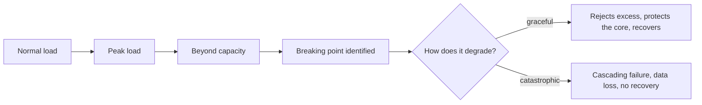
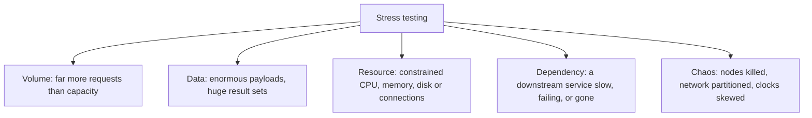

# Stress Testing

**Stress testing** pushes the system past its expected capacity to find where it breaks,
how it breaks, and whether it recovers. Unlike [load testing](Load%20Testing.md), failure is
the expected outcome. The information sought is the *manner* of failure.

## Graceful versus catastrophic

The whole point of the technique is telling these apart before a real traffic surge does.

| Graceful degradation | Catastrophic failure |
|---|---|
| Excess requests rejected quickly with a clear error | Every request accepted and all of them time out |
| Non-essential features shed, core path preserved | Everything degrades equally until nothing works |
| Queues bounded, back pressure applied upstream | Unbounded queues consume memory until the process dies |
| Recovery when load drops, without intervention | Stuck in a failed state, requires a manual restart |
| No data loss or corruption | Partial writes, inconsistent state, lost messages |

A system that returns 503 quickly at 3x capacity is in far better shape than one that
accepts everything and stops responding.

## Kinds of stress

The dependency branch deserves particular attention, because the most common production
outage pattern is not "too much traffic". It is a downstream service becoming slow, callers
holding connections while waiting, thread or connection pools exhausting, and the failure
propagating upward to services that never depended on the failed one directly.

## What to verify under stress

| Question | Evidence to look for |
|---|---|
| Does back pressure work? | Requests rejected fast rather than queued indefinitely |
| Do timeouts fire? | No caller waiting on a dependency longer than its own budget |
| Do circuit breakers open and close? | Failing dependency isolated, then traffic restored after recovery |
| Are retries safe? | Retry storms do not amplify the original overload |
| Is data intact? | No partial writes, no duplicate side effects such as double charges |
| Does it recover unaided? | Returns to normal when load drops, without a restart |
| Are alerts correct? | The right alert fires, early enough, naming the real cause |

The retry row is a genuine amplifier: a client that retries three times turns a struggling
service into one receiving four times the traffic, which is how a slow dependency becomes a
total outage.

## Running it responsibly

Stress tests are destructive by design.

- **Isolate the environment.** Shared staging environments mean stressing one service takes
  down another team's work.
- **Watch dependencies you do not own.** Overloading a third-party sandbox can breach terms
  of use and will get the account throttled.
- **Have a stop condition and a kill switch** agreed before starting.
- **Verify data integrity afterwards**, since the interesting defects are the state
  corruptions, not the timeouts.
- **In production, only with care.** Controlled chaos experiments on a small traffic share,
  with automatic abort, are valuable. Uncontrolled ones are an outage you caused yourself.

## Check Your Understanding

<quiz>
What is the primary information a stress test produces?

- [ ] Whether the system meets its latency targets at expected load
- [x] Where the breaking point is and whether failure is graceful and recoverable rather than catastrophic
> Correct. Load testing answers the target question, stress testing answers the failure-mode question.
- [ ] The optimal instance size for production
- [ ] Whether the workload model matches production traffic
</quiz>

<quiz>
A downstream service slows down, and the whole platform becomes unavailable even for features that do not use it. What is the usual mechanism?

- [ ] The downstream service returned corrupted data
- [x] Callers hold connections while waiting, exhausting shared thread or connection pools, and retries amplify the load until the failure propagates
> Correct. This is why timeouts, bulkheads, circuit breakers and bounded retries are what stress testing verifies.
- [ ] Memory leaked in the unrelated features
- [ ] The load balancer stopped health-checking correctly
</quiz>
