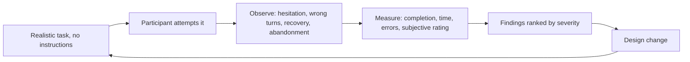
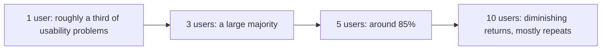

# Usability Testing

**Usability testing** observes real people attempting real tasks to find where the design,
not the code, makes them fail. It measures effectiveness, efficiency and satisfaction: can
they finish, how long does it take, and how does it feel.

It is [validation](../Quality%20Fundamentals/Verification%20and%20Validation.md) work. The
software can be entirely correct and still unusable.

## The method in one page

| Step | Getting it right |
|---|---|
| **Recruit** | People from the actual user group, not colleagues who built it |
| **Task** | A goal in the user's own language: "find out why your last order was refunded" |
| **Environment** | Their device, their conditions, realistic data |
| **Facilitate** | Ask them to think aloud, then stay quiet |
| **Observe** | Where they pause, what they click first, what they misread |
| **Measure** | Completion rate, time on task, errors, and a short satisfaction rating |
| **Report** | Ranked by severity and frequency, with the observed evidence |

The single hardest discipline is silence. Every hint given destroys the finding it was
about to produce, and facilitators hint by reflex because watching someone struggle is
uncomfortable.

## Five users is usually enough

The practical implication is not "test with five people once". It is to run small rounds
often: five participants, fix what was found, then five more on the changed design. Two
rounds of five beat one round of ten, because the second round tests the fixes.

## Formative and summative

| | Formative | Summative |
|---|---|---|
| **Purpose** | Improve the design while it is still changing | Measure how the finished design performs |
| **When** | Early, on sketches, prototypes or partial builds | Late, or against a competitor or a previous version |
| **Output** | A list of problems ranked by severity | Numbers: completion rate, time, error rate |
| **Participants** | Few, iterating | Enough for statistical confidence |

Most teams need formative testing and run summative testing by mistake, discovering
problems at a point where the design can no longer change.

## Cheap alternatives when a study is not possible

- **Heuristic evaluation.** Two or three evaluators walk the interface against established
  usability heuristics such as visibility of system status, user control, error prevention
  and recognition over recall. Finds a good share of problems in an afternoon.
- **Cognitive walkthrough.** Step through a task asking, at each step, whether the user
  would know what to do and whether they would see that it worked.
- **Session recordings and funnel analytics.** Where people abandon, in production, at
  scale. Shows where but not why.
- **Support tickets.** A recurring "how do I" question is a usability defect that was
  already reported, in a form nobody is triaging as one.

## Related but distinct

[Accessibility testing](Accessibility%20Testing.md) overlaps with usability but is not the
same activity, and neither substitutes for the other. An interface can be fully conformant
with accessibility standards and still be confusing, and an interface that most users find
delightful can be completely unusable with a screen reader.

## Check Your Understanding

<quiz>
A participant cannot find the export function during a usability session. What should the facilitator do?

- [ ] Point it out so the remaining tasks can be attempted
- [x] Stay silent, observe and record it, since the struggle is the finding the session exists to produce
> Correct. Any hint destroys the data, and difficulty finding a function is a genuine, severe result.
- [ ] Mark the task as passed because the function exists
- [ ] Ask the participant why they cannot find it, mid-task
</quiz>

<quiz>
Why are two rounds of five participants generally better than one round of ten?

- [ ] Ten participants exceed the capacity of most usability labs
- [x] Five participants surface most problems, and a second round tests whether the resulting fixes actually worked
> Correct. Iteration is what produces improvement, since additional participants in a single round mostly repeat known findings.
- [ ] Smaller rounds produce statistically stronger completion rates
- [ ] Ten participants cannot be recruited from a single user group
</quiz>
