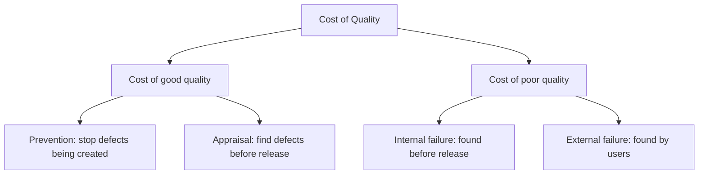
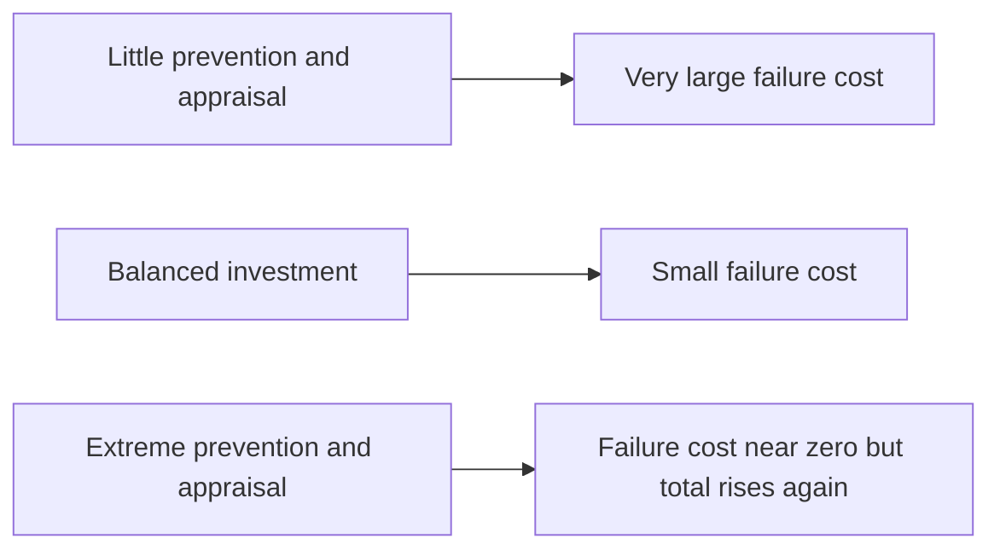
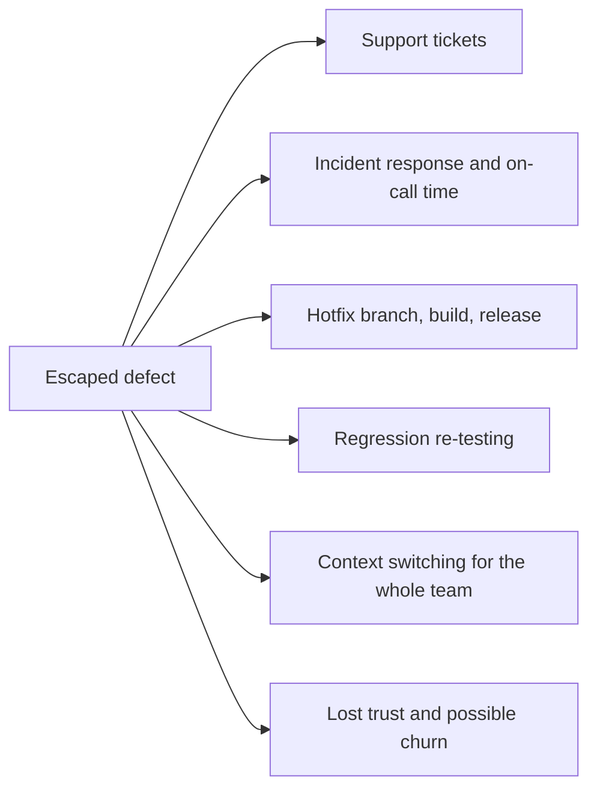

# Cost of Quality

**Cost of Quality (CoQ)** is the total spend caused by quality, both the money spent
achieving it and the money lost failing at it. It exists to settle one argument: quality
work is not an extra cost added to development, it is a reallocation of money that gets
spent either way.

## The four buckets

| Bucket | Spent on | Examples |
|---|---|---|
| **Prevention** | Making defects unlikely | Requirement reviews, training, standards, better tooling, design work, pairing |
| **Appraisal** | Looking for defects | Test design and execution, code review, static analysis, CI compute, audits |
| **Internal failure** | Fixing what you found yourself | Rework, re-testing, broken builds, delayed releases, scrapped work |
| **External failure** | Fixing what users found | Hotfixes, incident response, support load, credits and penalties, churn, reputation |

Prevention and appraisal are chosen. Failure costs are inflicted.

## The shape of the trade-off

Failure cost falls steeply as prevention and appraisal begin, then flattens. Past the
flattening point, each extra check buys less than it costs. That point is not universal:
for a pacemaker it sits far to the right, for an internal dashboard far to the left.

## Why external failure dominates

An escaped defect costs the fix, plus everything the fix drags with it.

The engineering time is usually the smallest of these, which is exactly why estimates
made by engineers understate it.

## A concrete comparison

One ambiguous requirement about discount stacking:

| Where it is caught | Cost |
|---|---|
| Requirement review | 20 minutes of conversation |
| Design | Half a day of rework on the pricing model |
| Unit test | An hour, caught by the developer who wrote it |
| System test | Two days, involving three people and a re-run of the suite |
| Production | Incident, hotfix, refunds for wrongly charged orders, an audit of affected accounts |

The work is identical. Only the amount of built material sitting on top of the mistake
changes, and that is what you pay to unwind.

## Using CoQ without a finance degree

Full CoQ accounting is rarely worth it in software teams. The useful version is lighter:

- Track **escaped defects** and roughly what each one consumed, including support and
  incident time.
- Track **rework**: time spent on work that was already called done.
- When either rises, move money left in the diagram, into prevention rather than more
  appraisal, since more appraisal only finds the same defects slightly earlier.
- When failure costs are already low and appraisal keeps growing, you are past the flat
  part of the curve. Delete tests that never fail and checks nobody reads.

The argument this equips you for: cutting a review to save two days is not a saving, it
moves that cost into a bucket where it is larger and arrives later.

## Check Your Understanding

<quiz>
A team cuts requirement reviews to hit a date, and the release ships on time with three production incidents in the following month. What happened in cost of quality terms?

- [ ] Total cost of quality fell because prevention spend fell
- [x] Prevention cost was moved into external failure cost, which is the most expensive bucket
> Correct. The work was not removed, only relocated to a bucket that costs more and arrives later.
- [ ] Appraisal cost rose while prevention stayed constant
- [ ] Internal failure cost fell because fewer defects were found before release
</quiz>

<quiz>
Failure costs are already near zero, yet the team keeps adding checks and the suite keeps slowing. What does cost of quality suggest?

- [ ] Keep adding checks, since failure cost can always fall further
- [x] The investment is past the point where extra appraisal buys less than it costs, so trim checks that never fail
> Correct. Cost of quality has an optimum, and it is not maximum inspection.
- [ ] Move the spend from prevention into appraisal
- [ ] Replace appraisal entirely with production monitoring
</quiz>
