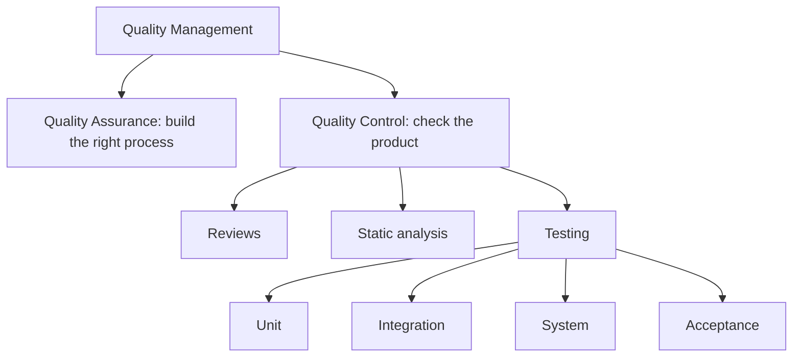
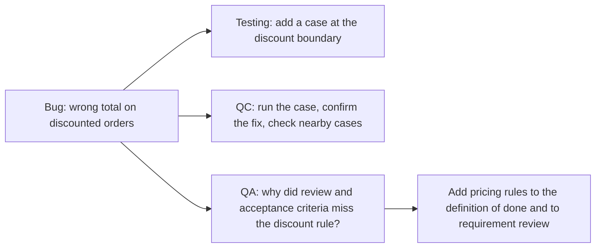

# QA vs QC vs Testing

These three terms get used as synonyms in job titles and in conversation, which hides a
useful hierarchy: testing is one technique inside quality control, and quality control
is one half of quality management. The other half is quality assurance.

## The containment picture

Reading it outward: a test is a check, checks are how you control quality, and assurance
is what makes the checks rarely fail.

## Side by side

| | Quality Assurance | Quality Control | Testing |
|---|---|---|---|
| **Object** | The process | The product | The running or readable artefact |
| **Goal** | Prevent defects | Detect defects | Detect defects by exercising behaviour |
| **Timing** | Continuous, before and around building | On each artefact | On each build or change |
| **Typical output** | Standards, gates, improvements | Pass or fail verdicts, defect reports | Test results, coverage, bug reports |
| **Question** | Are we capable of building it right? | Did we build this one right? | Does it behave as specified? |
| **Owner** | Whole team, often led by engineering leadership | Whole team | Developers and testers |

## Same problem, three responses

A checkout total is wrong for orders containing a discounted item.

The testing answer produces one more test. The QA answer produces one fewer future bug
of that shape. Teams that only ever produce the first answer accumulate a large suite
and a stable defect rate.

## Common confusions worth naming

- **"We have QA" meaning "we have testers."** A testing team is QC capacity. It is not
  assurance, and calling it assurance hides that nothing upstream is changing.
- **"Automation is QA."** An automated test is still a check on a product, so it is QC.
  Deciding *which* checks must exist and gate the pipeline is QA.
- **"QA signs off on quality."** Quality is produced by the people building the thing.
  A late sign-off gate cannot add quality that the process did not create, it can only
  reject.
- **"Testing proves it works."** Testing shows behaviour for the cases you ran. See the
  [testing principles](../Testing%20Fundamentals/Testing%20Principles.md) for why absence
  of defects is not provable by testing.

## Choosing where to invest

If defects are being found late but the same categories repeat, invest in QA. If defects
reach users because nobody looked, invest in QC. If the checks exist but are slow,
manual, or untrusted, invest in test automation.

Escaped defect data tells you which of the three you are short on, which is why
recording it is worth more than most other quality metrics combined.

## Check Your Understanding

<quiz>
A team adds a mandatory pipeline stage that blocks merges when coverage of changed lines drops. What is that decision?

- [ ] Testing, because coverage comes from tests
- [x] QA, because it changes the process that governs how work gets built
> Correct. Running the tests is QC. Deciding they must gate the merge is assurance.
- [ ] QC, because it inspects the build
- [ ] None of these, it is release management
</quiz>

<quiz>
Which statement about the relationship between the three is accurate?

- [ ] Testing contains quality control, which contains quality assurance
- [x] Testing is one technique within quality control, and quality control is the detection half of quality management alongside assurance
> Correct. The nesting runs the other way from how the terms are usually spoken.
- [ ] QA and QC are the same activity performed by different roles
- [ ] Quality control only applies to executable software
</quiz>
