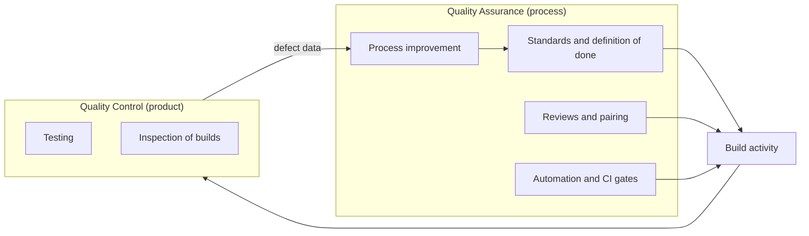
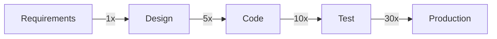

# Quality Assurance

**Quality Assurance (QA)** is the process-focused half of quality work. It shapes *how*
software gets built so that defects are unlikely in the first place, rather than
inspecting the finished product and hoping the inspection was thorough.

The distinction that matters: QA acts on the process, [Quality Control](Quality%20Control.md)
acts on the product.

## Where QA sits

The feedback arrow is the point. Every defect QC finds is evidence about the process,
and QA is the activity that turns that evidence into a change so the same defect class
does not come back.

## What QA actually covers

| Activity | Question it answers | Typical artefact |
|---|---|---|
| **Standards** | What does acceptable work look like here? | Coding standard, definition of done |
| **Reviews** | Did we agree on this before it was built? | Requirement review, design review, code review |
| **Test planning** | How will we know it works? | [Test plan](../Testing%20Fundamentals/Test%20Plan.md), [test strategy](../Testing%20Fundamentals/Test%20Strategy.md) |
| **Automation** | Which checks should never be manual again? | CI pipeline, quality gates |
| **Measurement** | Is the process getting better or worse? | Escaped defect rate, lead time, [flaky test](../Test%20Quality/Flaky%20Tests.md) rate |
| **Improvement** | What do we change next? | Retrospective actions, [root cause analysis](../Defects/Root%20Cause%20Analysis.md) |

## Prevention beats detection

The cost of a defect rises with how long it survives.

The multipliers are illustrative, not laws of nature, but the shape holds in every study
of the subject. A misunderstood requirement caught in a 20 minute review costs a
conversation. The same misunderstanding caught after release costs a hotfix, a
regression run, a support queue, and the trust of whoever reported it.

This is the entire argument for [shift-left](../Quality%20in%20the%20SDLC/Shift-Left%20Testing.md) testing
and for reviewing requirements at all.

## QA is not a department

Treating QA as a team that receives finished code creates a queue and a handoff, and
handoffs are where context dies. The people who wrote the code know where the risky
parts are. In practice QA works when:

- Developers own their unit and integration tests.
- Testers contribute to requirements and acceptance criteria before code exists.
- The pipeline enforces the standards automatically, so nobody has to police them.
- Quality is a release criterion, not a phase that can be cut when the date slips.

The failure mode of the separate-department model is predictable: the schedule
compresses, the only phase left to squeeze is the one at the end, and QA becomes the
team that gets blamed for both the delay and the escaped bugs.

## Useful signals

- **Escaped defects**: bugs found in production per release. The headline QA metric.
- **Defect removal efficiency**: defects found before release divided by total defects
  found, including those found after. Rising means the process catches more.
- **Flaky test rate**: high flakiness quietly destroys trust in every other signal.
- **Rework time**: hours spent fixing what was already called done.

Avoid counting test cases written or bugs filed as productivity. Both reward volume over
value, and both are trivially gamed.

## Check Your Understanding

<quiz>
What is the clearest way to separate QA from QC?

- [ ] QA is manual, QC is automated
- [x] QA acts on the process to prevent defects, QC acts on the product to detect them
> Correct. Prevention versus detection is the distinction that survives every context.
- [ ] QA happens after development, QC happens before
- [ ] QA is done by testers, QC is done by developers
</quiz>

<quiz>
A team finds the same category of defect in three consecutive releases. Which response is QA rather than QC?

- [ ] Write more test cases for that area
- [ ] Extend the manual regression pass before release
- [x] Run a root cause analysis and change the process step that keeps producing it
> Correct. Adding detection catches the next instance. Changing the process stops producing them.
- [ ] Raise the severity of those defects
</quiz>
