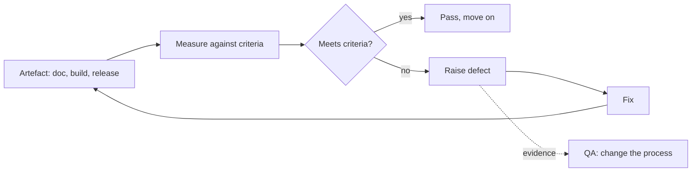
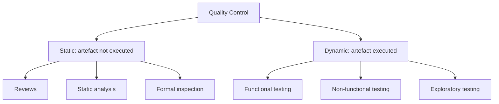

# Quality Control

**Quality Control (QC)** is the product-focused half of quality work. It examines
something that already exists, a requirement document, a build, a running system, and
decides whether it meets the stated criteria.

Where [Quality Assurance](Quality%20Assurance.md) asks "is our process capable of
producing good software", QC asks "is *this artefact* good".

## The control loop

Two outputs, not one. The obvious output is a fixed artefact. The valuable output is the
dotted line: defect data that tells QA which process step is leaking.

## Forms of quality control

| Form | Applied to | Example |
|---|---|---|
| **Review** | Documents, designs, code | Requirement walkthrough, pull request review |
| **Static analysis** | Source code | Linters, type checkers, security scanners |
| **Dynamic testing** | Running software | [Unit](../Test%20Levels/Unit%20Testing.md), [integration](../Test%20Levels/Integration%20Testing.md), [system](../Test%20Levels/System%20Testing.md) tests |
| **Inspection** | Release candidates | Checking a build against release criteria |
| **Audit** | Process records | Confirming the agreed steps were actually followed |

Testing is the most visible form of QC but not the only one, and not always the
cheapest. A static analyser finds a null dereference in milliseconds without anyone
writing a test for it.

## Static and dynamic control

Static control can be applied before anything runs, which is why it is the earliest
possible QC and the natural partner of shift-left work. Dynamic control is the only way
to observe emergent behaviour: timing, concurrency, memory growth, real integration.

## What good QC needs

- **Explicit criteria.** "Looks fine" is not a criterion. Acceptance criteria,
  a [test oracle](../Testing%20Fundamentals/Testing%20Oracle.md), and a definition of
  done make pass and fail decidable.
- **Independence of judgement.** Not necessarily a separate team, but someone other than
  the author looking, because authors read what they meant to write.
- **Repeatability.** The same check on the same build must give the same verdict, which
  is why flaky tests are a QC emergency.
- **Traceability.** Every check should map to a requirement or a risk, otherwise nobody
  can answer what was covered.

## Where QC alone fails

QC has an inherent ceiling. It samples: no realistic amount of testing exercises every
input, path, and timing of a non-trivial system. So QC can prove that defects exist and
can raise confidence, but it cannot prove absence of defects.

That is why a team relying only on QC plateaus. Detection improves for a while, then the
same defect classes keep arriving at the same rate, because nothing upstream changed.
Pair QC with the QA feedback loop or it becomes an expensive bug counter.

## Check Your Understanding

<quiz>
A linter flags an unused variable and a possible null dereference before the code runs. What is this?

- [ ] Quality assurance, because it is automated in CI
- [x] Static quality control, because it examines an artefact against criteria without executing it
> Correct. Automation does not make something QA. The activity is checking a product, so it is QC.
- [ ] Dynamic testing at the unit level
- [ ] Verification only, never quality control
</quiz>

<quiz>
Why can quality control raise confidence but never prove a system is defect free?

- [ ] Because testers make mistakes
- [ ] Because requirements are always incomplete
- [x] Because testing samples a tiny fraction of possible inputs, paths and timings, so passing tests only show that the sampled cases behaved
> Correct. This is the exhaustive testing limitation, and it is why risk-based prioritisation exists.
- [ ] Because automated tests are less reliable than manual tests
</quiz>
