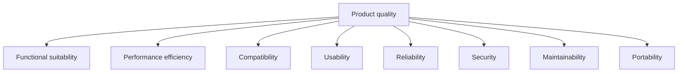
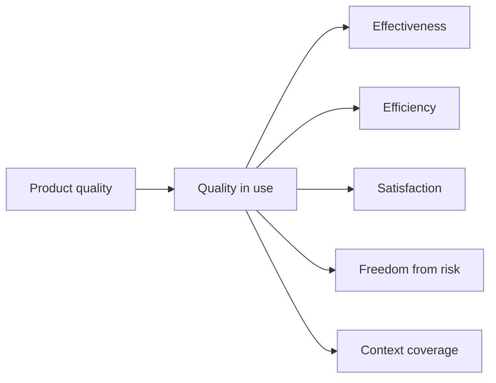
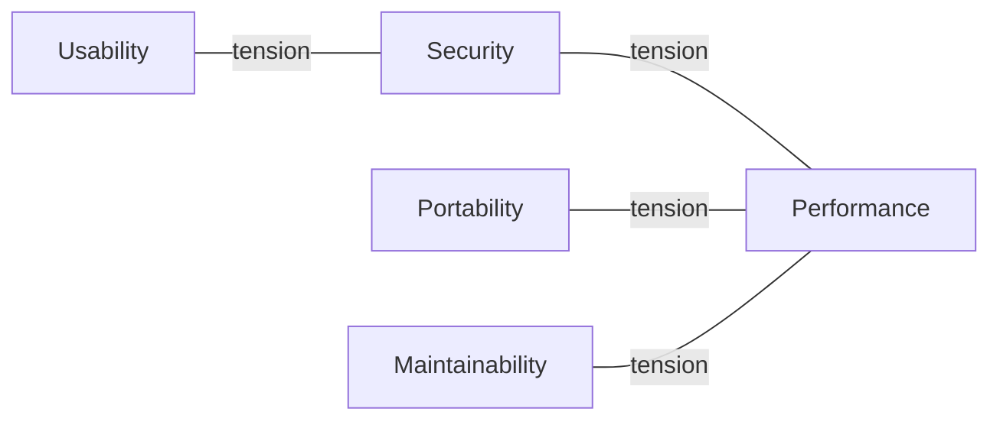

# Software Quality Models

"Quality" on its own is unarguable and therefore useless in a requirement. A quality
model breaks it into named characteristics that can be argued about, prioritised, and
measured. It is the vocabulary that turns "make it good" into "p99 under 200ms, recovery
under 5 minutes, and any developer can add an endpoint in a day".

## ISO/IEC 25010, product quality

The current standard model. Eight characteristics, each with sub-characteristics.

| Characteristic | Sub-characteristics | Typical measure |
|---|---|---|
| **Functional suitability** | Completeness, correctness, appropriateness | Acceptance criteria met, escaped functional defects |
| **Performance efficiency** | Time behaviour, resource use, capacity | Latency percentiles, CPU and memory per request |
| **Compatibility** | Coexistence, interoperability | Supported browsers, protocol conformance |
| **Usability** | Learnability, operability, error protection, accessibility | Task success rate, time on task, WCAG level |
| **Reliability** | Maturity, availability, fault tolerance, recoverability | Uptime, MTBF, MTTR |
| **Security** | Confidentiality, integrity, non-repudiation, accountability, authenticity | Findings by severity, time to patch |
| **Maintainability** | Modularity, reusability, analysability, modifiability, testability | Change lead time, coupling, [test coverage](../Testing%20Fundamentals/Test%20Coverage.md) |
| **Portability** | Adaptability, installability, replaceability | Platforms supported, install success rate |

These are the same concerns the architecture side calls
architectural characteristics,
seen from the testing end instead of the design end.

## Quality in use

25010 separates the product from the experience of using it. A product can score well and
still fail in context.

This is the [validation](Verification%20and%20Validation.md) view: measured with real users
doing real tasks, not with the product on a bench.

## Earlier models worth recognising

| Model | Structure | Still useful for |
|---|---|---|
| **McCall (1977)** | 11 factors in three views: operation, revision, transition | The framing that quality splits into use, change, and moving to new environments |
| **Boehm (1978)** | Hierarchy from general utility down to measurable metrics | The idea of decomposing until something is countable |
| **FURPS / FURPS+** | Functionality, Usability, Reliability, Performance, Supportability, plus constraints | Quick checklist during requirements workshops |

FURPS+ survives in practice because it is short enough to remember in a meeting. ISO
25010 survives because it is complete enough to audit against.

## Using a model without drowning in it

A model is a checklist for finding the characteristics that matter, not a list of things
to maximise. Characteristics conflict: security adds latency, portability costs
performance, maintainability abstractions cost throughput.

A workable process:

1. Walk the eight characteristics with the stakeholders and mark each as driving,
   relevant, or ignorable.
2. Pick at most three or four drivers. A system that claims seven priorities has none.
3. For every driver, write a measurable target with a number and a condition.
4. Turn each target into a check: a test, a monitor, or a gate.

Step 3 is where most attempts fail. "The system shall be highly available" cannot pass or
fail. "99.9% monthly availability measured at the load balancer, excluding announced
maintenance" can.

## Check Your Understanding

<quiz>
Why is "the system must be maintainable" a poor quality requirement?

- [ ] Maintainability is not part of any standard quality model
- [x] It has no measurable target or condition, so no check can decide whether it was met
> Correct. A quality model names the characteristic. The requirement still has to make it countable.
- [ ] Maintainability only matters after release
- [ ] It should be classified as a functional requirement instead
</quiz>

<quiz>
A product scores well on every ISO 25010 product characteristic, yet users abandon the main task. Which part of the model addresses this?

- [ ] Functional suitability
- [ ] Compatibility
- [x] Quality in use, which measures effectiveness, efficiency and satisfaction for real users in a real context
> Correct. Product quality is measured on the bench, quality in use is measured in context.
- [ ] Portability
</quiz>
