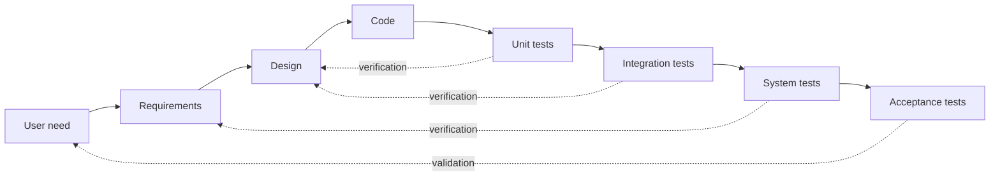
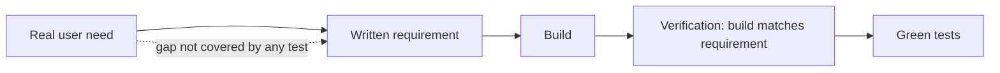

# Verification and Validation

Two questions, easy to confuse, and a system can pass one while failing the other.

- **Verification**: are we building the product **right**? Does the artefact match its
  specification?
- **Validation**: are we building the **right** product? Does it solve the user's actual
  problem?

## The V-model view

Verification checks each step against the step above it. Validation checks the finished
system against the need that started it.

The left side builds specifications, the right side checks them. This is the same shape
as the [V-Model](../../Methodologies/Process%20Models/V-Model.md), where each test level
was designed to verify one specific development artefact.

## The four outcomes

| | Validated | Not validated |
|---|---|---|
| **Verified** | Correct software solving the right problem | A flawless implementation of the wrong thing |
| **Not verified** | Right idea, buggy build | Failing on both counts |

The top-right cell is the expensive one, and it is invisible to any amount of testing
against the specification. Every test passes. The spec was wrong.

## How each one is done

| | Verification | Validation |
|---|---|---|
| **Against** | Specifications, designs, standards | User needs, business goals |
| **Techniques** | Reviews, static analysis, unit and integration tests, contract testing | User acceptance testing, demos, usability testing, beta releases, production metrics |
| **Answers** | Does it match what we wrote down? | Does it help the person it was for? |
| **Can be fully automated** | Largely yes | Rarely, it needs human judgement |
| **Cheapest form** | Review the artefact before building on it | Show a working slice to a real user early |

Note that most of the verification column is machine-checkable and most of the validation
column is not. That asymmetry explains why teams over-invest in verification: it is the
half that a pipeline can do for you.

## A worked confusion

A requirement says: *"Export must return the last 30 days of transactions as CSV."*

Verification succeeds: the export returns exactly 30 days, encoded as CSV, with tests
covering the boundary at day 30 and an empty range.

Validation fails: accountants needed the previous *calendar month* for reconciliation,
and a rolling 30 day window never matches a month boundary. The feature is correct and
useless.

Only contact with a real user surfaces this, and the cheapest moment for that contact is
before the code exists.

The gap sits between need and written requirement, upstream of everything the test suite
can see.

## Practical guidance

- Validate early and in small slices. A demo of one working flow at week two beats a
  perfect acceptance phase at month six.
- Treat acceptance criteria as the handshake between the two: written by or with the
  person who has the need, and specific enough to verify.
- Use production signals as continuing validation. Feature usage, funnel drop-off and
  support tickets tell you whether the built thing was the right thing.
- Keep verification cheap and automated, so that human attention is free for validation,
  which cannot be automated.

## Check Your Understanding

<quiz>
A payment feature passes every unit, integration and system test, then merchants say it does not fit how they settle funds. What happened?

- [ ] Verification failed because the tests were incomplete
- [x] Verification succeeded and validation failed: the implementation matched a specification that did not match the real need
> Correct. This is the classic top-right cell, and no amount of specification-based testing detects it.
- [ ] Both verification and validation failed
- [ ] The defect is a regression
</quiz>

<quiz>
Which activity is validation rather than verification?

- [ ] A code review against the team's coding standard
- [ ] A contract test confirming a service still returns the agreed schema
- [x] A usability session where a real user attempts a task without guidance
> Correct. It checks the product against the need, not against a written specification.
- [ ] Static analysis flagging an unreachable branch
</quiz>
