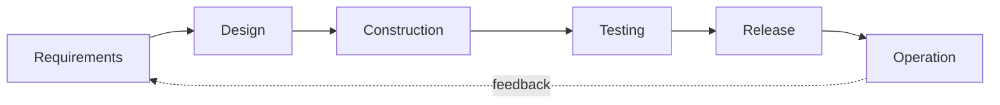
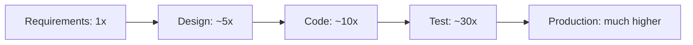
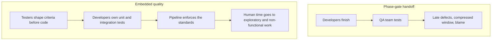

# QA in the SDLC

Quality is not a phase. Every stage of the
[software development life cycle](../../Methodologies/Systems%20Development%20Life%20Cycle%20(SDLC).md)
either builds quality in or defers a defect to a later, more expensive stage.

## What quality work looks like at each stage

| Stage | Quality activity | Defect class it prevents |
|---|---|---|
| **Requirements** | Review, worked examples, testable acceptance criteria, [decision tables](../Testing%20Techniques/Decision%20Table%20Testing.md) | Ambiguity, missing rules, wrong product |
| **Design** | Architecture review, threat modelling, quality attribute targets with numbers | Untestable design, missing controls, unachievable performance |
| **Construction** | [TDD](../Testing%20Approaches/Test-Driven%20Development.md), code review, static analysis, pairing | Logic defects, unsafe patterns, untestable code |
| **Testing** | Level-appropriate suites, exploratory sessions, non-functional verification | Integration and behavioural defects |
| **Release** | [Quality gates](Quality%20Gates.md), smoke checks, staged rollout | Broken deployments, configuration mistakes |
| **Operation** | Monitoring, incident review, [root cause analysis](../Defects/Root%20Cause%20Analysis.md) | Recurring classes, unknown real-world behaviour |

The pattern: the earlier the row, the cheaper the prevention and the wider the class of
defect prevented.

## The cost curve, one more time

Multipliers vary by study, the shape does not. A misunderstood rule caught in refinement
costs a conversation. The same rule caught after release costs an incident, a hotfix, a
regression run, refunds and trust.

## Testing in each process model

| Model | Where testing sits | Consequence |
|---|---|---|
| [Waterfall](../../Methodologies/Process%20Models/Waterfall%20Model.md) | A phase after construction | Late feedback, and testing is squeezed when the schedule slips |
| [V-Model](../../Methodologies/Process%20Models/V-Model.md) | Each test level planned against its specification level | Test design starts early, execution still late |
| [Iterative and incremental](../../Methodologies/Process%20Models/Iterative%20Model.md) | Every iteration | Feedback per increment |
| [Agile](../../Methodologies/Agile/index.md) | Continuously, inside the team | Fastest feedback, requires strong automation |

The V-Model's contribution is worth keeping regardless of process: for every specification
artefact, decide up front how it will be verified.

## Whole-team quality

The handoff model reliably produces the same outcome: the schedule compresses, the only
remaining phase to squeeze is the last one, and quality becomes the thing that was cut.

## Signals that quality has been deferred rather than built

- Testing consistently starts late and finishes under pressure.
- Most defects are found at [system](../Test%20Levels/System%20Testing.md) or acceptance
  level rather than below.
- Requirements are clarified during testing rather than during refinement.
- Non-functional issues appear only in production.
- The release decision is made without knowing what was not covered.

## Check Your Understanding

<quiz>
Why is quality assurance described as spanning the whole life cycle rather than being a testing phase?

- [ ] Because testers are involved in every meeting
- [x] Because each stage either prevents a defect class cheaply or defers it to a later stage where it costs far more
> Correct. Requirements review and design review prevent classes that no amount of later testing can catch cheaply.
- [ ] Because agile methods have removed the testing phase
- [ ] Because automated pipelines run at every stage
</quiz>

<quiz>
What element of the V-Model is worth keeping in any process?

- [ ] Sequential phases with formal sign-off between them
- [x] Deciding, for every specification artefact, how it will be verified, which starts test design early even when execution is later
> Correct. It pairs each level of specification with a matching level of testing.
- [ ] Executing all test levels only after construction is complete
- [ ] Assigning a separate team to each test level
</quiz>
